# Agenda

- Local Randomization Approach
- Fuzzy RD
- GRD
- Difference-in-discontinuities
- PCRD

# Recap: Continuity-based Approach

- Assume regression functions are continuous to obtain

\[ \tau_{SRD} = \mathbb{E}[Y_i(1) - Y_i(0)|X_i = c] = \lim_{x \downarrow c} \mathbb{E}[Y_i|X_i = x] - \lim_{x \uparrow c} \mathbb{E}[Y_i|X_i = x] \]
  
- Approximates regression function and relies on continuity assumptions.
- Requires: choosing weights, bandwidth and polynomial order.
- Alternative: local randomization approach

# Analogies with experiment

- Lee (2008): RD design can be as credible as a randomized experiment for units very near cutoff

- Imagine that score depends on each unit’s unobservables characteristics and choices

- If the two following conditions hold:
  - there is a random chance element to score that unit receives
  - probability of this random "error" doesn’t change abruptly at cutoff

- Then the RD design can be seen as an experiment:
  - units barely above the cutoff as-if randomly assigned to treatment
  - units barely above the cutoff as-if randomly assigned to control

- \textcolor{red}{This fails if individuals have ability to exactly control their score}

# Analogies with experiment

- Consider an RD Design where:
  - treatment is assigned based on score exceeding cutoff
  - units lack ability to manipulate score (continuity holds)

- Crucial distinction:
  - Experiment → no need to make assumptions about shape of the average potential outcomes
  - RD design → inferences depend crucially on assumptions regarding functional form of regression functions

- Any experiment can be recast as an RD design where
  - score is a uniform random variable
  - cutoff chosen to ensure a given probability of treatment
  - \textcolor{red}{Ex: each student assigned uniform random number between 0 and 100, scholarship given to students whose score is above 50
}

# Experiment vs. RD design

\centering
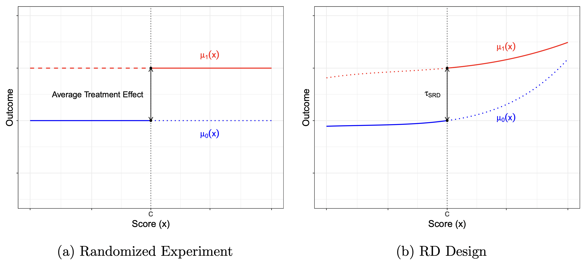

# If as-if random interpretation is true: Local Randomization RD

\centering
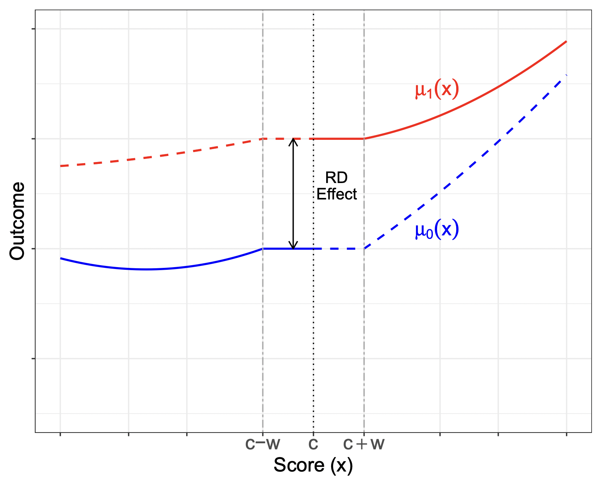{width=320}

# Local Randomization Approach to RD Design

- Gives an alternative that can be used as a robustness check.

- Key assumption: exists window \( W = [-w, w] \) around cutoff \( (-w < c < w) \) where (assuming random potential outcomes)
  
  \( T_i \) independent of \( (Y_i(0), Y_i(1)) \) (for all \( X_i \in W \))

- Thus, inside \( W_0 \) subjects are as-if randomly assigned to either side of cutoff
  - The distribution of running variable same for all units inside  $W_0$ 
  - Potential outcomes in $W_0$ depend on running variable only through threshold indicators within $W_0$

- Stronger than Continuity-Based Approach $\to$ Relevant population functions are not only continuous at \( x_0 \), but also completely unaffected by the running variable in \( W_0 \)

# Local Randomization Approach to RD Design

- In window \( W_0 \), subjects randomly assigned to either side of cutoff:
  - Window \( W_0 \)
  - Assignment mechanism

- If assignment mechanism and \( W_0 \) are known, RD becomes an experiment in \( W_0 \)

- If few units inside \( W_0 \), adopt a Fisherian setup: potential outcomes are fixed, only randomness is in the assignment of subjects

# Local Randomization Approach Using Fisherian Methods

- Approach has two steps:
  - Step 1: Choose window around cutoff where randomization holds
  - Step 2: Apply randomization inference tools, given a hypothesized treatment assignment, within \( W_0 \)

# Step 1: Choose the window $W_0$

- How to choose window?
  - Use balance tests on pre-determined/exogenous covariates.
  - Very intuitive, easy to implement.

# Window Selector Based on Covariate Balance in Locally Random RD

\centering
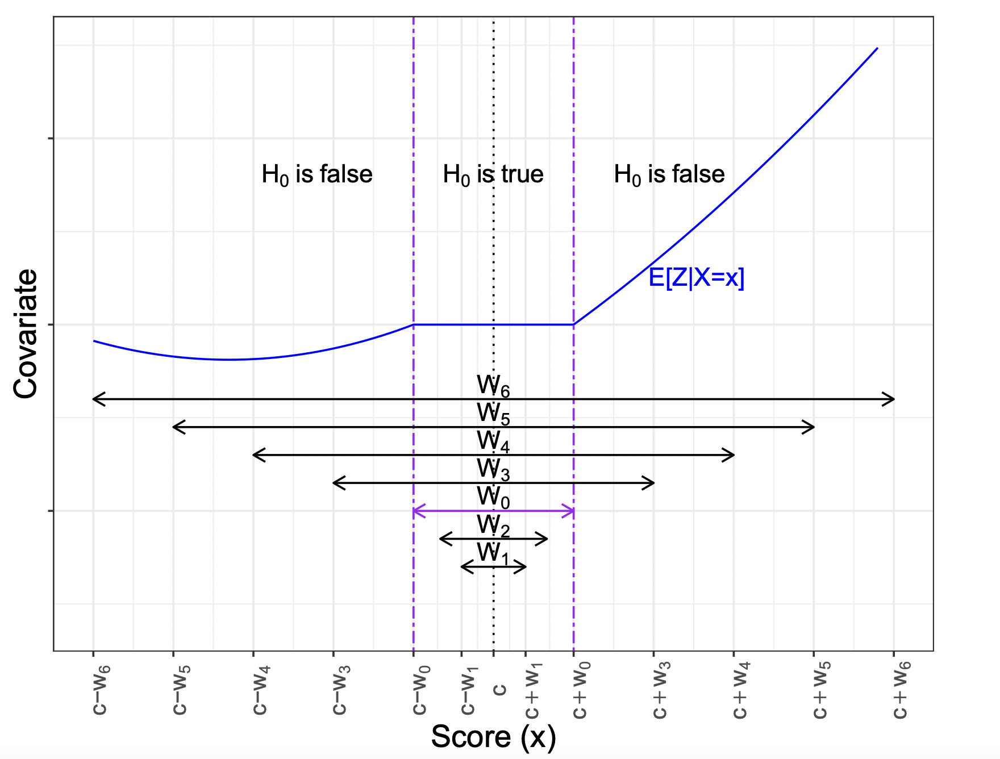{width=350}


# Step 2: Use Randomization Inference Tools within $W_0$

- Under this framework, we can treat observations within the window \( W_0 \) as if generated by a randomized experiment

- One possible randomization mechanism:
  - \( T_i \) is Bernoulli with parameter \( \pi \): for all vectors \( t \) in \( \Omega_{W_0} \),
  \[
  \Pr(T_{W_0} = t) = \pi^{t'1} (1 - \pi)^{(1-t)'1}
  \]
  - Since \( \pi \) is unknown, we estimate it \( \hat{\pi} = \frac{T'_{W_0}}{n_{W_0}} \)

- Another possible randomization mechanism:
  - Fix number of treated units within the window at \( m_{W_0} \), which leads to
  \[
  \Pr(T_{W_0} = t) = \frac{1}{{n_{W_0} \choose m_{W_0}}} \text{ for all } t \in \Omega_{W_0}
  \]

# Step 2: Use Randomization Inference Tools within $W_0$

- Given local random assumption, can test sharp null hypothesis of no treatment effect for any \( i \)

- Under this hypothesis, observed outcomes are fixed regardless of realization of \( T_{W_0} \): \( y_i (t) = y_i \) for all \( i \) within \( W_0 \) and for all \( t \in \Omega_{W_0} \)

- Thus, the distribution of any test statistic \( Q(T_{W_0}, Y_{W_0}) \) is known, since it depends only on the known distribution of \( T_{W_0} \)

- One-sided significance level:

\begin{footnotesize}
  \[
  \Pr(Q(T_{W_0}, Y_{W_0}) \geq Q(t_{W_0}, Y_{W_0})) = \sum_{t \in \Omega_{W}} 1(Q(t, Y_{W_0}) \geq Q(t_{W_0}, Y_{W_0})) \Pr(T_{W_0} = t)
  \]
\end{footnotesize}

- Different test statistics may be used

# Hypothetical Randomization Distribution with Five Units


\centering
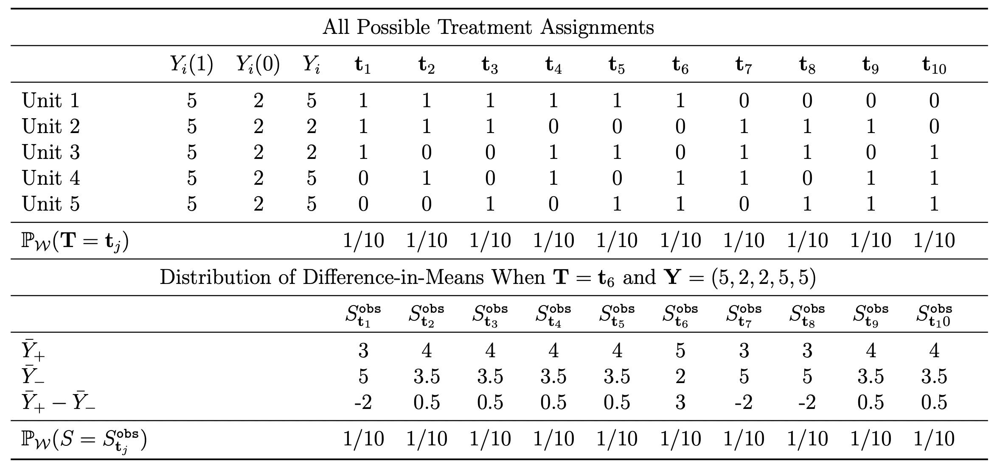


# Empirical Illustration: Incumbency Advantage (CFT, 2015, JCI)

- Problem: incumbency advantage (U.S. senate).

- Data:
  - \( Y_i \) = election outcome at \( t + 1 \).
  - \( T_i \) = whether party wins election at \( t \).
  - \( X_i \) = margin of victory at \( t \)  (\( c = 0 \)).
  - \( Z_i \) = covariates (_demvoteshlag1, demvoteshlag2, dopen_, etc.).

- Potential outcomes:
  - \( Y_i(0) \) = election outcome at \( t + 1 \) if had not been incumbent.
  - \( Y_i(1) \) = election outcome at \( t + 1 \) if had been incumbent.

- Causal Inference:
  - \( Y_i(0) \neq Y_i | T_i = 0 \)
  - \( Y_i(1) \neq Y_i | T_i = 1 \)
  
# Empirical Illustration: Incumbency Advantage (CFT, 2015, JCI)
\tiny
```{r,warning=FALSE,message=FALSE}
library(rdlocrand)
library(rdrobust)
data <- read.csv("rdlocrand_senate.csv")
X  <-  cbind(data$presdemvoteshlag1,
            data$population/1000000, data$demvoteshlag1,
            data$demvoteshlag2, data$demwinprv1,
            data$demwinprv2, data$dopen,
            data$dmidterm, data$dpresdem)
colnames(X) <-  c("DemPres Vote", "Population",
                 "DemSen Vote t-1","DemSen Vote t-2",
                 "DemSen Win t-1", "DemSen Win t-2",
                 "Open", "Midterm", "DemPres")
R <- data$demmv
Y <- data$demvoteshfor2
D <- as.numeric(R>=0)
```

# Simple RD plot
\tiny
```{r,warning=FALSE,message=FALSE}
rdplot(Y,R,p=3) 
```

# Randomization inference using selected window
\tiny
```{r,warning=FALSE,message=FALSE}
out <- rdrandinf(Y, R, wl = -2.5, wr = 2.5, seed = 50)
```

# Binomial randomization mechanism
\tiny
```{r,warning=FALSE,message=FALSE}
bern_prob <- numeric(length(R))
bern_prob[abs(R) > 2.5] <- NA
bern_prob[abs(R) <= 2.5] <- 1/2
out <- rdrandinf(Y, R, wl = -2.5, wr = 2.5, seed = 50, bernoulli = bern_prob)
```

# Selecting the Window
\tiny
```{r,warning=FALSE,message=FALSE,echo=FALSE}
out <- rdwinselect(R, X, seed = 50, reps = 1000, wobs = 2)
```

# P-value for Different Windows
\tiny
```{r,warning=FALSE,message=FALSE}
tmp <- rdwinselect(R,X,wmin=.5,wstep=.125,approx=TRUE,nwin=80,quietly=TRUE,plot=TRUE)
```

# Continuity-Based vs Local Randomization Analysis, CFT

\centering
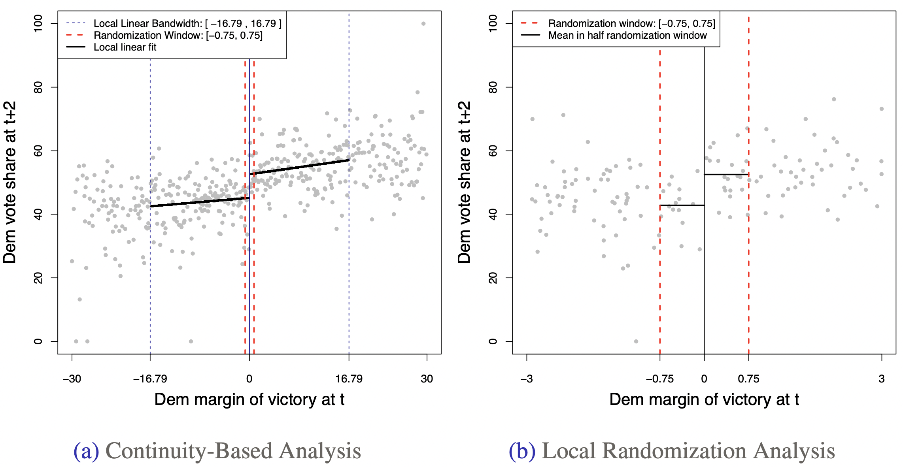

# Fuzzy RD

Treatment Assignment in (Sharp) RD Design

\centering
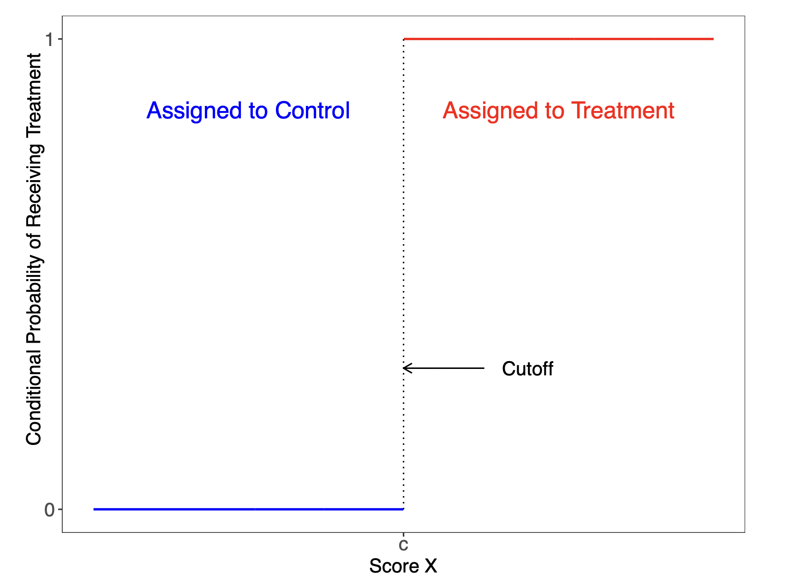

# Sharp Regression Discontinuity Design

- \( n \) units, indexed by \( i = 1, 2, \dots, n \)

- Unit’s score is \( X_i \), treatment is \( T_i = 1(X_i \geq c) \)

- Each unit has two potential outcomes:
  - \( Y_i(1) \): outcome that would be observed if \( i \) received treatment
  - \( Y_i(0) \): outcome that would be observed if \( i \) received control

- The *observed* outcome is

  \[
  Y_i = 
  \begin{cases} 
  Y_i(0) & \text{if } X_i < c, \\
  Y_i(1) & \text{if } X_i \geq c.
  \end{cases}
  \]

- Fundamental problem of causal inference: only observe \( Y_i(0) \) for units below cutoff and only observe \( Y_i(1) \) for units above cutoff

# RD Treatment Effect in Sharp RD Design

\centering
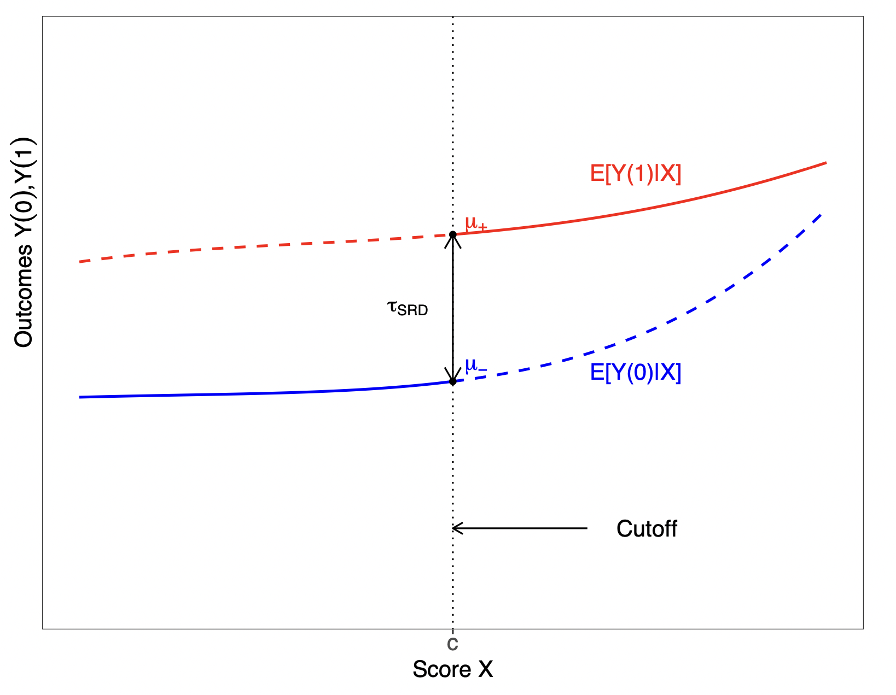

# Fuzzy RD Design

- Imperfect compliance:
  - Probability of treatment changes at \( c \), but not necessarily from 0 to 1
  - Some units with score above \( c \) may decide not to take up treatment
  - Example: voting eligibility at 18

- \( T_i \) is treatment assigned, \( D_i \) is treatment taken

- Now for some units \( T_i \neq D_i \)

- Treatment taken has two potential values, \( D_i(1) \) and \( D_i(0) \), and observed treatment taken is \( D_i = T_i \cdot D_i(1) + (1 - T_i) \cdot D_i(0) \)

- Four potential outcomes instead of two:
  \[
  Y_i(1, D_i(1)) = D_i(1)Y_i(1, 1) + (1 - D_i(1))Y_i(1, 0)
  \]
  \[
  Y_i(0, D_i(0)) = D_i(0)Y_i(0, 1) + (1 - D_i(0))Y_i(0, 0).
  \]


# Conditional Probability of Receiving Treatment Sharp vs. Fuzzy RD Designs

\centering


# Fuzzy RD Design

- Interest in both the effect of being assigned to treatment (i.e., the effect of \( T \)) and the effect of actually receiving treatment (i.e., the effect of \( D \))

- Since treatment assignment cannot be changed, compliance with the assignment is always perfect. Thus, analysis of the effect of \( T \) follows a Sharp RD design

- In contrast, the study of the effect of \( D \) requires modifications and additional assumptions

# Fuzzy RD Design: Continuity-based parameters

- The Sharp RD estimator of the effect of \( T_i \) on \( Y_i \) consistently estimates the quantity

  \[
  \tau_Y := \lim_{x \downarrow c} \mathbb{E}[Y_i | X_i = x] - \lim_{x \uparrow c} \mathbb{E}[Y_i | X_i = x]
  \]
  \[
  = \lim_{x \downarrow c} \mathbb{E}[Y_i(1, D_i(1)) | X_i = x] - \lim_{x \uparrow c} \mathbb{E}[Y_i(0, D_i(0)) | X_i = x]
  \]

  where the equality follows from the more general definition of the observed outcome as \( Y_i = T_iY_i(1, D_i(1)) + (1 - T_i)Y_i(0, D_i(0)) \), and thus requires no special assumptions.


# Fuzzy RD Design: Intention-to-treat

- Assuming continuity of \(\mathbb{E}[Y_i(1, D_i(1))|X_i = x]\) and \(\mathbb{E}[Y_i(0, D_i(0))|X_i = x]\), seen as functions of \(x\), at the cutoff \(c\), we have

  \[
  \tau_Y = \tau_{ITT} , \quad \tau_{ITT} := \mathbb{E}[Y_i(1, D_i(1)) - Y_i(0, D_i(0))|X_i = c],
  \]

  and thus estimated jump in the average observed outcome at the cutoff recovers the average effect of \(T\) on \(Y\) at \(c\).

- \(\tau_{ITT}\) is usually called average "intention-to-treat" effect, and it captures effect (at the cutoff) of being assigned to treatment

- This parameter is different from Sharp RD parameter \(\tau_{SRD}\) under perfect compliance,

  \[
  \tau_{SRD} = \mathbb{E}[Y_i(1) - Y_i(0)|X_i = c]
  \]

# Fuzzy RD Design: Intention-to-treat

- Perfect compliance is a particular case where
  - \(\mathbb{P}[D_i(0) = 0|X_i = x] = 1\) for \(x < c\) and \(\mathbb{P}[D_i(1) = 1|X_i = x] = 1\) for \(x \geq c\)
  - \(D_i = T_i = 1(X_i \geq c)\)
  - \(Y_i(1, 1) := Y_i(1)\) and \(Y_i(0, 0) := Y_i(0)\)

- Thus, when compliance is perfect, the RD ITT effect of the treatment assignment on the outcome is equivalent to the Sharp RD effect of the treatment received:

  \[
  \tau_{ITT} = \mathbb{E}[Y_i(1) - Y_i(0)|X_i = c]
  \]

- But when some units are non-compliers, \(\tau_{ITT}\) captures the effect of the treatment assignment, which will be in general different from the effect of actually receiving the treatment

# Fuzzy RD Design: First Stage

- Fuzzy analysis includes study of how the RD assignment rule affects the probability of receiving the treatment.

- Treating \( D_i \) as the outcome, a Sharp RD strategy estimates

  \[
  \tau_D := \lim_{x \downarrow c} \mathbb{E}[D_i | X_i = x] - \lim_{x \uparrow c} \mathbb{E}[D_i | X_i = x]
  \]

- Since \( D_i \) is binary, \( \tau_D \) captures the difference in the probability of receiving the treatment between units assigned to treatment vs. assigned to control, at the cutoff.


# Fuzzy RD Design: First Stage

- Assuming continuity at \( c \) of \(\mathbb{E}[D_i(1)|X_i = x]\) and \(\mathbb{E}[D_i(0)|X_i = x]\), seen as functions of \( x \), we have

  \[
  \tau_D = \tau_{FS} , \quad \tau_{FS} := \mathbb{E}[D_i(1) - D_i(0)|X_i = c]
  \]

  and thus can interpret \(\tau_D\) as the causal effect of \( T_i \) on \( D_i \).

- \(\tau_{FS}\) captures the effect of assigning the treatment on receiving the treatment for units with scores near or at the cutoff, usually called "first-stage" effect.

# Fuzzy RD Design: Estimation of FS and ITT effects

- Since both \( \tau_{FS} \) and \( \tau_{ITT} \) are Sharp RD parameters, analysis follows standard continuity-based Sharp RD methods, using \( X_i \) as running variable, \( T_i = 1(X_i \geq c) \) as treatment of interest, and \( D_i \) and \( Y_i \) as outcomes:

  \[
  \hat{\tau}_{ITT} = \lim_{x \downarrow c} \hat{\mathbb{E}}[Y_i | X_i = x] - \lim_{x \uparrow c} \hat{\mathbb{E}}[Y_i | X_i = x]
  \]
  \[
  \hat{\tau}_{FS} = \lim_{x \downarrow c} \hat{\mathbb{E}}[D_i | X_i = x] - \lim_{x \uparrow c} \hat{\mathbb{E}}[D_i | X_i = x],
  \]

  with bandwidth selection and inference methods as discussed before.

# Fuzzy RD Design: Effect of Actual Treatment

- When interest is on the effect of the treatment received, it is common to focus on

  \[
  \tau_{FRD} := \frac{\tau_Y}{\tau_D}
  \]

  We call \( \tau_{FRD} \) the "fuzzy RD parameter."

- (Under the augmented continuity conditions for ITT effects, \( \tau_{FRD} = \frac{\tau_{ITT}}{\tau_{FS}} \). This interpretation of the Fuzzy RD parameter as ratio of two ITT effects is analogous to result in IV literature. Below we do not assume that these conditions hold.)

# Fuzzy RD Design: Effect of Actual Treatment

Explore conditions under which \( \tau_{FRD} \) can be directly interpreted as the average treatment effect of the treatment for some subpopulations.

- Non-zero first stage: \( \tau_{FS} \) must be nonzero—ideally, well-separated from zero: Moving above/below the cutoff must induce some units to actually take the treatment.

- Exclusion Restriction: the treatment assignment must affect the potential outcomes and potential treatments only via the treatment received, but not directly: \( \mathbb{E}[Y_i(T_i, 0)|X_i = x] \) and \( \mathbb{E}[Y_i(T_i, 1)|X_i = x] \) must be continuous in \( x \) at \( c \).

- Compliance Restriction: many possibilities, including
  - Local independence: potential outcomes independent of potential treatments near the cutoff (Hahn, Todd, and van der Klaauw, 2001).
  - Monotonicity: there are no units who receive the opposite treatment to the one they are assigned near the cutoff (i.e., no "defiers").

# Important Issues for Implementation of Fuzzy RD analysis

- Falsification: density test and covariates effects should focus on intention-to-treat effects.
- Bandwidth Selection: two bandwidths if focus on ITT and FS effects, single bandwidth if focus on Fuzzy RD effect.
- Weak Assignment: Avoid analyzing Fuzzy RD effects when the RD assignment rule has weak effect on the adoption of the treatment.

# Empirical Example

\centering


# Empirical Example

- Study by Londoño-Vélez, Rodríguez, and Sánchez (AEJ, 2020) on the effects Ser Pilo Paga (SPP), a governmental program in Colombia that funds full tuition to attend higher education institutions (HEIs).

- To be eligible, students must score in the top 9 percent of scores in the national high school exit exam ("SABER 11" score), and must come from a household with wealth index below a region-specific threshold ("SISBEN" wealth score).

- Focus on students who took the SABER 11 test in the fall of 2014.

- Transform this two-dimensional RD design into one-dimensional design: only students whose SABER 11 score is above the cutoff.

- Score: difference between student’s SISBEN wealth index and respective cutoff.

- Cutoff: normalized to zero.

- Treatment assignment (T): an indicator equal to one if score below zero. Treatment received (D): indicator equal to one if student received subsidy.


# Empirical Example
\tiny
```{r,warning=FALSE,message=FALSE}
library(haven)
data = read_dta("spp.dta")
data=data[data$running_saber11>=0,]
data = data[!is.na(data$running_sisben),]
X = data$running_sisben
D = data$beneficiary_spp
Y1 = data$spadies_any
Y2 = data$spadies_hq
out = rdrobust(D,X) # First Stage: T on D
summary(out)
```

# Sharp RD Plot
\tiny
```{r,warning=FALSE,message=FALSE,echo=FALSE}
rdplot(D,X, x.label="SISBEN wealth index", y.label="Received SPP subsidy")
```

# ITT: T on Y
\tiny
```{r,warning=FALSE,message=FALSE,echo=FALSE}
rdplot(Y1,X, x.label="SISBEN wealth index", y.label="Attended any HEI")
```

# ITT: T on Y
\tiny
```{r,warning=FALSE,message=FALSE,echo=FALSE}
out = rdrobust(Y1,X)
summary(out)
```

# Student Attended any high education institution (HEI) immediately after receiving subsidy
\tiny
```{r,warning=FALSE,message=FALSE}
# Fuzzy effect
fout = rdrobust(Y1, X, fuzzy = D)
h = fout$bws[1,1]
b = fout$bws[2,1]

out = rdrobust(Y1, X, h = h, b=b)
itt = out$Estimate[1]

out = rdrobust(D, X, h=h, b=b)
fs = out$Estimate[1]

itt/fs
```

# Student Attended any high education institution (HEI) immediately after receiving subsidy
\tiny
```{r,warning=FALSE,message=FALSE,echo=FALSE}
out = rdrobust(Y1, X, fuzzy = D)
summary(out)
```

# Geographic Regression Discontinuity 

 **GRD** is a design in which a geographic or administrative boundary splits units into treated and control areas and analysts make the case that the division into treated and control areas occurs in an as-if random fashion. 

# Empirical Example #1

\centering


# Empirical Example #1

\centering
{width=300}

# Empirical Example #2
\centering


# Empirical Example #2
\centering
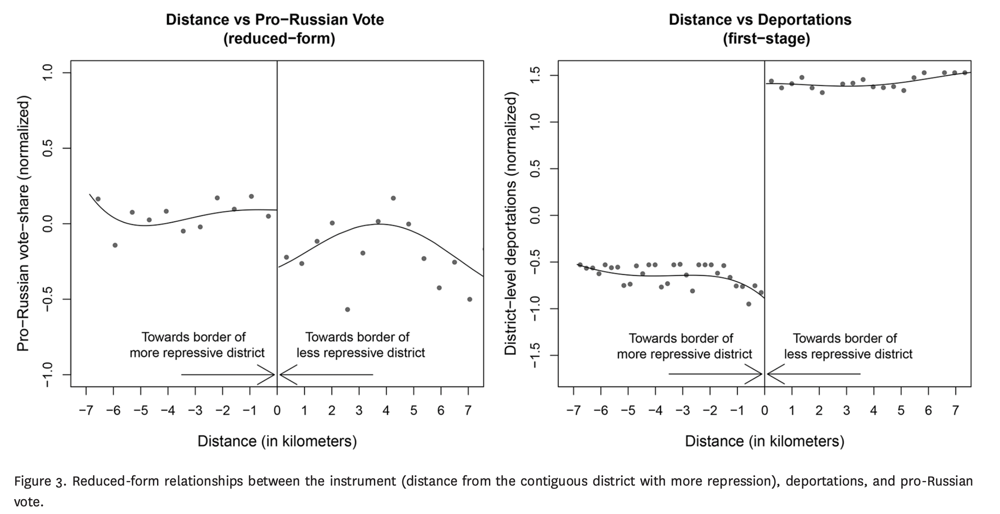

# Peculiarities of GRD (Keele and Titiunik, 2015)

1. *Compound* treatments — multiple treatments that affect the outcome of interest simultaneously;
2. Different measures of distance from the cutoffs may require different identification assumptions and affect fundamentally the interpretation of the results;
3. Spatial variation in treatment effects can be mapped to specific locations, which can be used to detect geographic areas where the identification assumptions are more (or less) likely to hold.

# Failure of one-dimensional distance to single out individual boundary points

\centering
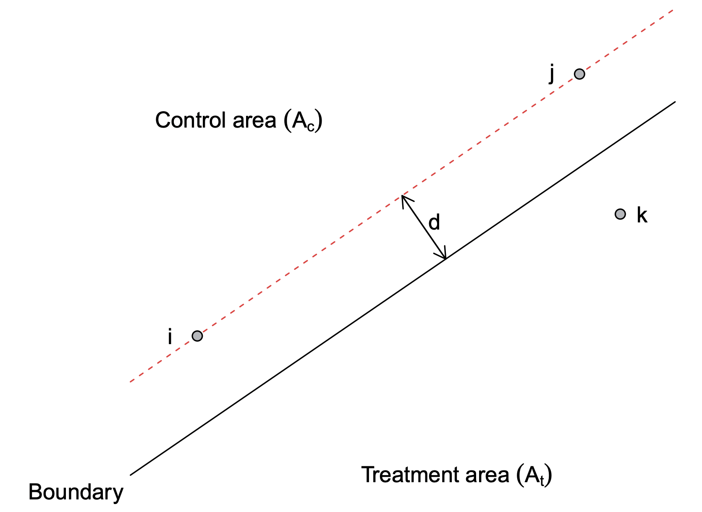

# Recommendations for practice 

- **Data:**
  - researchers need to collect geographic data
(addresses, latitude and longitude, or other geographic information that can be used for geocoding) along with more traditional covariates;
  - qualitative research on the history of the border and conditions around it will often prove useful to justify various assumptions.
- **Falsification tests:**
  - researchers should at least rule out nonzero treatment effects
on predetermined covariates, which can be easily implemented using covariates as outcomes in the estimation for each boundary point.
- **Isolating the treatment**:
  - restrict the analysis to areas around the border where other important geographically defined institutional units are kept constant on either side of border.


# Difference-in-discontinuities

\centering
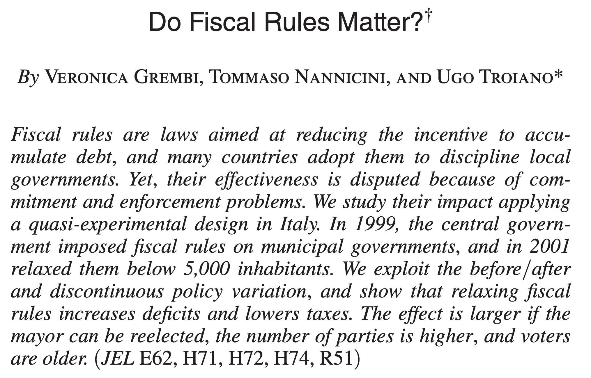


# Difference-in-discontinuities

- Grembi et al. (2016) investigate the effect of the fiscal policy on municipality outcomes;
- In 2001, fiscal rules were relaxed for municipalities with below
5,000 inhabitants in Italy;
- Though below/above 5,000 seems a standard regression
discontinuity cutoff, there is another policy that the mayor’s salary sharply changes at the 5,000 inhabitants threshold;
- In this context, before/after 2001 forms comparable groups to cancel out the confounding effect of the mayor’s salary treatment.

# Estimation in Diff-in-disc design

\centering
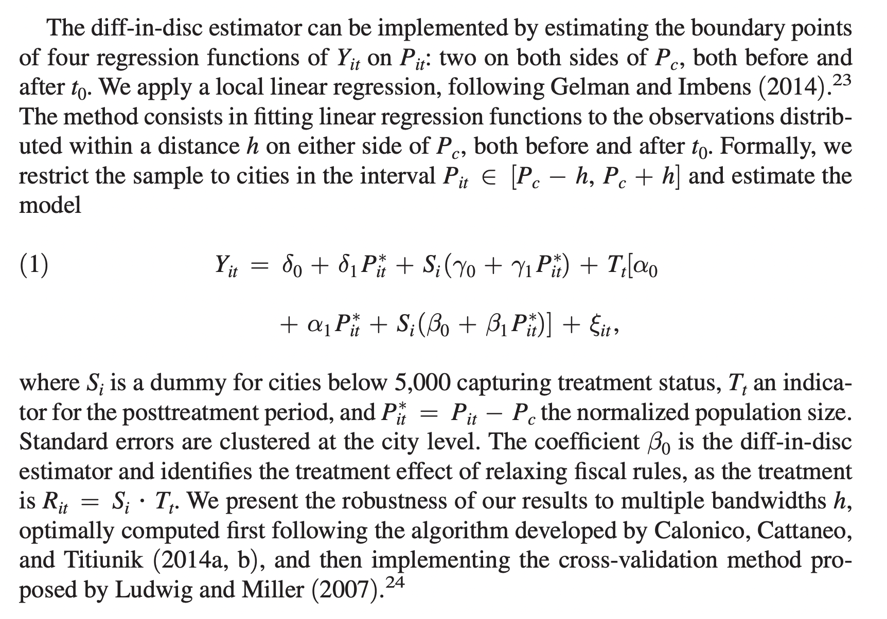

# Bonus: PCRD

- Marshall (2022) studies RD designs where \( D_i \) = some characteristic of winning politician
  - E.g. the effect of having a female politician in office
  - Sample restricted to close races between a woman and a man

- This is an unusual setup:
  - Standard RDD: effect of winning (e.g. on candidate longevity) $\to$ observe outcomes for both winners and losers
  - Here: effect of being female _conditional on winning_ $\to$ only observe outcomes for winners (or the district)

# Bonus: PCRD

How do we interpret the estimand?

- Standard issue: being female is an attribute not a cause — a bundle of characteristics
- Additional issue in RDDs: consider a characteristic \( W_i \) uncorrelated with \( D_i \) among all candidates
  - Suppose both \( D_i \) and \( W_i \) affect vote shares
  - Then among close races, \( D_i \) and \( W_i \) will be correlated — "compensating differential"

Is this a bias or a different interpretation/mechanism?

- Marshall (2022) argues for bias: it's not the effect of changing \( D_i \) while holding other characteristics fixed


