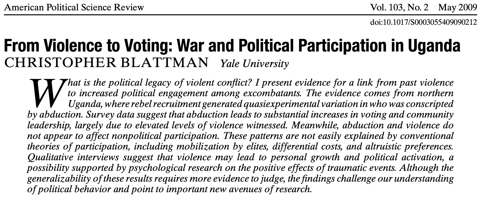

# Plan
- Refresher on DAGs, Bootstrap and FWL 
- Treatment Effect Heterogeneity
- Omitted Variable Bias 
- Specification Error

# DAGs
```{r,message=FALSE,warning=FALSE}
library(dagitty)
library(ggdag)
model <- dagitty("dag{x->y; u1->x; u1->z; u2->z; u2->y}")
latents(model) <- c("u1", "u2")
coordinates(model) <-  list(
  x = c(x=1, u1=1, z=2, u2=3, y=3),
  y = c(x=1, u1=2, z=2, u2=2, y=1))
```

# DAGs

```{r,message=FALSE,warning=FALSE}
ggdag(model) + theme_dag()
```


# DAGs
```{r,message=FALSE,warning=FALSE}
# simulate data (linear model)
n <- 1e4
u1 <- rnorm(n)
u2 <- rnorm(n)
z <- u1 + u2 + rnorm(n)
x <- u1 + rnorm(n)
y <- x - 4*u2 + rnorm(n)
# unadjusted estimate is *not* confounded!
lm(y ~ x)
```


# DAGs
```{r,message=FALSE,warning=FALSE}
# adjusting for Z induces bias!
lm(y ~ x + z)
```


# Frisch-Waugh-Lovell theorem
- Linear model with $K$ covariates. In matrix form: $y = X'\beta + \varepsilon$
- FWL gives a formula for the OLS estimate of the $k^{th}$ coefficient.

$$
\hat{\beta}_k = (X'_{k}M_{[X_{-k}]}X_{k})^{-1}X'_{k}M_{[X_{-k}]}y
$$

Equivalent to the following:

- Regress the individual variable $X_k$ on all the other covariates and take the residuals
- Regress the outcome variable $y$ on all the covariates, except $X_k$, and take the residuals
- Regress the residuals of $y$ on the residuals for $X$
- Note that to get $\hat{\beta}_k$ it is enough to regress the non-residualized $y$ on residualized $X_k$ (why?), but the SE won't be right

# FWL in R

```{r,message=FALSE,warning=FALSE}
set.seed(123) 
N <- 1000 
X <- rnorm(N, mean = 0, sd = 1) 
# Generate binary treatment D, making D and X correlated
D <- rbinom(N, size = 1, prob = plogis(X)) 
Y <- 2*D + 0.5*X + rnorm(N, mean = 0, sd = 1) 
model_ols <- lm(Y ~ D + X)
coef(model_ols) 
```

# FWL in R
```{r,warning=FALSE,message=FALSE}
resid_Y <- residuals(lm(Y ~ X))
resid_D <- residuals(lm(D ~ X))
model_fwl <- lm(resid_Y ~ resid_D - 1) 
coef(model_fwl) 
```

# Cluster bootstrap
- Most commonly used: Wild Cluster Bootstrap (Restricted)
- Run the regression, estimate $\hat{\beta}$ and $t$
- To test the null hypothesis: run the regression under the null hypothesis (i.e. setting $\beta=0$)
- Resample clusters. For each cluster, multiply the residuals by +1 or -1 with equal chance
- Predict new $y$s with the new residuals and imposing $\beta=0$
- Re-estimate the model for all parameters and find $\hat{\beta}_b$
- Compute $t$-statistic $t_b$ from the new estimates
- Repeat many times
- Compute bootstrap p-values by counting the share of simulated $t_b$ to the left/right of the observed one $t$

# Cluster bootstrap
In R:

- Option `cluster` in `sandwich::vcovBS()`
- The package `fwildclusterboot` is a translation of Stata's `boottest` (same options)
- Function `boottest` works with objects of class `lm`, `felm`, `fixest`
- Another option is the package `multiwaycov` and the function `cluster.boot` which can be used for post-estimation SE calculation (e.g. in `coeftest` or `stargazer`)

# ATT (from Cyrus' slides)

- ATT (Average Treatment Effect on the Treated)
\begin{align*}
\rho_{\text{ATT}} &= \mathbb{E}[Y_{1i} - Y_{0i} | D_i = 1] \\
&= \mathbb{E}_{X|D=1}\{ \mathbb{E}[Y_{1i} - Y_{0i} | X_i, D_i = 1] \} \\
&= \mathbb{E}_{X|D=1}\{ \mathbb{E}[Y_{1i} | X_i, D_i = 1] - \mathbb{E}[Y_{0i} | X_i, D_i = 1] \} \\
&= \mathbb{E}_{X|D=1}\{ \mathbb{E}[Y_{1i} | X_i, D_i = 1] - \mathbb{E}[Y_{0i} | X_i, D_i = 0] \}. 
\end{align*}

- Let \(\delta_x = \mathbb{E}[Y_{1i} | X_i = x, D_i = 1] - \mathbb{E}[Y_{0i} | X_i = x, D_i = 0]\). 
- For \(X_i\) discrete, unbiased ``matching estimator'', $\hat{\rho}_{\text{ATT}}$:

\[\hat{\rho}_{\text{ATT}} = \sum_x \hat{\delta}_x \cdot \Pr[X_i = x | D_i = 1]\]

\[\mathbb{E}[\hat{\rho}_{\text{ATT}}] = \sum_x \delta_x \cdot \Pr[X_i = x | D_i = 1]\]

\[ = \frac{\sum_x \delta_x \cdot \Pr[D_i = 1|X_i = x] \cdot \Pr[X_i = x]}{\sum_x \Pr[D_i = 1|X_i = x] \cdot \Pr[X_i = x]}\]

# Multiple Regression (from Cyrus' slides)
- FWL computes the  OLS estimator for the
coefficient on $D_i$:
\[
\hat{\delta}_R = \frac{\sum_{i=1}^N Y_i \tilde{D}_i}{\sum_{i=1}^N \tilde{D}_i^2} \overset{a}{\rightarrow} \frac{\text{Cov}(Y_i, \tilde{D}_i)}{\text{Var}(\tilde{D}_i)}
\]
\[
= \frac{\sum_x \text{Cov}(Y_i, \tilde{D}_i | X_i = x) \Pr[X_i = x]}{\sum_x \text{Var}(\tilde{D}_i | X_i = x) \Pr[X_i = x]}
\]
\[
= \frac{\sum_x \text{Cov}(Y_{0i} + \rho_i D_i, \tilde{D}_i | X_i = x) \Pr[X_i = x]}{\sum_x \text{Var}(\tilde{D}_i | X_i = x) \Pr[X_i = x]}
\]
\[
= \frac{\sum_x \text{Cov}(\rho_i D_i, \tilde{D}_i | X_i = x) \Pr[X_i = x]}{\sum_x \text{Var}(\tilde{D}_i | X_i = x) \Pr[X_i = x]}
\]
\[
= \frac{\sum_x \mathbb{E}(\rho_i D_i \tilde{D}_i | X_i = x) \Pr[X_i = x]}{\sum_x \text{Var}(\tilde{D}_i | X_i = x) \Pr[X_i = x]}
\]
\[
= \frac{\sum_x \delta_x \text{Var}(D_i | X_i = x) \Pr[X_i = x]}{\sum_x \text{Var}(D_i | X_i = x) \Pr[X_i = x]}
\]
\[
= \frac{\sum_x \delta_x \Pr[D_i = 1|X_i = x](1 - \Pr[D_i = 1|X_i = x]) \Pr[X_i = x]}{\sum_x \Pr[D_i = 1|X_i = x](1 - \Pr[D_i = 1|X_i = x]) \Pr[X_i = x]}.
\]

# ATT Matching vs Regression (from Cyrus' slides)

- 
Compare:
\[
\mathbb{E}[\hat{\rho}_{\text{ATT}}] = \frac{\sum_x \delta_x \Pr[D_i = 1|X_i = x] \Pr[X_i = x]}{\sum_x \Pr[D_i = 1|X_i = x] \Pr[X_i = x]}.
\]

versus
\[
\hat{\delta}_R \overset{a}{\rightarrow} \frac{\sum_x \delta_x [\Pr[D_i = 1|X_i = x](1 - \Pr[D_i = 1|X_i = x])] \Pr[X_i = x]}{\sum_x [\Pr[D_i = 1|X_i = x](1 - \Pr[D_i = 1|X_i = x])] \Pr[X_i = x]}.
\]

- Both are weighted averages of \(\delta_x\)'s, but \(\hat{\rho}_{\text{ATT}}\) aggregates via population weighting while \(\hat{\delta}_R\) aggregates via conditional variance weighting wrt \(D_i\).
- Population weighting is unbiased for population target.
- Conditional variance weighting is not.

# Effective sample
- From Angrist and Krueger (1999), Angrist and Pischke (2009), Aronow and Samii (2016), the following result holds:

$$
\hat{\beta}\,{\buildrel p \over \to}\,\frac{E[w_i \tau_i]}{E[w_i]} \text{, where } w_i = (D_i - E[D_i|X_i])^2 
$$

where 

$$
E[w_i|X_i] = E[ (D_i - E[D_i|X_i])^2|X_i)] = Var[D_i|X_i]
$$

- Conditional variance weighting equivalent to run the regression on an *effective* sample different from the one we think we are working with
- To characterize the effective sample we can estimate the $w_i$s


# Effective sample
$$
E[w_i|X_i] = E[{\color{blue} (D_i - E[D_i|X_i])^2}|X_i] = Var[D_i|X_i]
$$

- If we assume linearity of the treatment assignment in $X_i$, the weight is equal to the square of the residual from regressing the treatment indicator on $X_i$
- Higher conditional variance of treatment $\implies$ more variance not explained by the covariates $\implies$ higher error term
- To estimate the regression weights:
   - Run the regression $D_i = X_i\gamma + e_i$
   - Take residual $\hat{e}_i = D_i - X_i \hat{\gamma}$ and square it

# Example #1

\centering
{width=400}


# Oversight and Ideology (Table 1 from the paper)
\tiny
```{r,warning=FALSE,message=FALSE}
load('t1-oversight.Rds')
m1 <- lm(d.casework ~ agency + idno + cong +
             seniority + comm + chair + ranking + budget.millions +
             cs.distance, data=dat[which(dat$agency!='Federal Deposit Insurance Corporation'),])
m2 <- lm(d.policy ~ agency + idno + cong +
             seniority + comm + chair + ranking + budget.millions +
             cs.distance, data=dat[which(dat$agency!='Federal Deposit Insurance Corporation'),])
m3 <- lm(d.total ~ agency + idno + cong +
             seniority + comm + chair + ranking + budget.millions +
             cs.distance, data=dat)
```

# Oversight and Ideology (Table 1 from the paper)
\tiny
```{r,warning=FALSE,message=FALSE,echo=FALSE}
# Load the necessary library
library(stargazer)
stargazer(m1, m2, m3, type = "text", 
          title = "Regression Results",
          column.labels = c("Casework","Policy","Both"),
          covariate.labels = c("Committee", "Chair", "Ranking Member", "Distance"),
          dep.var.labels.include = FALSE,
          omit = c("agency", "idno", "cong", "seniority", "budget.millions"),
          keep = c("comm", "chair", "ranking", "cs.distance"),
          omit.stat = c("f", "ser", "adj.rsq"),
          intercept.bottom = FALSE,
          intercept.top = TRUE)
```
# Ideology of Effective Legislator Sample
\tiny
```{r,warning=FALSE,message=FALSE}
M <- lm(cs.distance ~ agency + idno + cong +
            seniority + comm + chair + ranking + budget.millions, data=dat)
d.tilde <- as.numeric(residuals(M))
w <- d.tilde^2 
w1 <- tapply(w, dat$idno, mean) 
w2 <- tapply(w, dat$agency, mean)
R <- lm(comm ~ agency + idno + cong +
            seniority + chair + ranking + budget.millions + cs.distance, data=dat)
d.tilde <- as.numeric(residuals(R))
w <- d.tilde^2 
w3 <- tapply(w, dat$idno, mean) 
w4 <- tapply(w, dat$agency, mean) 
```

```{r,message=FALSE,warning=FALSE,include=FALSE}
require(mfx)
require(ggplot2)
require(extrafont)
require(data.table)
require(table)
require(clusterSEs)
require(lmtest)
require(sandwich)
require(doBy)
require(RColorBrewer)
load('f6-voteview.Rds')
b <- data.frame(w1)
setDT(b, keep.rownames = TRUE)[]
b$rn <- as.numeric(b$rn)
names(b)[1] <- 'idno'
qnt <- quantile(b$w1,seq(0,1,.25))
b$weight <- as.numeric(cut(b$w1,unique(qnt),include.lowest=TRUE))
c <- merge(vv,b,by='idno',all.x=T)
c <- c[complete.cases(c),]
c <- c[rep(row.names(c), c$weight), 1:3]
```

# Ideological Distance

```{r,warning=FALSE,message=FALSE,echo=FALSE}
ggplot() +  geom_density(data=c, alpha=1, aes(x=mc.cs1,fill='Weighted')) + 
    geom_density(data=vv, alpha=.85, aes(x=mc.cs1,fill='Unweighted')) +
    scale_fill_manual(name='Sample',values=c('#a51417','#ABABAB')) +
    xlab('Commonspace DW-NOMINATE') + ylab('Density') + theme_bw() +
    theme(strip.text.x = element_text(size = 15))

```

# Committee Membership

```{r, message=FALSE,warning=FALSE,include=FALSE}
b <- data.frame(w3)
setDT(b, keep.rownames = TRUE)[]
b$rn <- as.numeric(b$rn)
names(b)[1] <- 'idno'
qnt <- quantile(b$w3,seq(0,1,.25))
b$weight <- as.numeric(cut(b$w3,unique(qnt),include.lowest=TRUE))
c <- merge(vv,b,by='idno',all.x=T)
c <- c[complete.cases(c),]
c <- c[rep(row.names(c), c$weight), 1:3]
```

```{r,message=FALSE,warning=FALSE,echo=FALSE}
ggplot() +  geom_density(data=c, alpha=1, aes(x=mc.cs1,fill='Weighted')) + 
    geom_density(data=vv, alpha=.85, aes(x=mc.cs1,fill='Unweighted')) +
    scale_fill_manual(name='Sample',values=c('#a51417','#ABABAB')) +
    xlab('Commonspace DW-NOMINATE') + ylab('Density') + theme_bw() +
    theme(strip.text.x = element_text(size = 15))
```

# Example 2 (code taken from Giacomo Lemoli)
\centering
{width=400}

# Application: weather and global warming beliefs

\footnotesize
```{r,warning=FALSE,message=FALSE}
# Import the data
library(haven)
library(dplyr)
d <- read_dta("gwdataset.dta")

# Import state IDs
zips <- read_dta("zipcodetostate.dta")
zips <- zips %>% select(c(statenum, statefromzipfile)) %>% unique()
zips <- zips %>% filter(!(statenum == 8 & statefromzipfile == "NY"))

# Import population data
pops <- read.csv("population_ests_2013.csv")

# Format
pops$state <- tolower(pops$NAME)
d$getwarmord <- as.double(d$getwarmord)
```


# Weather and global warming beliefs

\footnotesize
```{r,warning=FALSE,message=FALSE}
# Estimate primary model of interest:
d$doi <- factor(d$doi)
d$statenum <- factor(d$statenum)
d$wbnid_num <- factor(d$wbnid_num)
Y <- "getwarmord"
D <- "ddt_week"
X <- names(d)[c(15,17,42:72)]
reg_formula <- paste0(Y, "~", D, "+", paste0(X, collapse = "+"))
reg_out <- lm(as.formula(reg_formula), d)

# Or
out <- lm(getwarmord~ddt_week+educ_hsless+educ_coll+educ_postgrad+
          educ_dk+party_rep+party_leanrep+party_leandem+
          party_dem+male+raceeth_black+raceeth_hisp+
          raceeth_notwbh+raceeth_dkref+age_1824+age_2534+
          age_3544+age_5564+age_65plus+age_dk+ideo_vcons+
          ideo_conservative+ideo_liberal+ideo_vlib+ideo_dk+
          attend_1+attend_2+attend_3+attend_5+attend_6+
          attend_9+as.factor(doi)+as.factor(statenum)+
          as.factor(wbnid_num),d)


```


# Base Model
\footnotesize
```{r,warning=FALSE,message=FALSE}
summary(reg_out)$coefficients[1:10,]
```


# Estimate the weights

\footnotesize
```{r,warning=FALSE,message=FALSE}
# Regress treatment indicator on the vector of covariates
D_formula <- paste0(D, "~", paste0(X, collapse = "+"))
outD <- lm(as.formula(D_formula), d)

# Extract the residuals and take their square
eD2 <- residuals(outD)^2
```


# Effective sample statistics

\footnotesize
```{r,warning=FALSE,message=FALSE}
# Take some relevant variables
compare_samples<- d[, c("wave", "ddt_week", "ddt_twoweeks",
  "ddt_threeweeks", "party_rep", "attend_1", "ideo_conservative",
  "age_1824", "educ_hsless")]

# Compute statistics with and without weights
compare_samples <- t(apply(compare_samples,2,function(x) 
  c(mean(x),sd(x),weighted.mean(x,eD2),
    sqrt(weighted.mean((x-weighted.mean(x,eD2))^2,eD2)))))
colnames(compare_samples) <- c("Nominal Mean", "Nominal SD",
      "Effective Mean", "Effective SD")
```

# Effective Sample Statistics
\scriptsize
```{r,warning=FALSE,message=FALSE}
compare_samples
```


# Effective sample maps
\footnotesize
```{r,warning=FALSE,message=FALSE}
# Construct the "effective sample weights" for each state
wts_by_state <- tapply(eD2, d$statenum, sum)
wts_by_state <- wts_by_state/sum(wts_by_state)*100
wts_by_state <- data.frame(eff = wts_by_state, 
                           statenum = as.numeric(names(wts_by_state)))

# Merge to the state name variable
data_for_map <- merge(wts_by_state, zips, by="statenum")

# Construct the "nominal sample weights" for each state
wts_by_state <- tapply(rep(1,6726),d$statenum,sum)
wts_by_state <- wts_by_state/sum(wts_by_state)*100
wts_by_state <- data.frame(nom = wts_by_state, 
                           statenum = as.numeric(names(wts_by_state)))

# Add to the other data
data_for_map <- merge(data_for_map, wts_by_state, by="statenum")
```


# Effective sample maps
\tiny
```{r,warning=FALSE,message=FALSE}
# Get correct state names
require(maps,quietly=TRUE)
data(state.fips)

# Add them to the dataset
data_for_map <- left_join(data_for_map, state.fips,
                          by = c("statefromzipfile" = "abb"))

# More data prep
data_for_map$state <- sapply(as.character(data_for_map$polyname),
                             function(x)strsplit(x,":")[[1]][1])
data_for_map <- data_for_map %>% group_by(statefromzipfile) %>%
  summarise_all(first) %>% ungroup() %>% select(-polyname)

# Diff between nominal and effective weights
data_for_map$diff <- data_for_map$eff - data_for_map$nom

# Merge with population data
data_for_map <- left_join(data_for_map, pops, by="state")

# Actual "weight" of each state in the US
data_for_map$pop_pct <- data_for_map$POPESTIMATE2013/sum(
  data_for_map$POPESTIMATE2013)*100

# Different representativity of the two samples
data_for_map <- mutate(data_for_map,
                       pop_diff_eff = eff - pop_pct,
                       pop_diff_nom = nom - pop_pct)
data_for_map <- mutate(data_for_map, 
                       pop_diff = pop_diff_eff - pop_diff_nom)

require(ggplot2,quietly=TRUE)
state_map <- map_data("state")
```

# More setup
\tiny
```{r,warning=FALSE,message=FALSE}
# Plot the weights in each sample
plot_eff <- ggplot(data_for_map, aes(map_id = state)) +
  geom_map(aes(fill=eff), map = state_map) +
  expand_limits(x= state_map$long, y = state_map$lat) +
  scale_fill_continuous("% Weight", limits=c(0,17), low="white", high="black") +
  labs(title = "Effective Sample") +
  theme(legend.position=c(.2,.1),legend.direction = "horizontal",
        axis.line = element_blank(), axis.text = element_blank(),
        axis.ticks = element_blank(), axis.title = element_blank(),
        panel.background = element_blank(), 
        plot.background = element_blank(),
        panel.border = element_blank(), 
        panel.grid = element_blank())


plot_nom <- ggplot(data_for_map, aes(map_id = state)) +
  geom_map(aes(fill=nom), map = state_map) +
  expand_limits(x=state_map$long, y=state_map$lat) +
  scale_fill_continuous("% Weight", limits=c(0,17), low="white", high="black") + 
  labs(title="Nominal Sample") +
  theme(legend.position=c(.2,.1),legend.direction = "horizontal",
        axis.line = element_blank(), axis.text = element_blank(),
        axis.ticks = element_blank(), axis.title = element_blank(),
        panel.background = element_blank(), 
        plot.background = element_blank(),
        panel.border = element_blank(), panel.grid = element_blank())


```

# Maps
\footnotesize
```{r,,warning=FALSE,message=FALSE, fig.cap='',fig.height=3,fig.width=7, fig.align="center"}
require(gridExtra,quietly=TRUE)
grid.arrange(plot_nom,plot_eff,ncol=2)
```

# Setup comparison plot
\footnotesize
```{r,warning=FALSE,message=FALSE}
plot_diff <- ggplot(data_for_map,aes(map_id=state)) +
  geom_map(aes(fill=diff), map = state_map) +
  expand_limits(x = state_map$long, y = state_map$lat) +
  scale_fill_gradient2("% Weight", low = "red", mid = "white", high = "black") +
  labs(title = "Effective Weight minus Nominal Weight") +
  theme(legend.position=c(.2,.1),legend.direction = "horizontal",
        axis.line = element_blank(), axis.text = element_blank(), 
        axis.ticks = element_blank(), axis.title = element_blank(),
        panel.background = element_blank(), 
        plot.background = element_blank(),
        panel.border = element_blank(), panel.grid = element_blank())

```

# Difference in weights
\tiny
```{r,fig.cap='',fig.height=2.8,fig.width=3.8, fig.align="center"}
plot_diff
```


# Sensitivity analysis 

- Suppose the true model includes covariates;
- If omit covariates, then the coefficient on $D_i$ is
\begin{equation*}
\frac{\text{Cov}(Y_i, D_i)}{\text{Var}(D_i)} = \rho + \underbrace{\gamma' \delta}_{\text{"omitted variable bias"}}
\end{equation*}
- Following Cinelli & Hazlett (2020) OVB = “confounder
impact $\gamma$ × imbalance $\delta$”
- According to Cinelli & Hazlett 
\begin{equation*}
\hat{\left| \text{bias} \right|} = \hat{\text{se}}(\hat{r}_{\text{res}}) \sqrt{\frac{R^2_{Y \sim Z | D, X} R^2_{D \sim Z | X}}{1 - R^2_{D \sim Z | X}}} (\text{df}).
\end{equation*}

# Example 
\centering
{width=400}

# Impact of Abduction on Social and Political Participation
\tiny
```{r, message=FALSE,warning=FALSE}
library(sensemakr)
data <- read_dta("SWAY_I_June2013.dta")
newdata <- subset(data, found == 1)
# use weighted regression
wls <- lm(vote05 ~ abd + age + I(age^2) + I(age^3) + 
            C_ach + C_akw + C_ata + C_kma + C_oro +
            C_pad + C_paj + fthr_ed + fthr_ed0 +
            mthr_ed + mthr_ed0 + no_fthr96 + 
            no_mthr96 + hh_fthr_frm + hh_size96 +
            hh_land + hh_cattle + hh_stock + hh_plow,
          data = newdata, weights = w_sel_abs)
```

#  Impact of Abduction on Social and Political Participation

```{r,warning=FALSE,message=FALSE,echo=FALSE}
stargazer(wls, type = "text", 
          title = "Regression Results",
          column.labels = c("Voted in 2005"),
          covariate.labels = c("Abducted"),
          dep.var.labels.include = FALSE,
          keep = "abd",
          omit.stat = c("f", "ser", "adj.rsq"),
          intercept.bottom = FALSE,
          intercept.top = TRUE)
```

# Sensitivity Analysis
\tiny
```{r,message=FALSE,warning=FALSE}
sensitivity_1 <- sensemakr(wls, treatment = "abd",
                           benchmark_covariates = c("age"),kd =1:3)
plot(sensitivity_1)
```

# Sensitivity Analysis

```{r,message=FALSE,warning=FALSE}
plot(sensitivity_1,sensitivity.of = "t-value")
```

