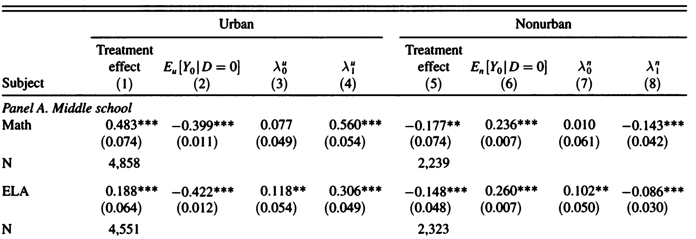
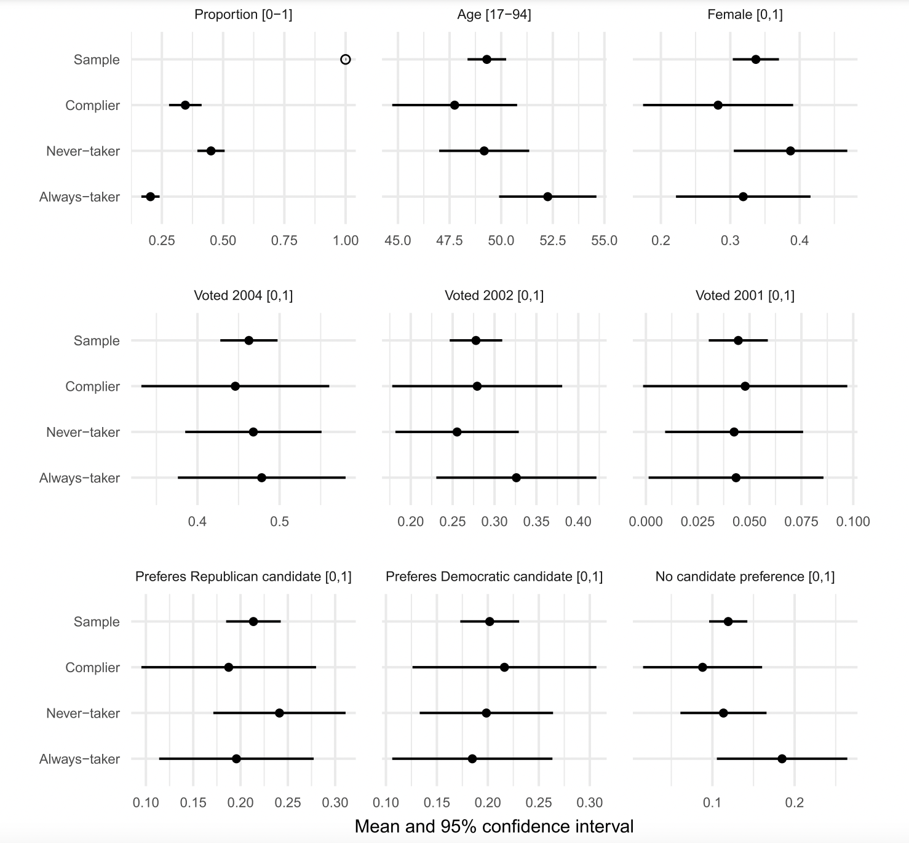

# Plan

- IV basics
- Characterizing Compliers
- Weak Instruments
- Practical Recommmendations

# DAG

{width=400}

# IV in practice: peasant unrest and representation


# The effect of unrest on representation
\tiny
```{r,message=FALSE,warning=FALSE}
library(haven); library(AER); library(stargazer)
data <- read_dta("DFGN_cleaned.dta")

## OLS
olsfit <- lm(peasantrepresentation_1864 ~ afreq + distance_moscow + 
               goodsoil + lnurban + lnpopn + 
               province_capital, data)

## IV (1): serfdom
ivfit1 <- ivreg(peasantrepresentation_1864 ~ afreq + distance_moscow + 
                  goodsoil + lnurban + lnpopn + province_capital | serfperc1 +
                  distance_moscow + goodsoil + lnurban + lnpopn +
                  province_capital, data=data)

## IV (2): religious polarization
ivfit2 <- ivreg(peasantrepresentation_1864 ~ afreq + distance_moscow + 
                  goodsoil + lnurban + lnpopn + province_capital | religpolarf4_1870 + 
                  distance_moscow + goodsoil + lnurban + lnpopn +
                  province_capital, data=data)

mod <- list(olsfit, ivfit1, ivfit2)
ses <- lapply(mod, function(x) coeftest(x, vcov = vcovHC(x, type = "HC1"))[,"Std. Error"])
labs <- c("", "Z: % serfs", "Z: religious pol.")

```


# The effect of peasant unrest on representation
\tiny
```{r,warning=FALSE,message=FALSE}
stargazer(mod, se = ses, column.labels = labs, omit.stat = c("f", "ser"), type = "text",omit=c("Constant"))

```


# Applications Discussion

- Randomized experiments with noncompliance
- Papers using a lagged version of the treatment as an instrument
- Miguel, Satyanath and Sergenti (2004), "Economic Shocks and Civil Conflict."
- Aronow, Carnegie and Marinov, "The Effects of Foreign Aid on Rights and Governance."
- Angrist (1990), "Lifetime Earnings and the Vietnam Era Draft Lottery."
- Gerber, Green, Shachar (2003), "Voting May Be Habit-forming."
- Acemoglu et al. (2011), "The Consequences of Radical Reform: The French Revolution."


# IV with Heterogeneous Treatment Effects 

- Binary instrument $Z_i \in \{0, 1\}$
- Binary treatment $D_z \in \{0, 1\}$ is potential treatment status given $Z = z$
- Potential outcomes: $Y_i(D, Z) = \{Y(1, 1), Y(1, 0), Y(0, 1), Y(0, 0)\}$
- Heterogeneous treatment effects $\beta_i = Y_i(1) - Y_i(0)$
- Note that with constant treatment effect it is enough to use structural equations.


# Compliance Types 

* Four compliance types (or principal strata) in this setting:
  * Complier $D_i(1) = 1$ and $D_i(0) = 0$
  * Always-taker $D_i(1) = D_i(0) = 1$
  * Never-taker $D_i(1) = D_i(0) = 0$
  * Defier $D_i(1) = 0$ and $D_i(1) = 1$
  
* Connections between observed data and compliance types:

|           | $Z_i = 0$                       | $Z_i = 1$                       |
|-----------|---------------------------------|---------------------------------|
| $D_i = 0$ | Never-taker or Complier         | Never-taker or Defier           |
| $D_i = 1$ | Always-taker or Defier          | Always-taker or Complier        |

* Let $\pi_{co}$, $\pi_{at}$, $\pi_{nt}$, and $\pi_{de}$ be the proportions of each type.

# IV Assumptions

* Canonical IV assumptions for $Z_i$ to be a valid instrument:
  1. Randomization of $Z_i$
  2. Presence of some compliers $\pi_{co} \neq 0$ (first-stage)
  3. Exclusion restriction $Y_i(z, d) = Y_i(z', d)$
  4. Monotonicity: $D_i(1) \geq D_i(0)$ for all $i$ (no defiers)

* Implies ITT effect on treatment equals proportion compliers: $ITT_{D} = \pi_{co}$

* Implies ITT for the outcome has the same interpretation:

$$
ITT_{Y} = ITT_{Y,co} \pi_{co} + \underbrace{ITT_{Y,at}}_\text{=0 (ER)} \pi_{at} + \underbrace{ITT_{Y,nt}}_\text{=0 (ER)} \pi_{nt} + ITT_{Y,de} \underbrace{\pi_{de}}_\text{=0 (mono)}
$$
$$ = ITT_{Y,co} \pi_{co} $$

* $\approx$ same identification result: $\tau_{LATE} = \frac{ITT_Y}{ITT_D}$

# LATE Theorem

**Theorem:** Under assumptions 1 - 4:  
\[
\frac{E[Y_i|Z_i = 1] - E[Y_i|Z_i = 0]}{E[D_i|Z_i = 1] - E[D_i|Z_i = 0]} = E[Y_{1i} - Y_{0i}|D_{1i} > D_{0i}]
\]

**Proof.**  

Start with the first bit of the Wald estimator:

\[
E[Y_i|Z_i = 1] 
= E[Y_{0i} + (Y_{1i} - Y_{0i})D_i|Z_i = 1]
\]
\[
= E[Y_{0i} + (Y_{1i} - Y_{0i})D_{1i}]
\]

# LATE Theorem
**Proof.**  

Similarly
\[
E[Y_i|Z_i = 0] = E[Y_{0i} + (Y_{1i} - Y_{0i})D_{0i}]
\]

So the numerator of the Wald estimator is
\[
E[Y_i|Z_i = 1] - E[Y_i|Z_i = 0] = E[(Y_{1i} - Y_{0i})(D_{1i} - D_{0i})]
\]

Monotonicity means \(D_{1i} - D_{0i}\) equals one or zero, so
\[
E[(Y_{1i} - Y_{0i})(D_{1i} - D_{0i})] = E[Y_{1i} - Y_{0i}|D_{1i} > D_{0i}]P[D_{1i} > D_{0i}].
\]

A similar argument shows
\[
E[D_i|Z_i = 1] - E[D_i|Z_i = 0] = P[D_{1i} > D_{0i}].
\]

# Better LATE than never or vice versa?

- Angrist, Imbens, and others: The LATE cup is half full. We don't get the average effect on a stable population (like the average treatment effect on the treated) but we get something that still makes some
sense (particularly for policy).

- Heckman, Deaton, and others: The LATE cup is half empty (or all empty!): We don't get what we want, the average treatment effect on the treated, so IV is somewhat useless, and we need to augment it with something else to produce economically meaningful parameters (e.g. more structural econometric models).

\centering
{width=300}

# Getting under IV hood

It can often be useful to characterize the compliers of a given IV

* E.g., to hint at mechanisms, contextualize findings, or reconcile findings across different (quasi-)experiments

Of course we can’t tell if \( D_i(1) > D_i(0) \) for any given \( i \). But it turns out we can still learn about compliers *on average*. We’ll step through:

1. Average potential outcomes: \( E[Y_i(d) | D_i(1) > D_i(0)] \) for \( d \in \{0, 1\} \)
2. Characteristics: \( E[W_i | D_i(1) > D_i(0)] \) for baseline \( W_i \)
3. Abadie's Kappa

This is all easier than they might seem...

# Separating Treated and Untreated Outcomes

Suppose we want to know \( E[Y_i(1) | D_i(1) > D_i(0)] \) in the basic IA setup

Trick: Consider IV on the modified outcome \( \tilde{Y_i} = Y_i D_i \) instead of \( Y_i \)

* Potential outcomes: \( \tilde{Y_i}(1) = Y_i(1) \), and \( \tilde{Y_i}(0) = 0 \)
* Hence "treatment effects": \( \tilde{Y_i}(1) - \tilde{Y_i}(0) = Y_i(1) - 0 = Y_i(1) \)
* Check: exclusion, independence, and monotonicity still hold with \( \tilde{Y_i} \)
* Hence IV identifies LATE: \( E[\tilde{Y_i}(1) | D_i(1) > D_i(0)] \)

Similar logic shows that IV of \( \tilde{Y_i} = Y_i(1 - D_i) \) on \( \tilde{D_i} = 1 - D_i \) identifies a LATE of \( E[\tilde{Y_i}(1) - \tilde{Y_i}(0) | D_i(1) > D_i(0)] = E[Y_i(0) | D_i(1) > D_i(0)] \)

Such an easy bonus analysis to any $ivreg$!

# Illustration: Angrist, Pathak, and Walters (2013)
\centering
{width=400}


# Illustration: Angrist, Pathak, and Walters (2013)

{width=400}
Decomposing
\[
LATE = \underbrace{E[Y_i(1) | D_i(1) > D_i(0)] - E[Y_i(0) | D_i = 0]}_\text{$\lambda_1$}
\]
\[
- \underbrace{(E[Y_i(0) | D_i(1) > D_i(0)] - E[Y_i(0) | D_i = 0])}_\text{$\lambda_0$}
\]
shows that charter compliers have typical counterfactual achievement

# Complier Summary Statistics

We can use the same trick to estimate \( E[W_i | D_i(1) > D_i(0)] \):

* IV of \( W_iD_i \) on \( D_i \), instrumenting with \( Z_i \)
* IV of \( W_i(1 - D_i) \) on \( (1 - D_i) \), instrumenting with \( Z_i \)
* Some weighted average of the two

Testing that these two approaches indeed estimate the same thing can be shown to be equivalent to a balance regression of \( W_i \) on \( Z_i \)

* "Stacking" the two specifications up, and estimating a single \( E[W_i | D_i(1) > D_i(0)] \) with two IVs, automates the weights+overid. test

Fun to compare with \( E[W_i | D_i(1) = D_i(0) = 1] \) = \( E[W_i | D_i = 1, Z_i = 0] \) and \( E[W_i | D_i(1) = D_i(0) = 0] \) = \( E[W_i | D_i = 0, Z_i = 1] \)


# Illustration: Angrist, Hull, and Walters (2023)
\centering
{width=250}


# Illustration: Angrist, Hull, and Walters (2023)
\centering
{width=350}

# Abadie's Kappa (2003)

Suppose assumptions of LATE theorem hold conditional on covariates \( X \). Let \( g(\cdot) \) be any measurable real function of \( Y, D, X \) with finite expectation. We can show that the expectation of \( g \) is a weighted sum of the expectation in the three groups


\[
E[g|X] = \underbrace{E[g|X, D_1 > D_0] Pr(D_1 > D_0|X)}_\text{Compliers} + 
\]
\[
+\underbrace{E[g|X, D_1 = D_0 = 1] Pr(D_1 = D_0 = 1|X)}_\text{Always Takers}
\]
\[
+ \underbrace{E[g|X, D_1 = D_0 = 0] Pr(D_1 = D_0 = 0|X)}_\text{Never Takers}
\]

# Abadie's Kappa (2003)

Rearranging terms gives us then,
\[
E[g(Y, D, X)|D_1 > D_0] = \frac{E[k \cdot g(Y, D, X)]}{Pr(D_1 > D_0)} = \frac{E[k \cdot g(Y, D, X)]}{E[k]}
\]
where
\[
k_i = \frac{D(1 - Z)}{1 - Pr(Z = 1|X)} - \frac{(1 - D)Z}{Pr(Z = 1|X)}
\]

* This result can be applied to \textit{any characteristic or outcome and get its mean for compliers
by removing the means for never and always takers}.
* Standard example: average covariate value among compliers: $E[X|D_1 > D_0] = \frac{E[kX]}{E[k]}$

# Illustration: Mullainathan, Washington, and Azari (2009)

- Do debates truly provide citizens with information that influences their opinions or choices?
- During the 2005 election season, in the days leading up to the final debate between mayoral incumbent Republican Michael Bloomberg and Democratic challenger Fernando Ferrer, the authors interviewed a random sample of 1,000 New York City voters
- They randomly assigned these 1,000 individuals to one of two groups: they asked the treatment group to watch the November 1 debate, and they asked the control group to watch a “placebo” program, PBS’s The NewsHour with Jim Lehrer, which aired opposite WNBC’s debate broadcast. 
- They find that those in the watch group were 6 percentage points more likely to report that their opinions of one or both candidates had changed from the first to the second interview.


# Illustration: Mullainathan, Washington, and Azari (2009)
```{r,warning=FALSE,message=FALSE, include=FALSE}
library(haven)
library(dplyr)
library(AER)
debate<-read_dta("/Users/diasahmetbekov/Downloads/M_Washington_A_Chapter_2010_Dataset_EDITED.dta")
debate$actwatch<-(debate$watchdps1==1|debate$watchdps2==1)
debate$actwatch[is.na(debate$actwatch)]<-FALSE
debate$actwatch<-as.numeric(debate$actwatch)
```
\tiny
```{r,warning=FALSE,message=FALSE}
# watch is Z, actwatch is D, age is X
# using a standard logit/probit for Pr(Z=1|X).
mod <- glm(watch ~ age, family = binomial(link = "logit"),
           data = debate, na.action = na.exclude)
debate$watch_hat <- predict(mod, type = "response")
# generate kappa
debate <-debate %>%mutate(
k=1-((actwatch*(1-watch))/(1-watch_hat))-((1-actwatch)*watch/watch_hat))
# compute avg age of complier 
avg_complier_age = weighted.mean(debate$age, debate$k,na.rm = T)
avg_complier_age

```

# Profiling Compliers and Noncompliers (Marbach & Hangartner 2020)

- Subjects assigned to the control group who take the treatment are “observable”
always-takers, and subjects assigned to the treatment group who do not take the treatment
are “observable” never-takers;
- Observable and nonobservable always-takers and nevertakers, respectively, have the same covariate distribution (the instrument is independently assigned) $\to$ can directly estimate the covariate means for these two subpopulations;
- By subtracting the weighted covariate mean of observable always-takers and never-takers from the covariate mean of the entire sample, we can back out the covariate mean for compliers.

# Illustration: Gerber, Karlan, and Bergan (2009)
\centering
{width=400}


# Illustration: Gerber, Karlan, and Bergan (2009)
\centering
{width=320}

# Weak Instruments

The probability limit of the IV estimator is given by:

\[
\text{plim} \ \hat{\alpha}_{IV} = \frac{\text{Cov}[Y, Z]}{\text{Cov}[Z, D]} + \frac{\text{Cov}[Z, u_2]}{\text{Cov}[Z, D]} = \alpha_D + \frac{\text{Cov}[Z, u_2]}{\text{Cov}[Z, D]}
\]

The second term is non-zero if the instrument is not exogenous. Let \(\sigma^2_{u_1}\) be the variance of the first stage error and \(F\) be the F statistic of the first-stage. Then, the bias in IV is

\[
\text{E}[\hat{\alpha}_{IV} - \alpha] = \frac{\sigma_{u_1 u_2}}{\sigma^2_{u_2}} \left( \frac{1}{F + 1} \right)
\]

If the first stage is weak, the bias approaches \(\frac{\sigma_{u_1 u_2}}{\sigma^2_{u_2}}\). As \(F\) approaches infinity, \(B_{IV}\) approaches zero.

# Weak Instrument: Simulation
\tiny
```{r,warning=TRUE,message=TRUE}
set.seed(123) # For reproducibility
n <- 1000 # Number of observations
beta_true <- 2 # True effect of the treatment on the outcome
simulate_2SLS <- function(n, beta_true, corr_strength) {
  Z <- rnorm(n) 
  X <- rnorm(n, mean = corr_strength * Z) 
  epsilon <- rnorm(n) # 
  Y <- X * beta_true + epsilon 
  first_stage <- lm(X ~ Z)
  second_stage <- ivreg(Y ~ X | Z)
  return(summary(second_stage)$coef[2, 1])
}
beta_hat_strong <- simulate_2SLS(n, beta_true, corr_strength = 0.9)
beta_hat_weak <- simulate_2SLS(n, beta_true, corr_strength = 0.1)
```

```{r,warning=FALSE,message=FALSE,echo=FALSE}
cat("Estimated treatment effect with strong instrument:", beta_hat_strong, "\n")
cat("Estimated treatment effect with weak instrument:", beta_hat_weak, "\n")
```

# Test for weak instruments

- Use the F-statistic of the first-stage regression
- Stock \& Yogo (2005): provide critical values for rejecting the null of weak instrument
- Results based on assumption of homoskedastic errors, hardly satisfied (Andrews, Stock \& Sun 2019)
- Solutions: Robust F statistic. Equivalent to Kleibergen-Paap statistic for the case of a single regressor (Andrews, Stock \& Sun 2019)
- Reported automatically by `ivreg2` in Stata
- Solutions: Effective first-stage F-statistic (Montiel Olea \& Pflueger 2013)
- Equivalent to robust F in the just-identified case
- With one instrument, Effective F can be compared to Stock \& Yogo critical values
- With multiple instruments, use the critical values in Montiel Olea \& Pflueger

# Recommendations (Lal et al. 2023): Design

- Prior to using an IV strategy, consider how selection bias may be affecting treatment
effect estimates obtained through OLS. If the main concern is underestimating an already
statistically significant treatment effect, an IV strategy may not be necessary.
- During the research design phase, consider whether the chosen instrument can realistically create random or quasi-random variations in treatment assignment while remaining
excluded from the outcome equation.

# Recommendations (Lal et al. 2023): Characterizing the first-stage

- Calculate and report $F_{Eff}$ for the first stage, taking into account heteroscedasticity and clustering structure as needed. However, do not discard a design simply because $F_{Eff}<0$.
- If $d$ and $z$ are continuous, plot $d$ against its predicted values $\hat{d}$ (with covariates and fixed effects already partialled out from both) and visually verify whether their relationship aligns with theoretical expectations.

# Recommendations (Lal et al. 2023): Hypothesis testing and inference

- \textbf{Option 1}. \textit{t-test with $F_{Eff}$ pretesting}. If $F_{Eff}$ < 10, choose Options 2 or 3. Utilize
conservative methods like \textit{bootstrap-t} and \textit{bootstrap-c} if outliers or group structures are
present.
- \textbf{Option 2}. \textit{tF procedure}. For single treatment and instrument cases, adjust $t$-test critical
values based on FEff.
- \textbf{Option 3}. \textit{Direct testing}. Apply weak-instrument-robust procedures, such as the AR test.

# Recommendations (Lal et al. 2023): Communicating your findings

- Present OLS and IV estimates alongside CIs from various inferential methods in a graphical format, like in figure below These CIs may not concur on statistical significance, but they collectively convey the findings’ robustness to different inferential approaches.
- Remember to report first-stage and reduced-form estimation results, including 95% CIs for coefficients, as they offer insight into both instrument strength and statistical power.


# Recommendations (Lal et al. 2023): Communicating your findings (cont.)

Example of McClendon (2014):

\centering
{width=400}

# Recommendations (Lal et al. 2023): Additional diagnostics

- If you expect the OLS results to be upward biased, be concerned if the 2SLS estimator
yields much larger estimates.
- If there is good reason to believe that treatment effects on compliers are significantly
larger in magnitude than those on non-compliers, explain this through profiling of these
principal strata (Abadie, 2003; Marbach and Hangartner, 2020).
- If it is possible to identify an observational analogue of “never takers” or a subset of
them, conduct a placebo test by estimating the effect of the instrument on the outcome
of interest in this ZFS (Zero-first-stage) sample. Using results from the ZFS test, obtain local-to-zero IV
estimates and CIs and compare them to the original estimates and CIs. 