# Plan 
- DiD: a quick review
- Violations of PT
- SC method

# Staggered Timing

- Remember that in the canonical DiD model we had:
  - Two periods and a common treatment date
  - Identification from parallel trends and no anticipation
  - A large number of clusters for inference
- A very active recent literature has focused on relaxing the first assumption: what if there are multiple periods and units adopt treatment at different times?
- This literature typically maintains the remaining ingredients: parallel trends and many clusters

# Overview of Staggered Timing Literature

1. Negative results: TWFE OLS doesn’t give us what we want with treatment effect heterogeneity
2. New estimators: perform better under treatment effect heterogeneity


# Staggered timing set-up

- Panel of observations for periods $t = 1, ..., T$
- Suppose units adopt a binary treatment at different dates $G_i \in \{1, ..., T\} \cup \infty$ (where $G_i = \infty$ means “never-treated”)
  - Literature is now starting to consider cases with continuous treatment & treatments that turn on/off – that lit is still developing
- Potential outcomes $Y_{it}(g)$ – depend on time and time you were first-treated

# Extending the Identifying Assumptions

- The key identifying assumptions from the canonical model are extended in the natural way
- **Parallel trends**: Intuitively, says that if treatment hadn't happened, all "adoption cohorts" would have parallel average outcomes in all periods
    $$ E[Y_{it}(\infty) - Y_{i,t-1}(\infty)|G_{i} = g] = E[Y_{it}(\infty) - Y_{i,t-1}(\infty)|G_{i} = g'] $$
    $$ \text{ for all } g, g', t $$
  
  Note: can impose slightly weaker versions (e.g. only require PT post-treatment)

- **No anticipation**: Intuitively, says that treatment has no impact before it is implemented
    $$ Y_{it}(g) = Y_{it}(\infty) \text{ for all } t < g $$


# Negative weights

- Suppose we again run the regression

    $$ Y_{it} = \alpha_{i} + \phi_{t} + D_{it}\beta + \varepsilon_{it}, $$

  where \( D_{it} = 1[t \geq G_{i}] \) is a treatment indicator.

- Suppose we're willing to assume no anticipation and parallel trends across all adoption cohorts as described above

- Good news: if treatment effects are constant across time and units, \( Y_{it}(g) - Y_{it}(\infty) = \tau \), then \( \beta = \tau \)

- Bad news: if treatment effects are heterogeneous, then \( \beta \) may put negative weights on treatment effects for some units and time periods

    → E.g., if treatment effect depends on time since treatment, \( Y_{it}(t - r) - Y_{it}(\infty) = \tau_{r} \), then some \( \tau_{r} \)s may get negative weight


# Where do these negative results come from?

- The intuition for these negative results is that the TWFE OLS specification combines two sources of comparisons:

  1. **Clean comparisons**: DiD's between treated and not-yet-treated units
  2. **Forbidden comparisons**: DiD's between two sets of already-treated units (who began treatment at different times)

- These forbidden comparisons can lead to negative weights: the "control group" is already treated, so we run into problems if their treatment effects change over time


# Some intuition for forbidden comparisons

- Consider the two period model, except suppose now that our two groups are **always-treated units** (treated in both periods) and **switchers** (treated only in period 2)

- With two periods, the coefficient \( \beta \) from \( Y_{it} = \alpha_{i} + \phi_{t} + D_{it}\beta + \varepsilon_{it} \) is the same as from the first-differenced regression \( \Delta Y_{i} = \alpha + \Delta D_{i}\beta + u_{i} \)

- Observe that \( \Delta D_{i} \) is one for switchers and zero for stayers. That is, the stayers are the control group! Thus,

  $$ \hat{\beta} = \underbrace{\left( \overline{Y}_{Switchers,2} - \overline{Y}_{Switchers,1} \right)}_\text{Change for switchers} - \underbrace{\left( \overline{Y}_{AT,2} - \overline{Y}_{AT,1} \right)}_\text{Change for always treated} $$

- Problem: if the treatment effect for the always-treated grows over time, that will enter \( \hat{\beta} \) negatively!

# Second Intuition for Negative Weights

- The Frisch-Waugh-Lovell theorem says that we can obtain the coefficient \( \beta \) in \( Y_{it} = \alpha_{i} + \phi_{t} + D_{it}\beta + \varepsilon_{it} \) by the following two-step procedure.

- First, regress the treatment indicator \( D_{it} \) on the FEs (a linear probability model):
  
  $$ D_{it} = \tilde{\alpha}_{i} + \tilde{\phi}_{t} + \tilde{\varepsilon}_{it} $$

- Then run a univariate regression of \( Y_{it} \) on \( D_{it} - \tilde{D}_{it} \) to obtain \( \beta \).

  $$ \beta = \frac{\text{Cov}(Y_{it}, D_{it} - \tilde{D}_{it})}{\text{Var}(D_{it} - \tilde{D}_{it})} = \frac{E(Y_{it}(D_{it} - \tilde{D}_{it}))}{\text{Var}(D_{it} - \tilde{D}_{it})} $$

- However, it's well known that the linear probability model for \( D_{it} \) may have predictions outside the unit interval. If \( \tilde{D}_{it} > 1 \) even though unit \( i \) is treated in period \( t \), then \( D_{it} - \tilde{D}_{it} < 0 \), and thus \( Y_{it} \) gets negative weight.


# Solutions: Use “Clean Comparisons”

Callaway & Sant'Anna (2020), Sun & Abraham (2021), and de Chaisemartin & D’Haultfoeuille propose alternative estimators that aggregate simple “clean” comparisons

- E.g. only compare “switchers” in time $t$ to never-treated units or units not treated until time $t$ to identify switcher ATEs
- Can choose how to average ATEs (as before)

Careful sample + regressor choice can automate things with OLS. Recall

$$ Y_{it} = \beta D_{it} + \alpha_{i} + \tau_{t} + W'_{i}\gamma_{t} + V_{it} $$

identifies a variance-weighted average of within-group DiDs when \( W_{i} \) contains group indicators and \( T = 2 \)

- Can use this to “stack” groups containing clean two-period comparisons (just don’t forget to cluster by repeated observations!)


# Regression-Based Solutions

Borusyak et al. (2021), Wooldridge (2021), and Gardner (2021) propose “imputation” estimators that estimate counterfactual \( Y_{it}(0) \) directly

- E.g. regress \( Y_{it} \) on unit and time FE in \( D_{it} = 0 \) cells, then average \( \hat{Y}_{it}(1) - \hat{Y}_{it}(0) \) in \( D_{it} = 1 \) cells (sound familiar?)

These use more variation (i.e. more pre-treatment periods), so are likely to yield more precise estimates than Callaway & Sant'Anna

- They also work for any approach based on a model for \( Y(0) \), not just TWFE / parallel trends
- Sometimes they can also be automated with OLS (see Wooldridge)


# Comparisons of new estimators

- Callaway and Sant'Anna also propose an analogous estimator using not-yet-treated rather than never-treated units.

- Sun and Abraham (2021) propose a similar estimator but with different comparisons groups (e.g. using last-to-be treated rather than not-yet-treated)

- Borusyak et al. (2021), Wooldridge (2021), Gardner (2021) propose “imputation” estimators that estimate the counterfactual \( \hat{Y}_{it}(0) \) using a TWFE model that is fit using only pre-treatment data
  - Main difference from C&S is that this uses more pre-treatment periods, not just period \( g - 1 \)
  - This can sometimes be more efficient (if outcome not too serially correlated), but also relies on a stronger PT assumption that may be more susceptible to bias

- Roth and Sant'Anna (2021) show that you can get even more precise estimates if you're willing to assume treatment timing is "as good as random"


# HTE Robust estimators (Chiu et al., 2023)

\centering
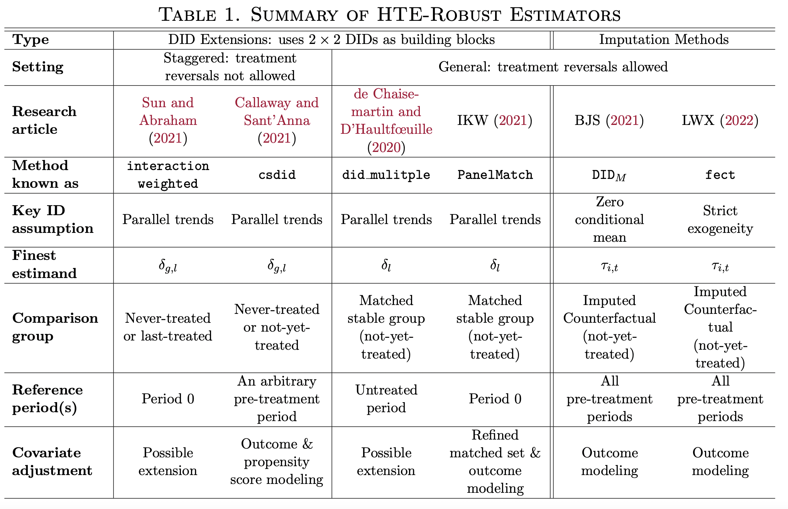


# Should we use them all?

\centering
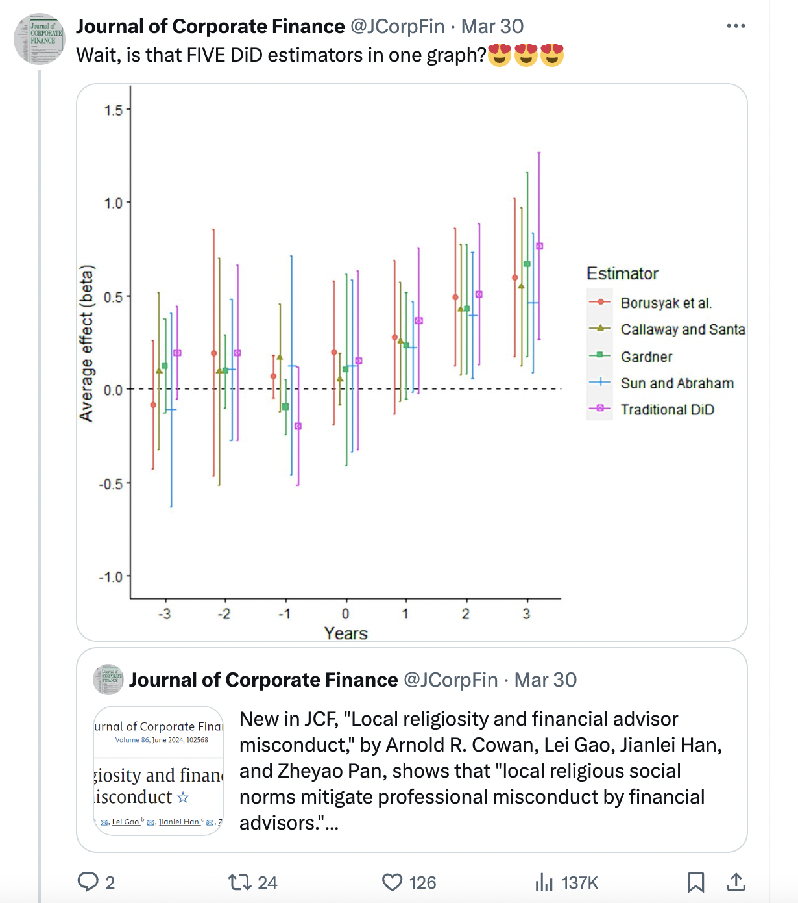


# Should we use them all?

\centering
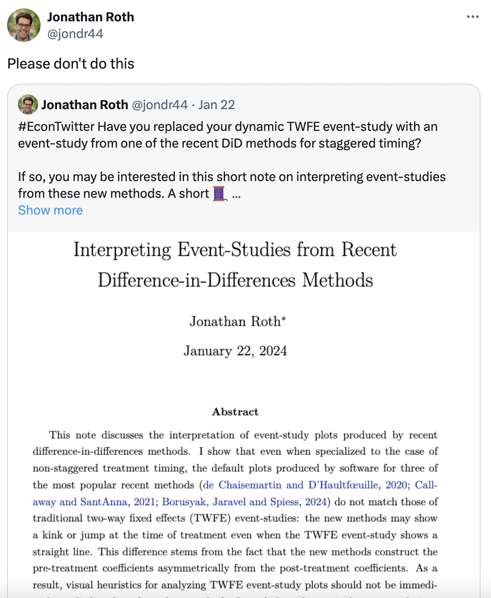

# Advice

- Don’t freak out about this new literature!
- In most cases, using the “new” DiD methods will not lead to a big change in your results (empirically, TE heterogeneity is not that large in most cases)
  - The exceptions are cases where there are periods where almost all units are treated – this is when “forbidden comparisons” get the most weight
- The most important thing is to be precise about who you want the comparison group to
be and to choose a method that only uses these “clean comparisons”
-  The difference between the new estimators seems to be typically not that large


# Violations of parallel trends

- Three substrands of this literature:
  - Parallel trends only conditional on covariates
  - Testing for violations of (conditional) parallel trends
  - Sensitivity analysis and bounding exercises
- We will focus on the latter two

# Why might we be skeptical of PT?

- Recall PT requires the selection bias to be constant over time.
Why might we be skeptical of this?
- There might be different confounding factors in period 1 as in period 0
  - E.g. states that pass a minimum wage increase might also change unemployment insurance at the same time
  - Then UI is a confound in period 1 but not in period 0
- The same confounding factors may have different effects on the outcome in different time periods
  - Suppose people who enroll in a job training program are more motivated to find a job
  - Motivation might matter more in a bad economy than in a good economy
  
# Why might we be skeptical of PT?

- Another reason to be skeptical of parallel trends is that its validity will often be functional form dependent

- Consider an example:
  - In period 0, all control units have outcome 10; all treated units have outcome 5.
  - In period 1, all control units have outcome 15.
  - If treatment hadn’t occurred, would treated units’ outcome have increased by 5 also (PT in levels)?
  - Or would they have increased by 50% (~ PT in logs)?
  
# Functional form

Roth and Sant'Anna (2023) show that PT will depend on functional form unless:

- **Randomization**: treated and control group have same dist. of $Y(0)$ in each period
- **No time effects**: distribution of $Y(0)$ doesn’t change over time for either group
- **A hybrid**: $\theta$  fraction of the population is as good as randomized; the other $1-\theta$ fraction has no time effects.

Absent these conditions, PT will be violated for at least some functional form; often hard to know if we chose the right one!

# Pre-trends to the rescue...

- Luckily, in most DiD applications we have several periods before anyone was treated
- We can test whether the groups were moving in parallel prior to the treatment
  - If so, then assumption that confounding factors are stable seems more plausible
  - If not, then it’s relatively implausible that would have magically started moving in parallel after treatment date
- Testing for pre-trends provides a natural plausibility check on the parallel trends assumption


# Overview of Limitations of pre-trends

- Parallel pre-trends doesn’t necessarily imply parallel (counterfactual) post-treatment trends
  - If other policies change at the same time as the one of interest — e.g. min wage and UI reform together — can produce parallel pre-trends but non-parallel post-trends
  - Likewise, could be that treated/control groups are differentially exposed to recessions, but there is only a recession in the post-treatment period
- Low power: even if pre-trends are non-zero, we may fail to detect it statistically
- Pre-testing issues: if we only analyze cases without statistically significant pre-trends, this introduces a form of selection bias (which can make things worse)

# Issue 1 - Low Power

\centering
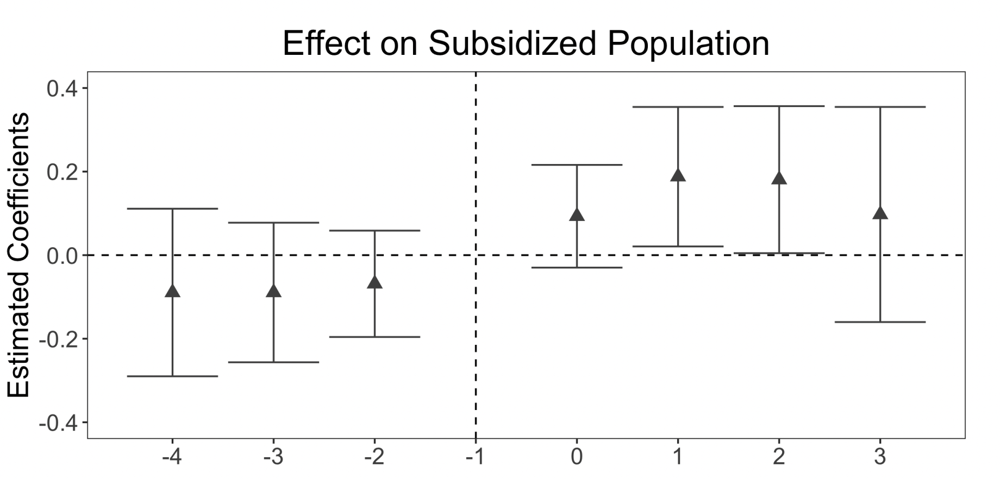{width=350}

- He & Wang (2017) study impacts of placing college grads as village officials in China
- Use an “event-study” approach comparing treated and untreated villages


# Issue 1 - Low Power

\centering
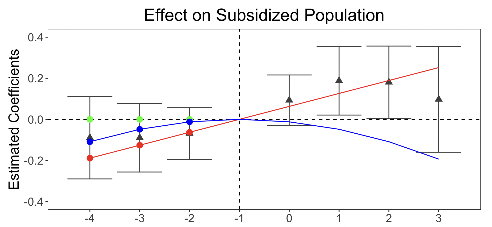{width=350}

- P-value for \( H_0 : \beta_{pre} = \) green dots (no pre-trend): 0.81
- P-value for \( H_0 : \beta_{pre} = \) red dots: 0.81
- P-value for \( H_0 : \beta_{pre} = \) blue dots: 0.81
- We can’t reject zero pre-trend, but we also can’t reject pre-trends that under smooth extrapolations to the
post-treatment period would produce substantial bias

# Issue 2 - Distortions from Pre-testing

- When parallel trends is violated, we will sometimes fail to find a significant pre-trend
- But the draws of data where this happens are a **selected sample**. This is known as *pre-test bias*.
- Analyzing this selected sample introduces additional statistical issues, and can make things worse!

# Stylized Three-Period DiD Example

- Consider a 3-period model (t = -1, 0, 1) where treatment occurs in last period

- No causal effect of treatment: \( Y_{it}(0) = Y_{it}(1) \) in all periods

- In population, treatment group is on a linear trend relative to the control group with slope \( \delta \)
  - Control group mean in period t: \( E[Y_{it}(0) | \text{Control group}] = 0 \)
  - Treatment group mean in period t: \( E[Y_{it}(0) | \text{Treated group}] = \delta \cdot t \)

- Simulate from this model with \( Y_{it} \) equal to the group mean plus independent normal errors


# 

\centering
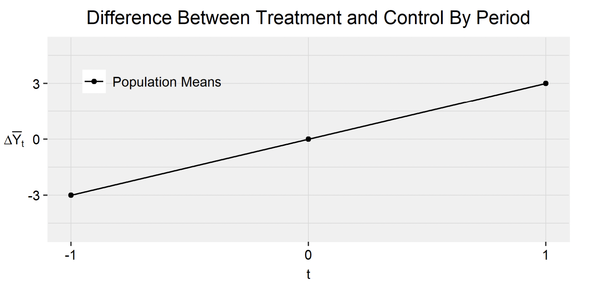{width=350}

- Example: In population, there is a linear difference in trend with slope 3

# 
\centering
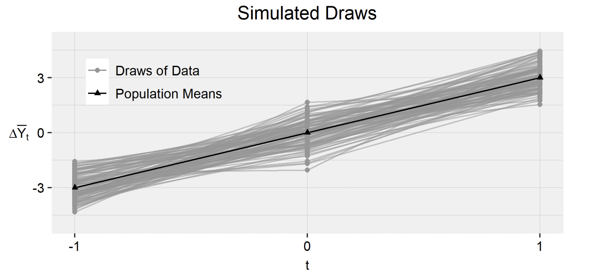{width=350}

- Example: In population, there is a linear difference in trend with slope 3
- In actual draws of data, there will be noise around this line


# 
\centering
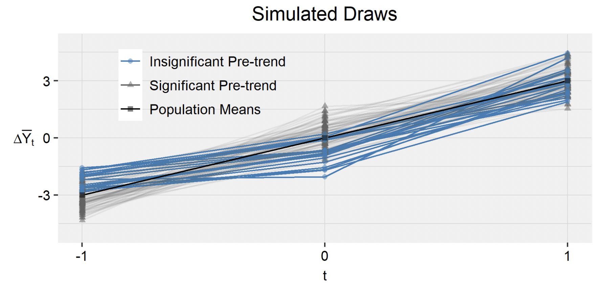{width=350}

- In some of the draws of the data, highlighted in blue, the difference between period -1 and 0 will be insignificant
- In the insignificant draws, we tend to underestimate the difference between treatment and control at $t = 0$.


# 

\centering
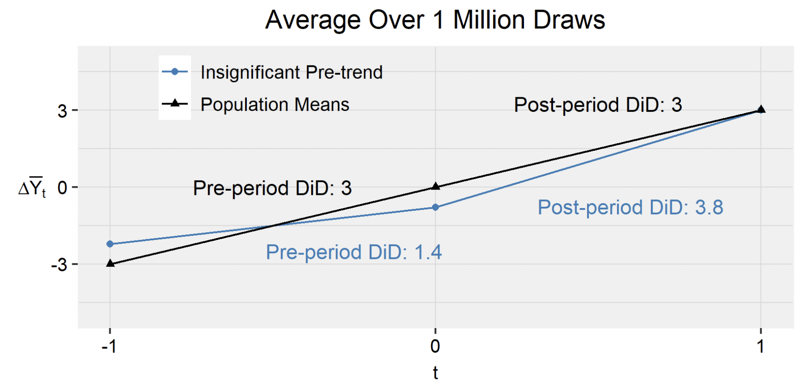{width=350}

- In the insignificant draws, we tend to underestimate the difference between treatment and control at t = 0
- As a result, the DiD between period 0 and 1 tends to be particularly large when we get an insignificant pre-trend

# To Summarize

**What are the Limitations of Pre-trends Testing?**

1. Low Power – May not find significant pre-trend even if PT is violated
2. Pre-testing Issues – Selection bias from only analyzing cases with insignificant pre-trend
3. If reject pre-trends test, what comes next?

**What Can We Do About It?**

1. Diagnostics of power and distortions from pre-testing (Roth, 2022, “Pre-Test with Caution...”). See `pretrends` package. 
2. Formal sensitivity analysis that avoids pre-testing (Rambachan and Roth, 2023, “A More Credible Approach...”). See `HonestDiD` package.


# “A More Credible Approach to Parallel Trends"

-  The intuition motivating pre-trends testing is that the pre-trends are informative about counterfactual post-treatment trends
- Formalize this by imposing the restriction that the counterfactual difference in trends can’t be “too different” than the pre-trend
- This allows us to bound the treatment effect and obtain uniformly valid (“honest”) confidence sets under the imposed restrictions
- Enables sensitivity analysis: How different would the counterfactual trend have to be from the pre-trends to negate a conclusion (e.g. a positive effect)?

# Restrictions on Violations of PT

- Consider the 3-period model (t = -1, 0, 1) where treatment occurs in last period

- Let \( \delta_1 \) be the violation of PT:

  $$ \delta_1 = \mathbb{E}[Y_{i,t=1}(0) - Y_{i,t=0}(0) | D_i = 1] - \mathbb{E}[Y_{i,t=1}(0) - Y_{i,t=0}(0) | D_i = 0] $$

- We don’t directly identify \( \delta_1 \), but we do identify its pre-treatment analog, \( \delta_{-1} \):


  $$ \delta_{-1} = \mathbb{E}[Y_{i,t=-1}(0) - Y_{i,t=0}(0) | D_i = 1] - \mathbb{E}[Y_{i,t=-1}(0) - Y_{i,t=0}(0) | D_i = 0] $$

- Key idea: restrict possible values of \( \delta_1 \) given \( \delta_{-1} \)
  Intuitively, counterfactual trend can’t be too different from pre-trend
  
# Examples of Restrictions on $\delta$

- Bounds on relative magnitudes: Require that \( |\delta_1| \leq \tilde{M}|\delta_{-1}| \)

- Smoothness restriction: Bound how far \( \delta_1 \) can deviate from a linear extrapolation of the pre-trend: \( \delta_1 \in [-\delta_{-1} - M, -\delta_{-1} + M] \)

\centering
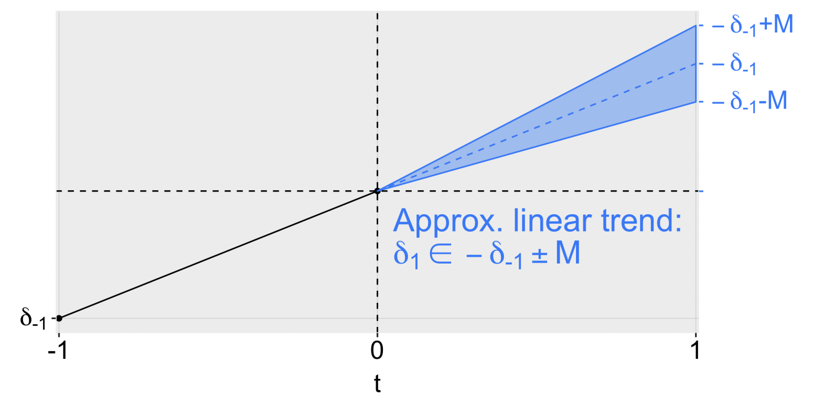{width=300}

# Robust confidence intervals

- In the paper, the authots develop confidence intervals for the treatment effect of interest under the assumptions on \( \delta \) discussed above

- The CIs account for the fact that we don’t observe the true (population) pre-trend \( \delta_{pre} \), only our estimate \( \hat{\beta}_{pre} \).

- The robust CIs tend to be wider the larger are the confidence intervals on the pre-trends – intuitive, since if we know less about the pre-trends, we should have more uncertainty

- This contrasts with pre-trends tests, where you’re less likely to reject the null that \( \beta_{pre} = 0 \) when the SEs are larger!

# Example usage – Medicaid expansions
\tiny
```{r,warning=FALSE,message=FALSE}
library(here)
library(dplyr)
library(did)
library(haven)
library(ggplot2)
library(fixest)
library(HonestDiD)

df <- read_dta("https://raw.githubusercontent.com/Mixtape-Sessions/Advanced-DID/main/Exercises/Data/ehec_data.dta")
head(df,5)
```

# Example usage – Medicaid expansions

 We  restrict the sample to the years 2015 and earlier, and drop the small number of states who are first treated in 2015. We are now left with a panel dataset where some units are first treated in 2014 and the remaining units are not treated during the sample period. We can then estimate the effects of Medicaid expansion using a canonical two-way fixed effects event-study specification:
\[
Y_{it} = \alpha_{i} + \lambda_{t} + \sum_{\substack{s \neq 2013}} 1_{\{s = t\}} \times D_{i} \times \beta_{s} + u_{it}
\]
where D is 1 if a unit is first treated in 2014 and 0 otherwise.

\tiny
```{r, warning=FALSE,message=FALSE}
#Keep years before 2016. Drop the 2016 cohort
df_nonstaggered <- df %>% filter(year < 2016 &
                                 (is.na(yexp2)| yexp2 != 2015) )
#Create a treatment dummy
df_nonstaggered <- df_nonstaggered %>% mutate(D = case_when( yexp2 == 2014 ~ 1,T ~ 0))
#Run the TWFE spec
twfe_results <- fixest::feols(dins ~ i(year, D, ref = 2013) | stfips + year,
                        cluster = "stfips",
                        data = df_nonstaggered)

betahat <- summary(twfe_results)$coefficients #save the coefficients
sigma <- summary(twfe_results)$cov.scaled #save the covariance matrix
```

# Example usage – Medicaid expansions

```{r,warning=FALSE,message=FALSE}
fixest::iplot(twfe_results)
```


# Sensitivity analysis using relative magnitudes restrictions
\tiny
```{r, warning=FALSE,message=FALSE}
delta_rm_results <-
HonestDiD::createSensitivityResults_relativeMagnitudes(
                                    betahat = betahat, #coefficients
                                    sigma = sigma, #covariance matrix
                                    numPrePeriods = 5, #num. of pre-treatment coefs
                                    numPostPeriods = 2, #num. of post-treatment coefs
                                    Mbarvec = seq(0.5,2,by=0.5) #values of Mbar
                                    )

delta_rm_results
```

# Sensitivity analysis using relative magnitudes restrictions
\tiny
```{r, warning=FALSE,message=FALSE}
originalResults <- HonestDiD::constructOriginalCS(betahat = betahat,
                                                  sigma = sigma,
                                                  numPrePeriods = 5,
                                                  numPostPeriods = 2)

HonestDiD::createSensitivityPlot_relativeMagnitudes(delta_rm_results, originalResults)
```

# Sensitivity Analysis Using Smoothness Restrictions
\tiny
```{r,warning=FALSE,message=FALSE}
delta_sd_results <-
  HonestDiD::createSensitivityResults(betahat = betahat,
                                      sigma = sigma,
                                      numPrePeriods = 5,
                                      numPostPeriods = 2,
                                      Mvec = seq(from = 0, to = 0.05, by =0.01))

delta_sd_results
```

# Sensitivity Analysis Using Smoothness Restrictions

```{r,warning=FALSE,message=FALSE}
createSensitivityPlot(delta_sd_results, originalResults)
```

# DiD vs. synthetic control method (SCM)

DiD uses the simple average of untreated units ("donors") as the control:

$$
\hat{\tau}_{NT} = Y_{NT} - \frac{1}{N_0} \sum_{i=1}^{N_0} Y_{iT} - \frac{1}{T_0} \sum_{t=1}^{T_0} \left( Y_{Nt} - \frac{1}{N_0} \sum_{i=1}^{N_0} Y_{it} \right) = Y_{NT} - \hat{Y}_{NT}(0)
$$

What if we found a weighted average of donors that closely traced the pre-treatment path of \( Y_{Nt} \): a "synthetic control" unit?

- If the same relationship continues into \( t = T \), can use \( \hat{Y}_{NT}(0) = \sum_{i=1}^{N_0} w_i Y_{iT} \)

# Example: Abadie, Diamond, Hainmueller (2010)

Abadie et al. (2010) study the effect of California’s 1988 tobacco control program (Proposition 99) on cigarette sales per capita

\centering
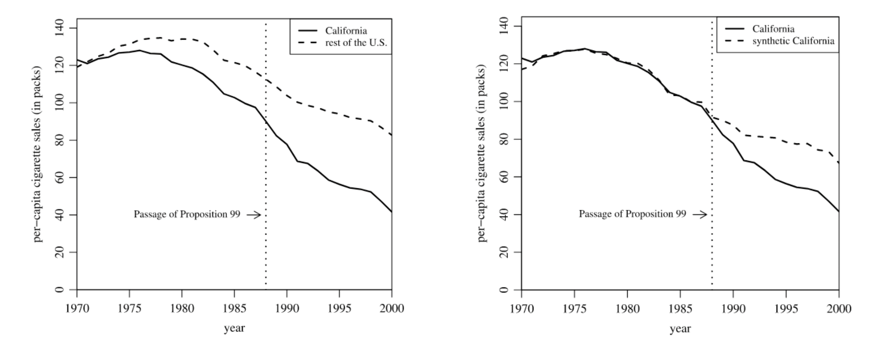{width=300}

- PTA clearly fails
- Avoid manually picking comparable states (as in Card and Krueger 1994)

# How does it work?

For some \( \{v_t\} \), we choose weights \( \omega_i \) on donors to solve

$$
\min_{\omega_1,\ldots,\omega_{N_0}} \sum_{t=1}^{T_0} v_t \cdot \left(Y_{Nt} - \sum_{i=1}^{N_0} \omega_iY_{it}\right)^2
\quad \text{s.t.} \quad \omega_i \geq 0, \quad \sum_{i=1}^{N_0} \omega_i = 1
$$

- "Simplex constraints" produce a well-defined average and avoid extrapolation
- They are also a form of regularization
  - Otherwise, a "vertical" regression of \( Y_{Nt} \) on \( Y_{1t}, \ldots, Y_{N_0t} \) across \( t = 1, \ldots, T_0 \)
  - With \( N_0 > T_0 \) there would be \( \infty \) ways to fit \( Y_{Nt} \) in pre-periods perfectly
  - And no reason to get good \( \hat{Y}_{NT}(0) \) — overfitting
  - With the constraints, typically get a unique, sparse solution: few non-zero weights
- Sparsity makes the counterfactual transparent

# Details

1. Besides pre-period outcomes, can match on any predetermined predictors:
\(X_i = (Y_{i1}, \ldots, Y_{iT_0}, Z_i)\)

2. How to pick weights on predictors, \(v\)?

   - Inverse variance of the predictor across all units
   - Or cross-validation:
    - Choose training period \( t = 1, \ldots, t_0 \)
    - Search for \( v \) to minimize out-of-sample MSE (on the validation period \( t_0 + 1, \ldots, T_0 \))
    - For estimation, limit the sample to the last \( t_0 \) pre-periods & treated period
    
# Details

3. \( \{\omega_i\} \) are not unique if the treated unit is in the convex hull of many donors

- Abadie and L'Hour (2019): try to match with donors that are more similar to the treated unit

  $$
  \min_{\omega_1,\ldots,\omega_{N_0}} \sum_{t} \left( Y_{Nt} - \sum_{i=1}^{N_0} \omega_iY_{it} \right)^2 + \lambda \sum_{i=1}^{N_0} \omega_i \left( Y_{Nt} - Y_{it} \right)^2
  $$
  s.t. \( \omega_i \geq 0, \sum_{i=1}^{N_0} \omega_i = 1 \), with penalty \( \lambda > 0 \)

  - Restores uniqueness and reduces interpolation bias

- Robbins, Saunders, Kilmer (2017): pick weights that minimize the distance from equal weights


# Abadie et al. 2010 example (cont.)

As predictors, use several observables (averaged in 1980–88) and outcome in three pre-periods

\centering
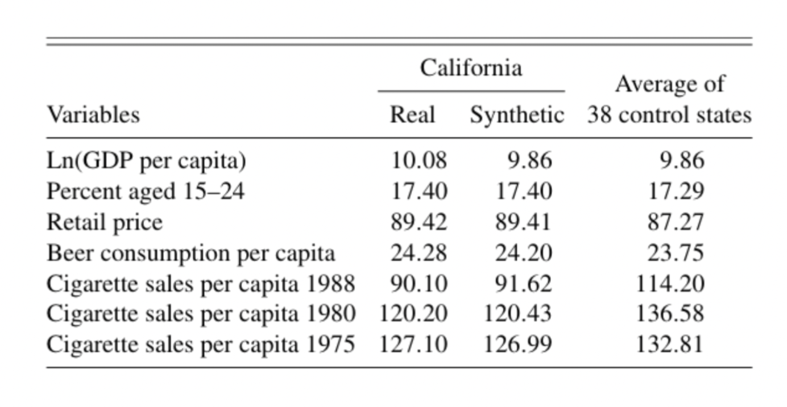{width=260}

- *Note*: Drop states that adopted other tobacco restrictions during the sample period

# Synthetic California (Abadie et al. 2010)

\centering
{width=250}

# Inference

Inference is difficult with only 1 treated unit

Abadie, Diamond, Hainmueller (2010): randomization inference (RI)

- Under the null of zero effect, the treated unit is no different than others

- For each \( i \) (including \( i = N \)), compute \( R_i = \sum_{t > T_0} \left( Y_{it} - Y_{it}(0) \right)^2 \)

- Reject if \( R_N \) is extreme in the set of \( R_1, \ldots, R_N \); p-value = \( \frac{1}{N} \sum_{i=1}^N 1_{[R_N \geq R_i]} \)

# Inference in Abadie et al. (2010)
\centering


# Inference details

Complication 1: for some \( i \), synthetic control may not match the pre-treatment trajectory well

- Can drop units with high pre-treatment MSE
- Or use \( R_i = \) post-treatment MSE divided by pre-treatment MSE

Complication 2: how can we get a confidence interval?

- Test inversion: for each \( \tau_0 \) test \( \tau = \tau_0 \); collect all \( \tau_0 \) that are not rejected
- To test \( \tau = \tau_0 \), replace \( Y_{NT} \) with \( Y_{NT} - \tau_0 \) and test \( \tau = 0 \)

# Inference details

Problem: RI is not justified without randomization

- Test has a 5% significance level in the sense that for 5% of units if they were treated the correct null would be rejected
   - Not very useful since the treated unit was not chosen randomly with equal probabilities

- Abadie, Diamond, Hainmueller (2015) study the economic impacts of German reunification on West Germany
   - What does assigning this treatment to another country mean?

One alternative (Chernozhukov, Wuthrich, Zhu 2021): "conformal inference" based on permuting residuals for the treated unit across periods

# Diagnostic testing and robustness

- Placebo test: **“backdating”**

\centering
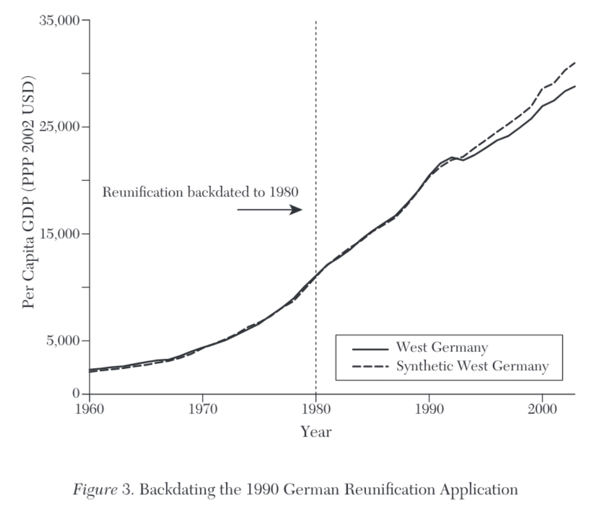{width=250}

- Robustness check: dropping each contributing donor at a time

# Some extensions

Everything works with multiple treated periods

- Multiple treated units:
  - Create a synthetic control for each treated unit and estimate the effects, then average (Abadie and L’Hour 2019)
  - Or a single synthetic control for the average of treated units (Robbins, Saunders, Kilmer 2017)
- Sun, Ben-Michael, Feller (October 10, 2023): construct a single synthetic control for multiple outcome variables
- Ben-Michael, Feller, Rothstein (2021): Augmented SCM estimators `augsynth`)
  - Adjust the estimator for mismatches in the pre-periods for double-robustness
  
# Model-based Justification

The outcome model is given by:

$$
Y_{it} = \tau_{it}D_{it} + \theta' Z_{i} + \xi_{t} + \lambda' f_{t} + \varepsilon_{it}
$$

or alternatively,

$$
\begin{cases}
Y_{it}(0) = \theta' Z_{i} + \xi_{t} + \lambda' f_{t} + \varepsilon_{it} \\
Y_{it}(1) = Y_{it} + \tau_{it}
\end{cases}
$$

- Suppose there are \( R \) time-varying signals \( f_t \) out there.
- Each unit (e.g., country, participant) picks up a fixed linear combination of these signals based on factor loadings \( \lambda_i \).
- Since these "confounders" are evidenced in the pre-treatment outcomes for both treated and controls, we can try to use this information to "balance on" these confounders.


# Model-based Justification

$$
\begin{cases}
Y_{it}(0) = \theta' Z_{i} + \xi_{t} + \lambda' f_{t} + \varepsilon_{it} \\
Y_{it}(1) = Y_{it}^0 + \tau_{it}
\end{cases}
$$

- Let \( W = (w_2, \ldots, w_{J+1})' \) with \( w_j \geq 0 \) and \( w_2 + \ldots + w_{J+1} = 1 \).
- Let \( \bar{Y}_{iK_1}, \ldots, \bar{Y}_{iK_M} \) be \( M > R \) linear functions of pre-intervention outcomes.
- Suppose that we can choose \( W^* \) such that:

$$
Z_1 = \sum_{j=2}^{J+1} w^*_j Z_j, \quad \bar{Y}_{1}^k = \sum_{j=2}^{J+1} w^*_j \bar{Y}_{j}^k, \ k \in \{K_1, \ldots, K_M\}
$$

- When \( T_0 \) is large, an approximately unbiased estimator of \( \tau_{1t} \) is:
$$
\hat{\tau}_{1t} = Y_{1t} - \sum_{j=2}^{J+1} w^*_j Y_{jt}, \ t \in \{T_0 + 1, \ldots, T\}
$$


  
# DiD and SCM

Impose four constraints

1. **No Intercept**: \( \mu = 0 \). Stronger than Parallel trends in DiD.
2. **Adding up**: \( \sum_{i=1}^n \omega_i = 1 \). Common to DiD, SCM.
3. **Non-negativity**: \( \omega_i \geq 0 \) \( \forall i \). Ensures uniqueness via 'coarse' regularisation + precision control. Negative weights may improve out-of-sample prediction.
4. **Constant Weights**: \( \omega_i = \bar{\omega} \) \( \forall i \)

- DiD imposes constraints 2-4;
- SCM imposes constraints 1-3: "convex hull" (no extrapolation)


# DiD and SCM

### DiD

- Assume (2-4)
- Fix \( \omega_{\text{did}} = \frac{1}{N} \)
- \( \hat{\mu}_{\text{did}} = \frac{1}{T_0} \sum_{s=1}^{T_0} Y_{0,s} - \frac{1}{NT_0} \sum_{s=1}^{T_0} \sum_{i=1}^N Y_{i,s} \)

### SCM

- Assume (1-3): convex hull
- For \( M \times M \) PSD diagonal matrix \( V \)

\[ (\hat{\omega}, \hat{\mu}) = \text{arg min}_{\omega,\mu} \{ (X_t - \mu - \omega'X)'V(X_t - \mu - \omega'X) \} \]

\[ \hat{V} = \text{arg min}_{V=\text{diag}(v_1,...,v_M)} \{ (Y_{t, \text{pre}} - \hat{\omega}Y_{c, \text{pre}})'(Y_{t, \text{pre}} - \hat{\omega}Y_{c, \text{pre}}) \} \]


# SCM (Prison Construction and Black Male Incarceration)
\tiny
```{r,warning=FALSE,message=FALSE}
library(tidyverse)
library(haven)
library(Synth)
library(devtools)
library(SCtools)
read_data <- function(df)
{
  full_path <- paste("https://github.com/scunning1975/mixtape/raw/master/", 
                     df, sep = "")
  df <- read_dta(full_path)
  return(df)
}
texas <- read_data("texas.dta") %>%
  as.data.frame(.)
dataprep_out <- dataprep(
  foo = texas,
  predictors = c("poverty", "income"), predictors.op = "mean",
  time.predictors.prior = 1985:1993,
  special.predictors = list(
    list("bmprison", c(1988, 1990:1992), "mean"),
    list("alcohol", 1990, "mean"),
    list("aidscapita", 1990:1991, "mean"),
    list("black", 1990:1992, "mean"),
    list("perc1519", 1990, "mean")),
  dependent = "bmprison", unit.variable = "statefip",
  unit.names.variable = "state",time.variable = "year",
  treatment.identifier = 48,
  controls.identifier = c(1,2,4:6,8:13,15:42,44:47,49:51,53:56),
  time.optimize.ssr = 1985:1993, time.plot = 1985:2000
)
```

# SCM (Prison Construction and Black Male Incarceration)
\tiny
```{r,warning=FALSE,message=FALSE}
synth_out <- synth(data.prep.obj = dataprep_out)
```

# SCM (Prison Construction and Black Male Incarceration)

```{r,warning=FALSE,message=FALSE}
path.plot(synth_out, dataprep_out)
```

# SCM: When and why?

In which contexts should one use synthetic controls?

Abadie (2021):

- No anticipation, no spillovers
- Donor units shouldn’t experience large idiosyncratic shocks in the post-periods
- Big effects and low-volatility outcomes (when few treated units)
- When a good synthetic control exists

But which outcome models imply existence of good synthetic controls?

- And is SCM the best for those models?
- SCM is usually motivated by factor models...
