# Plan

- RDD Identification
- Estimation and Inference
- Falsification Tests 

# Setting

Sharp regression discontinuity design involves:

- Scalar continuous score (a.k.a. running variable, forcing variable) $X_i$
- Scalar cutoff $c$ (with non-zero density of $X_i$ on both sides)
- Binary treatment $D_i = 1[X_i \geq c]$
    - Fully determined by the score, no discretion
    - Rule is discontinuous in $X_i$ at $c$
- Continuity of (expected) potential outcomes $\mathbb{E}[Y(0) | X_i], \mathbb{E}[Y(1) | X_i]$ at $X_i = c$
    - No other determinant of $Y_i$ jumps at $X_i = c$
    - Score cannot be precisely (and endogenously) manipulated
    
# Identification

Then 
$$
\lim_{X_i \downarrow c} \mathbb{E}[Y_i | X_i = x] - \lim_{X_i \uparrow c} \mathbb{E}[Y_i | X_i = x] = \mathbb{E}[Y_i(1) - Y_i(0) | X_i = c]
$$

- Discontinuity of regression $\mathbb{E}[Y_i | X_i]$ at $c$ identifies a local causal parameter

\centering
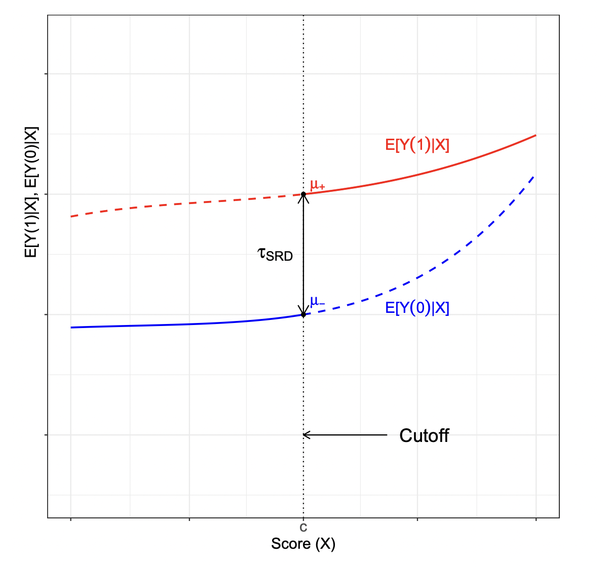{width=230}

# Is RDD a special case of something?

- Is RDD like selection on observables, with \( X_i \) as a control? 
- Is RDD like IV, with \( X_i \) as instrument?
- Is RDD like a RCT in the neighborhood of \( X_i = c \)?

# Is RDD a special case of something?

- Is RDD like selection on observables, with \( X_i \) as a control?
  - No. By construction, there is no overlap: no value of \( X_i \) where both \( D_i = 0 \) and \( D_i = 1 \) are observed
- Is RDD like IV, with \( X_i \) as instrument?
  - No. Exogeneity of \( X_i \) is not assumed, e.g. higher vote share in election \( t - 1 \) correlates with higher vote share in \( t \)
- Is RDD like a RCT in the neighborhood of \( X_i = c \)?
  - Yes. Continuity of potential outcomes implies their balance around \( X_i = c \)
  - No. This only holds in an infinitesimal neighborhood. So we need to be careful with estimation

# Example 

\centering
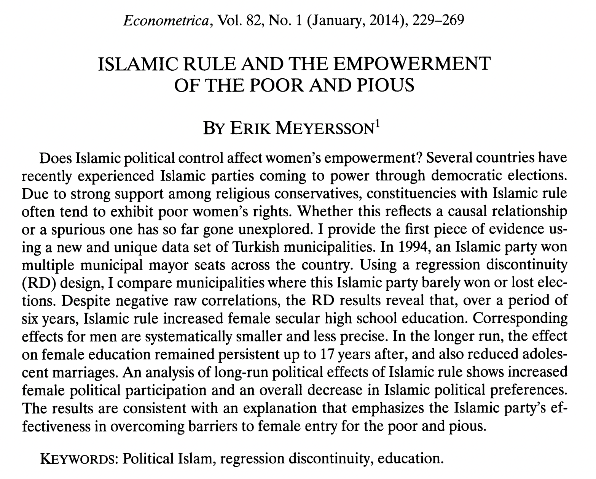

# Meyersson (2014)

Causal effects of interest: 

- Victory of Islamic candidate on educational attainment of women

Elements:

 - **Outcome (Y)**: percentage of women aged 15-20 in 2000 who had completed high school by 2000

 - **Running variable (X)**: vote percentage of the Islamic party minus vote percentage of the strongest secular opponent

 - **Treatment (T)**: 1 if Islamic party won in 1994, 0 otherwise


# A checklist for how to support the RDD analysis

- A graphical representation and test of "balance" and first stage (if fuzzy)
- Permutation test of characteristic at cutoff
- The density of the forcing variable (McCrary test)
- Placebo checks
- A graphical representation of the outcomes (what we’ve already seen)
- Estimates based on optimal bandwidth choice and robust inference, using local linear analysis
  - These decisions vary depending on running variable. If discrete running variable, need to account for discreteness (Kolesar and Rothe (2018))
  - Should use local linear regression, and not global polynomials (Gelman and Imbens)
- Robustness analysis along bandwidth choice (and other tuning parameters)
  - Present this graphically


# Set-up

```{r}
library(rdrobust) 
library(rddensity)
library(haven)
library(ggplot2)
# Import data and define variables
data <- read_dta("CIT_2019_Cambridge_polecon.dta")

Y <- data$Y
X <- data$X
T <- data$T
T_X <- T*X
```


# Visualization
\tiny
```{r, fig.align='center', out.width = "75%"}
# Raw means comparison
rdplot(Y, X, nbins = c(2500, 500), p = 0, col.lines = "red", col.dots = "black", title = "", 
       x.label = "Islamic Margin of Victory", y.label = "Female High School Percentage", y.lim = c(0,70))
```


# Visualization
\tiny
```{r, fig.align='center', out.width = "75%"}
# Local means comparison
rdplot(Y[abs(X) <= 50], X[abs(X) <= 50], nbins = c(2500, 500), p = 4, col.lines = "red", col.dots = "black", 
       title = "", x.label = "Islamic Margin of Victory", y.label = "Female High School Percentage", 
       y.lim = c(0,70))
```

# The Local Nature of RD Effects

\centering
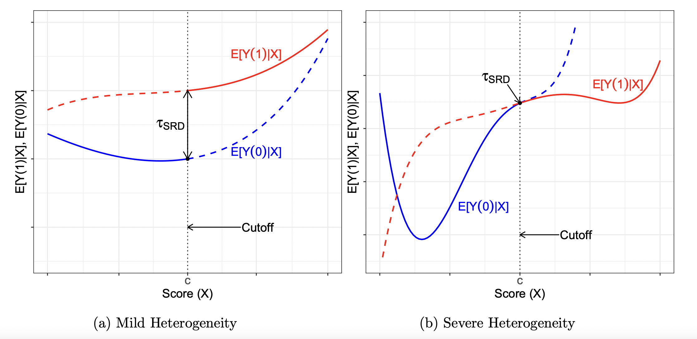

# the Raw Data is Rarely Informative
```{r, warning=FALSE,message=FALSE,echo=FALSE}
ggplot(data, aes(x = X, y = Y)) +
  geom_point(colour = 'black', size = 0.5) + 
  labs(x = "Score", y = "Outcome") +
  theme(axis.text = element_text(size = 15), 
        axis.title = element_text(size = 15)) + 
  geom_vline(xintercept = 0, linetype = "solid")
```

# RD plot: Details

Shows discontinuity in regression \( \mathbb{E}[Y_i | X_i] \) in two ways:

- Parametric fit: shows the _global_ shape and nonlinearity of the regression
  - Separately on the left and right of \( c \), fitted values from
  
  $$
  Y_i = \alpha_0 + \alpha_1(X_i - c) + \ldots + \alpha_p(X_i - c)^p + \text{error}
  $$
  
  e.g. with quartic polynomial (\( p = 4 \))

- Binscatter: a _local_/nonparametric estimator of the regression
  - Separately on each side, for some bins of \( X_i \): average \( Y_i \) against bin's midpoint
  - Bins with similar numbers of observations (splitting by quantile) are more informative. But equal width is also common
  - Calonico, Cattaneo, Titiunik (2015) propose data-driven optimal number of bins


# A quick aside on graphical construction

- Ideally, you would plot a version of the scatter plot, but focusing on means within binned areas
- The trade-off in number of bins typically comes down to bias (more bins helps get closer to the “true” conditional means) and noise (less bins increases observations within bins, lowering the SE for a bin)
- Turns out there are two important decisions:
  - How to place the bins: equal-spaced, or quantile
  - How many bins?
- The equal-spaced vs. quantile choice is somewhat arbitrary, but quantile binning is more transparent
  - Choice of equally spaced bins can mask underlying density 
  
# Partition of Islamic Margin of Victory into 40 Bins of Equal Length 

\centering
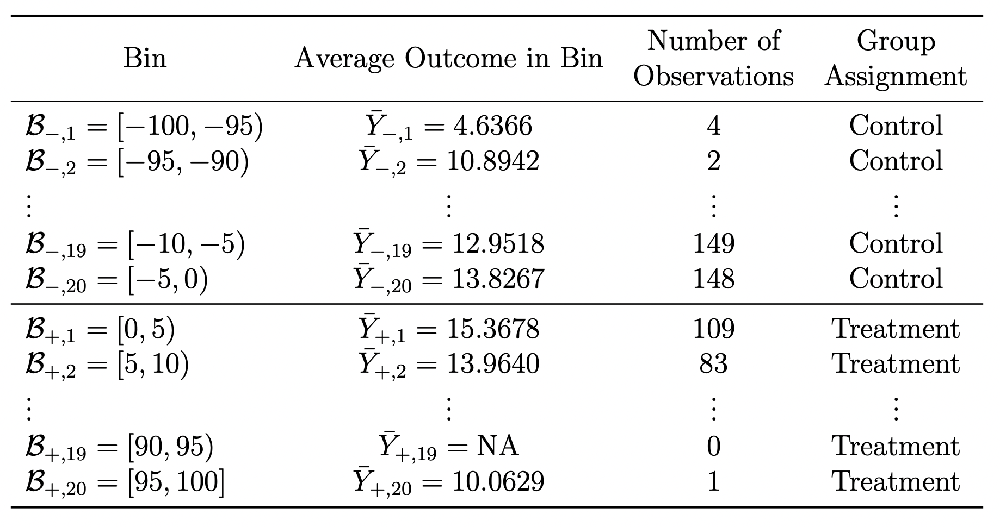

# Evenly-Spaced Binning
\tiny
```{r, fig.align='center', out.width = "75%"}
# Default is 4th polynomial degree on each side
rdplot(Y, X, nbins = c(20,20), binselect = "es", y.lim = c(0,25))
```

# Quantile-Spaced Binning
\tiny
```{r, fig.align='center', out.width = "75%"}
rdplot(Y, X, nbins = c(20,20), binselect = 'qs', x.label = 'Score', 
       y.label = 'Outcome', title = '', x.lim = c(-100,100), y.lim = c(0,25))
```

# Choosing the Number of Bins

- Once we choose how to do bins, how should we choose the number?
  - Can we choose "optimally"?

- Cattaneo et al. (2020) argue for two approaches (available in `rdrobust`'s `rdplot`):
  - IMSE-minimizing, and mimicking variance.
    - IMSE-minimizing trades off between bias and variance in choice of bins, but does it over the whole range – proportional to \( n^{1/3} \)
    - Mimicking-variance tries to match the underlying variance of the raw data in the binned plots – proportional to \( \frac{n}{\log(n)^2} \)

# Integrated Mean Squared Error (IMSE) Method

\tiny
```{r, fig.align='center', out.width = "75%"}
rdplot(Y, X, binselect = 'qs', x.label = 'Score', 
       y.label = 'Outcome', title = '', x.lim = c(-100,100), y.lim = c(0,25))
```

# Mimicking Variance Method

\tiny
```{r, fig.align='center', out.width = "75%"}
rdplot(Y, X, binselect = 'qsmv', x.label = 'Score', 
       y.label = 'Outcome', title = '', x.lim = c(-100,100), y.lim = c(0,25))
```


#  The Continuity-Based Approach to RD Analysis

Local Polynomial Approach:

- Choose polynomial of order $p$ and a kernel function $K(.)$
- Choose a bandwidth $h$ around the cutoff $c$
- Estimate on each side of the cutoff a WLS regression with weights $K(\frac{X_i-c}{h})$: 

$$
\begin{aligned}
{\color{red} \hat{Y}_i = \hat{\mu}_+ + \hat{\mu}_{+,1}(X_i -c) + \hat{\mu}_{+,2}(X_i -c)^2 + ... + \hat{\mu}_{+,p}(X_i -c)^p} \\
{\color{blue} \hat{Y}_i = \hat{\mu}_- + \hat{\mu}_{-,1}(X_i -c) + \hat{\mu}_{-,2}(X_i -c)^2 + ... + \hat{\mu}_{-,p}(X_i -c)^p} 
\end{aligned}
$$

- Calculate the sharp RD estimate: $\hat{\tau}_{SRD} = {\color{red} \hat{\mu}_+} - {\color{blue} \hat{\mu}_-}$, the difference of the two functions when $X_i = c$

# RD Estimation with Local Polynomial

\centering
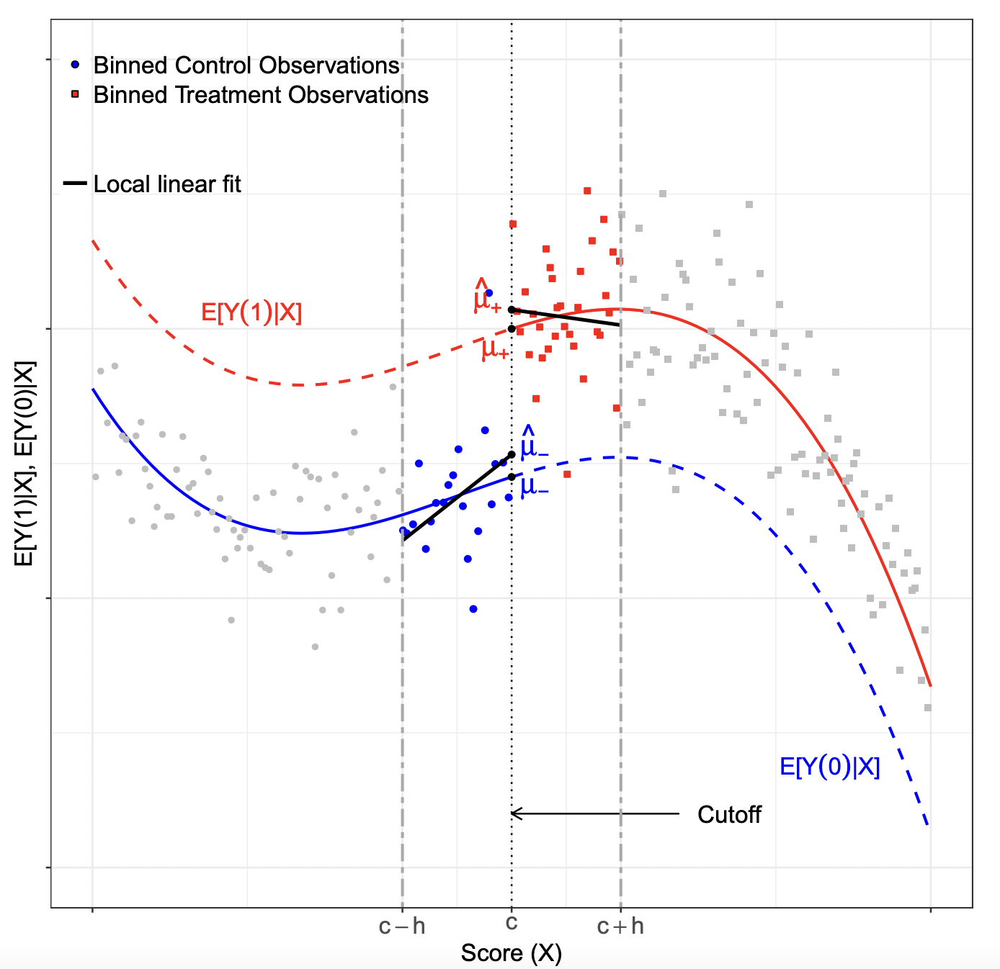{width=270}

# Kernel

Triangular one is recommended (weight = 0 outside $h$ and $\uparrow$ as we get closer to $c$) and default in `rdrobust`. Alternatives: Uniform and Epanechnikov 


\centering
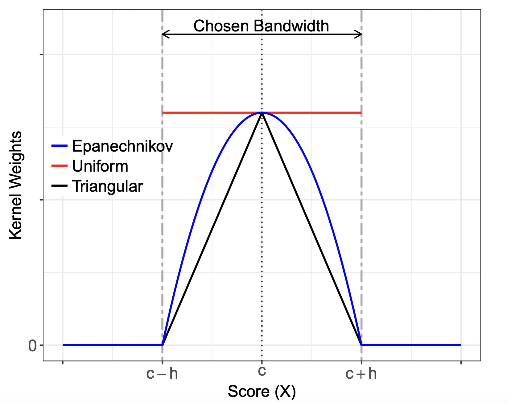{width=300}

# Kernel

\tiny
```{r}
# By default c = 0
out <- rdrobust(Y, X, kernel = "uniform", p = 1)
summary(out)
```

# Kernel

\tiny
```{r}
# By default c = 0
out <- rdrobust(Y, X, kernel = "triangular", p = 1)
summary(out)
```

# The choice of local polynomial order

1. A polynomial of order zero—a constant fit—has undesirable theoretical properties at boundary points, which is precisely where RD estimation must occur. 

2. For a given bandwidth, increasing the order of the polynomial generally improves the accuracy of the approximation but also increases the variability of the treatment effect estimator. 

3. Higher-order polynomials tend to produce overfitting of the data and lead to unreliable results near boundary points.


# The choice of local polynomial order

\tiny
```{r}
out <- rdrobust(Y, X, p = 1)
summary(out)
```

# The choice of local polynomial order

\tiny
```{r}
out <- rdrobust(Y, X, p = 2)
summary(out)
```

# Bandwidth Selection 

\centering
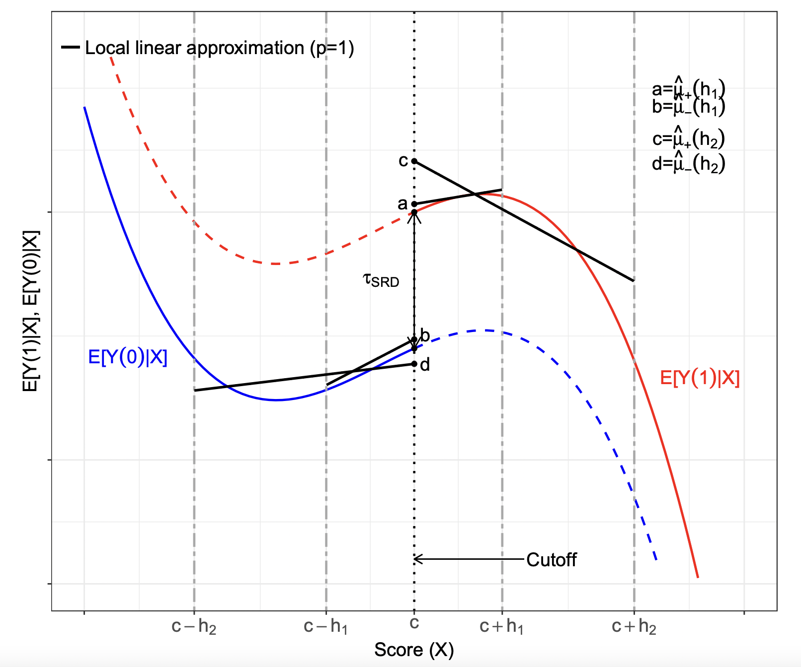{width=300}

# Optimal bandwidth choice

For local polynomial of order \( p \),

- \( \text{bias}(\hat{\tau}) \approx B \cdot h^{p+1} \), \( \text{Var} [\hat{\tau}] \approx \frac{V}{Nh} \)
  - \( B \) is determined by the curvature \( d^{p+1}\mathbb{E}[Y | X = x] / dx^{p+1} |_{x=c} \) (on each side)
  - \( V \) is determined by the variance of \( Y_i \) and density of \( X_i \)

Thus, \( MSE \approx (Bh^{p+1})^2 + \frac{V}{Nh} \) is minimized at \( h^* = \left(\frac{(2(p+1)B^2}{V}N\right)^{-1/(2p+3)} \)

- E.g. \( \propto N^{-1/5} \) when \( p = 1 \)
- \( h^* \uparrow \) when bias is less important: \( |B| \downarrow \), \( p \uparrow \)
- \( h^* \downarrow \) when variance is less important: \( V \downarrow \), \( N \uparrow \)

If we can estimate \( V \) (easy) and \( B \), we can compute \( h^* \)
- Calonico, Cattaneo, Titiunik (2014): to estimate \( B \), run local polynomial estimation with order \( q \geq p + 1 \) (with a larger "pilot" bandwidth)


# Illustrate the main effect

\tiny
```{r, fig.align='center', out.width = "75%"}
out <- rdrobust(Y, X, kernel = "triangular", p = 1, bwselect = "mserd")
bw <- out$bws[1,1]
rdplot(Y[abs(X)<=bw], X[abs(X)<=bw], p = 1, kernel = 'triangular', 
       x.label = 'Score', y.label = 'Outcome', title = '', y.lim = c(10,22))
```


# Inference and bias correction

- Problem: \( h^* \) minimizes MSE by trading off \( \text{bias}^2 \) and variance
  - At \( h^* \), bias and SE of the same order \(\Rightarrow\) conventional conf. intervals are wrong!
  
    \( \sqrt{Nh^*} (\hat{\tau} - \tau) \overset{d}{\rightarrow} \mathcal{N} (B^*, V^*) \), \( B^* \neq 0 \)

- One solution: "undersmoothing"
  - Use bandwidth \( h \) much smaller than \( h^* \). Then inference is fine (bias \( \ll \) SE)
  - But unclear how to choose \( h \), and would a higher-MSE estimator

- Better solution: "robust bias correction" (Calonico et al. 2014, `rdrobust`)
  - We already estimated the bias \(\Rightarrow\) let's subtract it from \( \hat{\tau} \)
  - Adjust SE for noise in bias estimation \(\Rightarrow\) "Robust bias-corrected conf. interval"

    Curiously, they recommend using this conf.interval for the original \( \hat{\tau} \)


# Local Polynomial Confidence Intervals

\centering
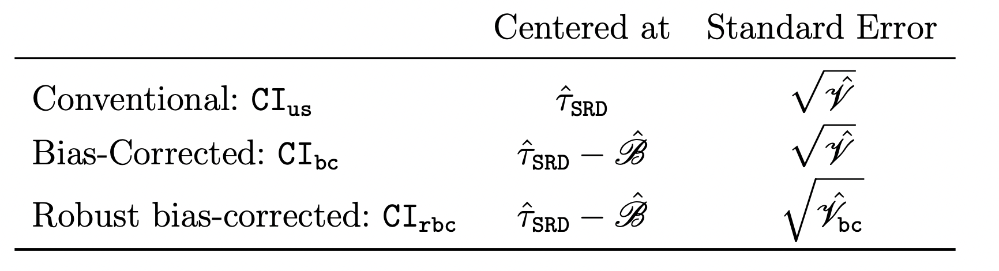{width=270}


# Inference
\tiny
```{r}
out <- rdrobust(Y, X, kernel = 'triangular',  p = 1, bwselect = 'mserd', all = TRUE)
summary(out)
```

# RDD assumption violations

**Sorting**: units try to get just above/below the cutoff 

- In our example: Islamic parties may invest more in winning election in some important municipalities, If they are successful, just-won towns would be different from just-lost ones, i.e. a discontinuity at the cutoff
  1. the null treatment effect on predetermined covariates or placebo outcomes;
  2. the continuity of the score density around the cutoff;
  3. the treatment effect at artificial cutoff values; 
  4. the exclusion of observations near the cutoff;
  5. the sensitivity to bandwidth choices.
  
# Checking for balance

\tiny
```{r,warning=FALSE,message=FALSE}
out = rdrobust(data$lpop1994, X)
summary(out)
```

#  Graphical Illustration of Local Linear RD Effects for Predetermined Covariates

\centering
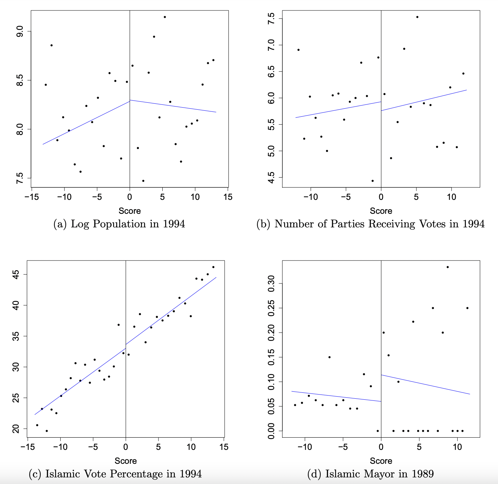{width=270}

# Checking for balance

- As we discussed above, key test is to compare the averages of other variables at \( Z = 0 \), the cutoff.

- Canay and Kamat (2017) show that if you are willing to assume a slightly stronger assumption – e.g. that choice of location around the cutoff is not fully deterministic – then you can do better

- Key points:
  - Testing just mean differences doesn’t look at other parts of the distribution (which may more obviously violate this) and so may have low power
  - Because the local sample size is effectively small, this can create problematic inference issues if the function is not particularly smooth

- They propose a permutation test, which has better statistical properties
  - Key intuition – covariates should be _approximately_ identically distributed on each side of the cutoff
  - This is an _asymptotic_ argument, since it’s not actually a random experiment!

# Checking for Balance - Canay and Kamat

\tiny
```{r,warning=FALSE,message=FALSE}
library(RATest)
lee2008<-lee2008
set.seed(101)
permtest<-RDperm(W="demshareprev", z="difdemshare",data=lee2008,q_type=51)
plot(permtest,w="demshareprev")
```

# Testing for bunching in forcing variable

- Similar to the balance test, Mccrary (2008) proposed a test of the continuity in the density of the running variable

- In essence, is there "bunching" in the characteristic on one side or the other?
  - This intuition makes sense economically – if there’s a benefit of being on one side, why would you not "shift" yourself across the boundary?

- This is easily tested by comparing the values of an estimated density on the left and right of the cutoff

- Software is also available for this!
  - `rddensity` in Stata and R
  
# McCrary (2008) test

```{r,warning=FALSE,message=FALSE}
library(rdd)
DCdensity(data$X, c = 0)
```

# Alternative Cattaneo, Jansson, and Ma (2020) estimator
\tiny
```{r,warning=FALSE,message=FALSE}
library(rddensity)
denstest <- rddensity(data$X, c = 0)
rdplotdensity(denstest, data$X)
```

# RDD with placebo cutoffs
\tiny
```{r}
placebo <- function(Y, X, new_cutoff){
  if (new_cutoff > 0){
    Y <- Y[X>=0]; X <- X[X>=0]
  }
  if (new_cutoff < 0){
    Y <- Y[X<0]; X <- X[X<0]
  }
  else{
    Y <- Y; X <- X
  }
  out <- rdrobust(Y, X, c = new_cutoff)
  coef <- out$coef["Conventional",]
  ll <- out$ci["Robust",1]
  ul <- out$ci["Robust",2]
  
  cbind(coef, ll, ul)
}

cutoffs <- as.list(c(-3:3))
(placebos <- do.call("rbind", lapply(cutoffs, function(i) placebo(Y, X, i))))
```

# RDD with placebo cutoffs
\tiny
```{r, fig.align="center", out.width="75%",warning=FALSE,message=FALSE}
library(dplyr)
placebos %>% as.data.frame() %>% mutate(cutoff = -3:3) %>% 
  ggplot(aes(x=cutoff, y=coef)) + geom_point(col="red") +
  geom_errorbar(aes(ymin=ll, ymax=ul), col="blue",width=0.1) + 
  labs(y = "RD Treatment Effect", x = "Cutoff (x=0 true cutoff)") +
  geom_hline(yintercept=0, col="black", linetype = "dashed") + theme_bw()
```

# Sensitivity checks
Other possible sensitivity analyses to check for stability of results:

- Exclude points closer to the cutoff ("donut" exercise)

- Vary the bandwidth in a neighborhood of the optimal bandwidth

# Summing up

The standard practice includes:

- Graphical and formal placebo tests with covariates and other outcomes

- Density tests for sorting around the cutoff

- Perturbate the cutoff values

- Exclude observations near the cutoff

- Vary the bandwidth choice

# Covariates

- Can we add covariates to RDD estimation?

- [Calonico, Cattaneo, Farrell, and Titiunik (2019)](https://cattaneo.princeton.edu/papers/Calonico-Cattaneo-Farrell-Titiunik_2019_RESTAT.pdf) study properties of RDD estimators with covariate adjustment

- There can be an efficiency argument in favor of covariate adjustment ($\sim$ randomized experiments)

- In applications, often people include group fixed effects or unbalanced covariates

- CCFT recommend not to interact covariates with treatment indicator (allowing for different effects on the two sides requires stronger assumptions)

- In `rdrobust`: use the  `covs` argument


# A cautionary tale

We have discussed an `algorithm` for estimating causal effects in RDDs

- Plots, estimators, inference methods, tests

But blindly following the algorithm is not enough to get to the truth

- Illustration following Andrew Gelman's blog posts in 2019 and 2020 in the RDD context but the lesson is broader

# Barfort et al. (2021)

- Study the effects of a candidate winning gubernatorial election on life expectancy
- Significant local linear regression estimates \(\hat{\tau} \approx 2000-3000\) days
  - Report placebo outcomes, robustness to bandwidth and polynomial order, etc.

\centering
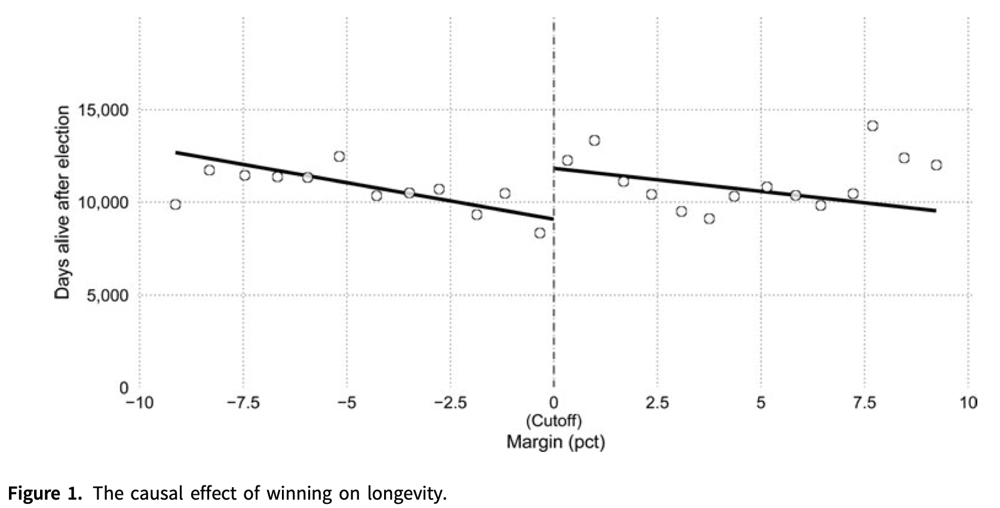{width=250}


# Reanalysis 

\centering
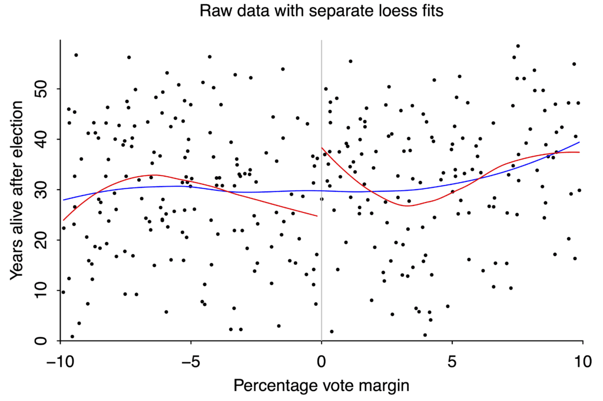{width=250}

# Lessons

- Gelman tries to replicate it from scratch and finds it difficult
  - Many choices during data cleaning not be captured by robustness checks
  - "The garden of forking paths"

- The effect magnitude is entirely implausible
  - But how should we use our priors?

- Raw data is noisy
  - Different models can fit them in different ways. "No smoking gun"
  - But should we give up on small effects?

