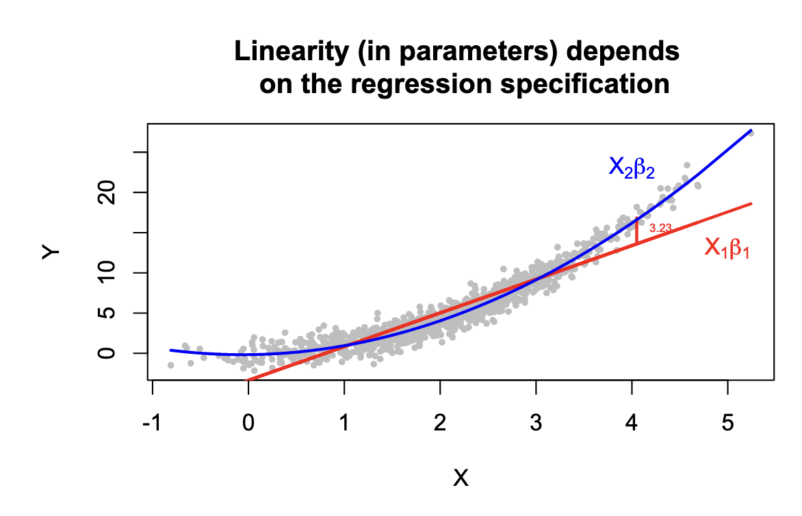

# Hi!
> - Sylvan Zheng, $4^{th}$ year PhD.
> - Fields: American Politics, Methods
> - Email: [saz310@nyu.edu](mailto:saz310@nyu.edu)
> - Office: 421 
> - What do **you** want to get out of Quant II?

# Logistics 
- Lab materials will be posted on the lab's GitHub repo: [https://github.com/squidgetx/quant2-labs-spring2025](https://github.com/squidgetx/quant2-labs-spring2025)
- Materials for future labs subject to change

# Some purposes of lab
> - Build intuition and motivation 
> - Review and extend 
> - Ask questions
> - Learn how to **do** the analysis we are learning about (ie, in R) 

# Today's Lab
> - Review Design vs Model Based Inference
> - Getting set up with RMarkdown
> - Lab Activity
>   - Potential outcomes and ATES
>   - Sampling and Estimators
> - ~~DAGs~~ (we will get more into DAGs in future sessions)

# Design vs Model Based Inference
> - What is it and why do we care?
> - What is a "population regression coefficient"?
> - What does it mean for the CEF to be linear (or not)?

# Design vs Model Based Inference
> - What does it mean for the CEF to be linear (or not)?

# Review proof of consistency for $\hat{\beta}$
> - [Cyrus slides 27-28]
> - [Break]

# RMarkdown
> - Tool that combines R, LaTeX, and Markdown 
> - Create **reproducible** documents 
> - Combine text, code, and analysis results
> - Your homework must be prepared using RMarkdown or similar tools
> - Code should be clean, well named, and properly formatted.

# Package: Here
> - [KVR Example]
>  - NO FILE PATHS IN CODE
> - Use the Here package
> - Works either with `.Rproj` or `.herefile`

# Lab Activity
- [See the `lab1.Rmd/lab1.pdf` in the Github]

