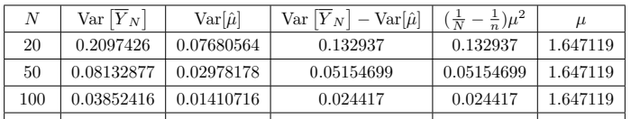

```{r include=F}
library(dagitty)
library(ggdag)
library(fixest)
library(tidyverse)
library(broom)
library(knitr)
# knitr::opts_chunk$set(fig.height = 3, fig.width = 4)
plot_dag <- function(m, Y = NA, D = NA, highlight = NA, adjust = NA) {
    set.seed(1)
    dg <- tidy_dagitty(m)
    if (!is.na(adjust)) {
        dg <- dg %>% control_for(adjust)
    }
    dg <- dg %>%
        mutate(
            c = factor(case_when(
                name == Y ~ "Y",
                name == D ~ "D",
                name == highlight ~ "X",
                name == adjust ~ "X",
                TRUE ~ NA
            ), levels = c("Y", "D", "X"))
        )
    plt <- dg %>% ggdag() + geom_dag_node(aes(color = c), show.legend = F) + geom_dag_label() + theme_dag()
    if (!is.na(adjust)) {
        plt <- plt + geom_dag_collider_edges(lty = 2, show.legend = F, curvature = 0.1)
    }
    plt
}
```


#  DAGs
> - **DAG** stands for Directed Acyclic Graph 
>     - *Directed*: No reverse causality or simultaneity;
>     - *Acyclic*: No cycles
> - Representation of the data generating process (DGP)
>     - Nodes ($X$,$D$,$Y$ etc.) are random variables
>     - Edges ($X\to Y$) denote a direct causal effect of $X$ on $Y$
> - Tools to help understand whether a research design can identify a causal relationship 

# Example: Becker, 1994

:::: columns
::: column

```{r, echo=FALSE, fig.height=5, fig.width=3.5}
set.seed(1)
model <- dagitty("dag{Edu[exposure]; Inc[outcome]; P_Edu->P_Inc; P_Inc->Edu; P_Edu->Inc; Edu->Inc; P_Inc->Inc; U->Edu; U->P_Edu}")
plot_dag(model, Y = "Inc", D = "Edu")
```

:::
::: column

> - Main relationship of interest: Education effect on Income
> - Parental effects (income, education) affect both child income and education
> - Unobserved **family specific** factors (ie, genetics) affect parent and child education

:::
::::

# DAGs and Identification

:::: columns
::: column

```{r, echo=FALSE, fig.height=5, fig.width=3.5}
plot_dag(model, Y = "Inc", D = "Edu")
```

:::
::: column

> - To identify the effect of some D on Y
> - DAG **must** satisfy the **backdoor criterion** (no backdoor paths)
>     - A **backdoor path** is an alternate path between D and Y that does not go through a collider (more on these later)
> - Eg, we cannot identify the effect of `Edu` on `Inc` because there is a **backdoor path**, eg through `P_Inc` 

:::
::::

# Controlling for a variable

> - If we *control for a variable* in a DAG, we **remove its node and corresponding edges** 
>     - Unless it's a collider
> - Ex, if we control for `P_Inc` and `P_Edu`, we get the following DAGs:

:::: columns
::: column

```{r, echo=FALSE, fig.width=3, fig.height=3.5}
model <- dagitty("dag{Edu[exposure]; Inc[outcome]; P_Edu->Inc; Edu->Inc;  U->Edu; U->P_Edu}")
plot_dag(model, Y = "Inc", D = "Edu")
```

:::
::: column

```{r, echo=FALSE, fig.width=3, fig.height=2}
model <- dagitty("dag{Edu[exposure]; Inc[outcome]  Edu->Inc; ; U->Edu}")
plot_dag(model, Y = "Inc", D = "Edu")
```

:::
::::

# Colliders

:::: columns
::: column
> - A **collider** is a node that has multiple arrows leading into it
> - Consider the following DAG that includes a sibling's education `S_Edu`. 
> - Suppose we are interested in understanding the relationship between sibling education (`Edu -> S_Edu`)
> - Should we control for `Inc`?

:::
::: column

```{r, echo=F, fig.height=5, fig.width=3.5}
model <- dagitty("dag{Edu[exposure]; Inc[outcome];  P_Edu->Inc; Edu->Inc; U->Edu; U->P_Edu; P_Edu->S_Edu; U->S_Edu; Edu->S_Edu}")
plot_dag(model, Y = "S_Edu", D = "Edu", highlight = "Inc")
```

:::
::::

# Colliders

:::: columns
::: column
- A **collider** is a node that has multiple arrows leading into it
- Consider the following DAG that includes a sibling's education `S_Edu`. 
- Suppose we are interested in understanding the relationship between sibling education (`Edu -> S_Edu`)
- Should we control for `Inc`?
     - No. Because `Inc` is a collider, the backdoor path is closed.  

:::
::: column

```{r, echo=F, fig.height=5, fig.width=3.5}
plot_dag(model, Y = "S_Edu", D = "Edu", adjust = "Inc")
```

:::
::::
# Colliders | Sample Selection

:::: columns
::: column

> - Collider bias often discussed in the context of sample selection
> - Super simple example
> - Suppose alternative medicine has no true effect on health outcomes
> - But, the study selects (conditions) on experience with alternative medicine
> - If health has any effect on study participation, conditioning on the study induces a relationship

::: 
::: column

```{r, echo=F, fig.height=3.5, fig.width=3.5}
model <- dagitty("Health->Study; AltMed->Study")
plot_dag(model, Y = "Health", D = "AltMed")
```


::: 
::::

# Colliders | Sample Selection

:::: columns
::: column

 - Collider bias often discussed in the context of sample selection
 - Super simple example
 - Suppose alternative medicine has no true effect on health outcomes
 - But, the study selects (conditions) on experience with alternative medicine
 - If health has any effect on study participation, conditioning on the study induces a relationship

::: 
::: column

```{r, echo=F, fig.height=3.5, fig.width=3.5}
model <- dagitty("Health->Study; AltMed->Study")
plot_dag(model, Y = "Health", D = "AltMed", adjust = "Study")
```

::: 
::::


# Colliders | Sample Selection

:::: columns
::: column

> - Another example
> - Country military strength appears to be uncorrelated with winning a war
>      - But, unobserved factors `U` also affect whether countries get into wars in the first place and whether they win
>      - Conditioning on `War` opens a backdoor path through `U`

:::
::: column


```{r, echo=F, fig.height=5, fig.width=3.5}
model <- dagitty("Strength->War; Strength->Win; U->War; U->Win")
plot_dag(model, Y = "Win", D = "Strength", adjust = "War")
```

:::
::::

# Colliders | Gender Wage Gap  

:::: columns
::: column


```{r echo=F, fig.width=5, fig.height=3.5}
model <- dagitty("Fem->Occ; Occ->Wage; Fem->Wage; U->Wage; U->Occ")
plot_dag(model, Y = "Wage", D = "Fem", highlight = "Occ")
```

:::
::: column

> - Should we control for Occupation (`Occ`)?
> - Let's use simulation to illustrate (`gender_wage_sim.R`)
> - Suppose the following DGP
>      - `Occ` = -0.1 * `Fem` + u + $\epsilon_1$
>      - `Wage` = -0.1 * `Fem` + `Occ` + 2 * u + $\epsilon_2$
>      - `Fem` ~ Bernoulli(0.5)
>      - $\epsilon_1, \epsilon_2, u \sim N(0,1)$

:::
::::

# Colliders | Gender Wage Gap 
## Simulation Setup

```{r, warning=FALSE,message=FALSE}
N <- 10000
tb <- tibble(
    # Gender is exogenous
    female = sample(c(0, 1), N, replace = T),
    # U is exogenous
    u = rnorm(N),
    # Occupation choice a function of u and gender
    occupation = u - 0.1 * female + rnorm(N),
    # Wage is a function of u and occupation
    #  AND very slightly directly affected by gender
    wage = -0.1 * female + occupation + 2 * u + rnorm(N)
)
```

# Colliders | Gender Wage Gap 
## Simulation Results

```{r, results='asis', echo=F}
etable(list(
    feols(wage ~ female, data = tb),
    feols(wage ~ female + occupation, data = tb),
    feols(wage ~ female + occupation + u, data = tb)
), tex = T, fitstat = c("n"))
```

# Bias Amplification

:::: columns
::: column

> - Same DAG as before, but let's say we are now interested in `Occ`->`Wage`
> - Suppose `Selfish` increases `Occ` but decreases `Wages`
> - Suppose we observe `Selfish`
> - Should we control for `Selfish`?

:::
::: column

```{r echo=F, fig.height=5, fig.width=3.5}
model <- dagitty("Occ->Wage; U->Wage; U->Occ; Selfish->Occ; Selfish->Wage;")
plot_dag(model, Y = "Wage", D = "Occ", highlight = "Selfish")
```
:::
::::

# Bias Amplification
## Simulation Setup

```{r}
tb <- tibble(
    # U and Selfish exogenous
    u = rnorm(N),
    selfish = rnorm(N),
    # Selfish positively affects occupation
    occupation = u + selfish + rnorm(N),
    # Selfish negatively affects wages
    wage = occupation + 2 * u - 0.5 * selfish + rnorm(N)
)
```

# Bias Amplification
## Simulation Results

```{r, results='asis', echo=F}
etable(
    list(
        feols(wage ~ occupation, data = tb),
        feols(wage ~ selfish + occupation, data = tb)
    ),
    tex = T,
    fitstat = c("n")
)
```

# Post-treatment bias

> - Homola, Pereira, and Tavits (2020, APSR) argue that living closer to a Nazi era concentration camp increases modern day far right support.
> - Pepinsky, Goodman, Ziller (2023, APSR) argue that "state-level differences confound the relationship between distance to camps and out-group intolerance"
>     - They add state level fixed effects and show that the original effect disappears.
>     - "Länder cannot be posttreatment variables unless we assume that the creation of Länder was caused by their distance from concentration camps."
> - HPT (2024, APSR) rebuttal. "contemporary state fixed effects induce post-treatment bias if any factor (observable or not) that varies across German Länder is a direct or indirect descendant of proximity to concentration camps.""

# Conclusions 

> - Should we give up on observational regression analysis? Maybe
>     - Don't control enough => Omitted variable bias
>     - Control on a collider => Collider bias 
>     - Control on post treatment => Post treatment bias
>     - Control on something innocuous => Bias Amplification, sometimes
> - Always use a DAG and domain knowledge to justify your control strategy
> - Sensitivity analysis and Double ML can help, kind of
>     - (Double ML next week)

# Sensitivity analysis

> - General idea - quantify **how large** an omitted variable would have to be to mess up your results
>     - Roman and D'Urso show a correlation between anti LGBTQ attitudes and dislike for "Latinx" group label, controlling for several factors
>     - Sensitivity analysis: Omitted variable would have to have as large an effect on "Latinx" favorability as partisanship


# Sensitivity analysis: Attitudes in Darfur (Hazlett, 2019)

> - 2003-2004 government violence against civilians 
> - Outcome (Y): attitudes toward peace
> - Treatment (D): exposure to violence

```{r message=F}
library(sensemakr)
data("darfur")
darfur.model <- feols(
    peacefactor ~ directlyharmed + female +
        age + farmer_dar + herder_dar + pastvoted + 
        hhsize_darfur | village,
    data = darfur
)
```

# Sensitivity analysis: Attitudes in Darfur (Hazlett, 2019)

:::: columns
::: column

> - Specification with lots of controls shows a positive relationship

:::
::: column

\footnotesize
```{r, results='asis', echo=F}
etable(darfur.model, tex = T, fitstat = c("n"))
```

:::
::::

# Sensitivity analysis: Attitudes in Darfur (Hazlett, 2019)

```{r, message=F}
darfur.sensitivity <- sensemakr(
    model = darfur.model,
    treatment = "directlyharmed",
    benchmark_covariates = "female",
    kd = 1:3,
    ky = 1:3,
)
```

> - `sensemakr` package lets us conduct sensitivity analysis **relative to a covariate of choice**
> - Ex, gender played an important role in exposure to violence: women were specifically targeted
> - `kd` and `ky` arguments: we investigate a hypothetical confounder **1-3x** as strong as `female`


# Sensitivity Analysis

```
ovb_minimal_reporting(darfur.sensitivity)
```

\footnotesize

\begin{table}[!h]
\centering
\begin{tabular}{lrrr}
\multicolumn{4}{c}{Outcome: \textit{peacefactor}} \\

\hline \hline 
Treatment: & $R^2_{Y \sim D |{\bf X}}$ & $RV_{q = 1}$ & $RV_{q = 1, \alpha = 0.05}$  \\ 
\hline 
\textit{directlyharmed} & 2.2\% & 13.9\% & 7.6\% \\ 
\hline 

\multicolumn{4}{r}{ \textit{Bound (1x female)}: $R^2_{Y\sim Z| {\bf X}, D}$ = 12.5\%, $R^2_{D\sim Z| {\bf X} }$ = 0.9\%} \\
\end{tabular}
\end{table}> 

# Sensitivity Analysis

```
summary(darfur.sensitivity)
```
> - Partial R2 of the treatment with the outcome: an extreme confounder (orthogonal to the covariates) that explains 100% of the residual variance of the outcome, would need to explain at least 2.19% of the residual variance of the treatment to fully account for the observed estimated effect.

> - Robustness Value, q = 1: unobserved confounders (orthogonal to the covariates) that explain more than 13.88% of the residual variance of both the treatment and the outcome are strong enough to bring the point estimate to 0.

> - Robustness Value, q = 1, alpha = 0.05: unobserved confounders (orthogonal to the covariates) that explain more than 7.63% of the residual variance of both the treatment and the outcome are strong enough to bring the estimate to a range where it is no longer 'statistically different' from 0 at the significance level of alpha = 0.05. 

# Sensitivity: Plots

```{r}
plot(darfur.sensitivity)
```

# HW1 

> - Grades coming soon
> - Q2.3: If $\bar{Y_N} \rightarrow \mu$ and $\bar{S_N} \rightarrow 1$ then by Slutsky $\hat{\mu} \rightarrow \frac{\mu}{1} = \mu$
>     - But how do we know that $\bar{Y_N} \rightarrow \mu$?
>     - Technically, not sufficient to say that $E(\bar{Y_N}) = \mu$. Unbiased != consistency!
>     - In Q2.5 we derive $V(\bar{Y_N}) = (\frac{1}{N} - \frac{1}{n})\frac{1}{n}\sum{y_i^2}$
>     - As N,n go to infinity $(\frac{1}{N} - \frac{1}{n})$ approaches 0
>     - $\frac{1}{n}\sum{y_i^2}$ approaches a finite value
>     - So $V(\bar{Y_N}) \rightarrow 0$ and now we can say unbiased = consistency for $\bar{Y_n}$

# HW1 | Q8 (Simulation question)



> - Table printed with `knitr::kable`. Good! But...
> - The theoretical difference in variances should NOT be identical to the empirical difference in variances
> - Please indent your code (can do this automatically with Ctrl/Cmd+I in Rstudio)

\pause
:::: columns
::: column

\small
```
for (N in sample_sizes) {
    do stuff
    for (j in 1:nsims) {
        do more stuff
    }
}
```

:::
::: column

\small
```
for (N in sample_sizes) {
do stuff
for (j in 1:nsims) {
do more stuff
}
}
```

:::
::::