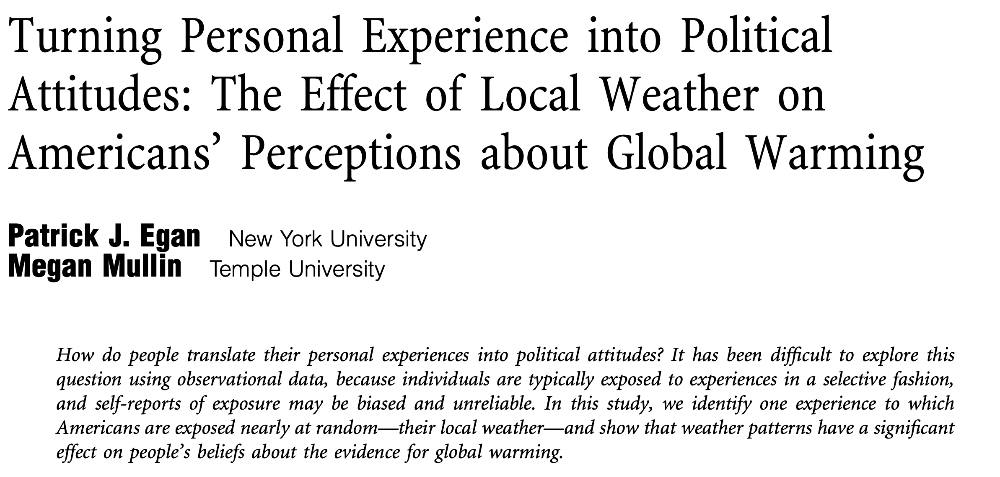

--- 
title: "Quant 2, Lab 4" 
subtitle: "Pitfalls of control strategies continued: Effective Samples, Specification Error/Double ML"
author: "Sylvan Zheng"
output: beamer_presentation
header-includes:
    - \usepackage{booktabs}
---

```{r, include=F}
library(tidyverse)
library(knitr)
library(broom)
library(fixest)
library(ggpubr)
```

# Effective Samples Intuition

> - Consider a unit whose D is perfectly explained by X
> - Then, does this unit help identify the effect of D|X on Y?

# Effective Samples Intuition

> - Simulation
> - True treatment effect is 1
> - How is X related to D here?

```{r}
set.seed(12)
N <- 1000
X <- rnorm(N)
D <- X + rbinom(N, size = 1, prob = 0.10) * rnorm(N)
Y <- D + X + rnorm(N)
df <- data.frame(X = X, D = D, Y = Y)
```

\pause

```{r}
table(df$X == df$D)
```

# Effective Samples: Intuition

\small
```{r}
models <- list(
    feols(Y ~ D + X, data = df),
    feols(Y ~ D + X, data = df %>% filter(df$X != df$D))
)
```

```{r echo=F, results='asis'}
etable(models, tex = T, fitstat = c("n"))
```

# Effective Sample Weights

> - Observations where D is already "explained" by X are basically useless
> - Effective Sample Weights formalize this intuition
> - The sample weight for unit $i$ is $w_i = (D_i - E[D_i|X_i])^2$
>     - If we assume linearity of the treatment assignment in $X_i$, then easy to construct
>     - Run the regression $D_i = X_i\gamma + e_i$
>     - Take residual $\hat{e}_i = D_i - X_i \hat{\gamma}$ and square it

# What can you do with the sample weights?

> - Use them to characterize your "effective" sample
> - Maybe some substantive interpretation
> - Eg, original sample is "representative". Is effective sample "representative?"
> - Interpretation depends on the research setting. Controlling for confounders likely makes the effective sample non representative, if you started with a representative sample.

# Example: Egan/Mullin 2012



# Example: Egan/Mullin 2012

```{r include=F}
pacman::p_load(haven, maps, tidyverse, gridExtra, here)


# Import state IDs
statenums <- read_dta(here("lab04/zipcodetostate.dta")) %>%
    distinct(statenum, statefromzipfile) %>%
    rename(abb = statefromzipfile) %>%
    filter(!(statenum == 8 & abb == "NY")) # duplicate entry

# Import population data
pops <- read.csv(here("lab04/population_ests_2013.csv")) %>% mutate(
    state = tolower(NAME)
)

# Import state fips data
data(state.fips)

state.data <- statenums %>%
    left_join(state.fips, by = "abb") %>%
    left_join(pops, by = c("fips" = "STATE")) %>%
    distinct(abb, .keep_all = T)

d <- read_dta(here("lab04/gwdataset.dta")) %>% left_join(state.data)

# Format
d$getwarmord <- as.double(d$getwarmord)
```

> - Outcome variable `getwarmord` (climate change attitudes)
> - Treatment variable `ddtweek` (change in change in temp)


\footnotesize
```{r}
out.d <- feols(ddt_week ~ educ_hsless + educ_coll + educ_postgrad +
    educ_dk + party_rep + party_leanrep + party_leandem +
    party_dem + male + raceeth_black + raceeth_hisp +
    raceeth_notwbh + raceeth_dkref + age_1824 + age_2534 +
    age_3544 + age_5564 + age_65plus + age_dk + ideo_vcons +
    ideo_conservative + ideo_liberal + ideo_vlib + ideo_dk +
    attend_1 + attend_2 + attend_3 + attend_5 + attend_6 +
    attend_9 | doi + state + wbnid_num, d)
```

\pause

```{r}
# Extract the residuals and take their square
d$wts <- residuals(out.d)^2
```

# Example: Egan/Mullin 2012

> - Suppose we want to characterize the sample contribution by state
> - "Nominal" weight: just the (normalized) number of observations per state

```{r include=F}
state_map <- map_data("state")
theme_state_map <- function(map) {
    map +
        expand_limits(x = state_map$long, y = state_map$lat) +
        scale_fill_continuous("% Weight", limits = c(0, 17), low = "white", high = "black") +
        theme(
            legend.position = c(.2, .1), legend.direction = "horizontal",
            axis.line = element_blank(), axis.text = element_blank(),
            axis.ticks = element_blank(), axis.title = element_blank(),
            panel.background = element_blank(),
            plot.background = element_blank(),
            panel.border = element_blank(),
            panel.grid = element_blank()
        )
}
```

```{r warning=F, message=F}
nom_map <- theme_state_map(d %>%
    group_by(state) %>%
    summarize(nom = n() * 100 / nrow(d)) %>%
    ggplot(aes(map_id = state)) +
    geom_map(aes(fill = nom), map = state_map) +
    labs(title = "Nominal Sample"))
```

# Example: Egan/Mullin 2012

```{r}
nom_map
```

# Example: Egan/Mullin 2012

- To characterize the "effective" contribution of each state, use the effective sample weight instead

```{r warning=F, message=F}
eff_map <- theme_state_map(d %>%
    group_by(state) %>%
    summarize(eff = sum(wts) * 100 / sum(d$wts)) %>%
    ggplot(aes(map_id = state)) +
    geom_map(aes(fill = eff), map = state_map) +
    labs(title = "Effective Sample"))
```

# Example: Egan/Mullin 2012

```{r}
eff_map
```

# Example: Egan/Mullin 2012

```{r echo=F}
d %>%
    group_by(state) %>%
    summarize(
        nom = n() * 100 / nrow(d),
        eff = sum(wts) * 100 / sum(d$wts),
        diff = eff - nom
    ) %>%
    ggplot(aes(map_id = state)) +
    geom_map(aes(fill = diff), map = state_map) +
    expand_limits(x = state_map$long, y = state_map$lat) +
    scale_fill_gradient2("Difference", limits = c(-2, 8), low = "coral", mid = "grey95", high = "dodgerblue") +
    labs(title = "Difference Effective and Nominal Weight") +
    theme(
        legend.position = c(.2, .1), legend.direction = "horizontal",
        axis.line = element_blank(), axis.text = element_blank(),
        axis.ticks = element_blank(), axis.title = element_blank(),
        panel.background = element_blank(),
        plot.background = element_blank(),
        panel.border = element_blank(), panel.grid = element_blank()
    )
```

# Example: Egan/Mullin 2012

> - One possible critique here: 
>     - Coastal cities in WA, CO, CA have extremely variable weather
>     - Rural areas of WA, CO, CA have extremely stable weather
>     - We control for liberal/conservative, but maybe there's urban/rural confounding slightly separate driving results?


# Frisch-Waugh-Lovell theorem
- Linear model with $K$ covariates. In matrix form: $y = X'\beta + \varepsilon$
- FWL gives a formula for the OLS estimate of the $k^{th}$ coefficient.

$$
\hat{\beta}_k = (X'_{k}M_{[X_{-k}]}X_{k})^{-1}X'_{k}M_{[X_{-k}]}y
$$

\pause

Equivalent to the following:

> - Regress the individual variable $X_k$ on all the other covariates and take the residuals
> - Regress the outcome variable $y$ on all the covariates, except $X_k$, and take the residuals
> - Regress the residuals of $y$ on the residuals for $X$
>     - "The part of Y unexplained by $X_{not_k}$" ~ "The part of $X_k$ unexplained by $X_{not_k}$"
>     - Note that to get $\hat{\beta}_k$ it is enough to regress the non-residualized $y$ on residualized $X_k$ (why?), but the SE won't be right

# FWL in R

```{r,message=FALSE,warning=FALSE}
set.seed(123)
N <- 1000
X <- rnorm(N, mean = 0, sd = 1)
# Generate binary treatment D, making D and X correlated
D <- rbinom(N, size = 1, prob = plogis(X))
Y <- 2 * D + 0.5 * X + rnorm(N, mean = 0, sd = 1)
model_ols <- lm(Y ~ D + X)
```

\pause

```{r}
coeftable(model_ols)[, 1:2] %>% kable()
```

# FWL in R
```{r,warning=FALSE,message=FALSE}
resid_Y <- residuals(lm(Y ~ X))
resid_D <- residuals(lm(D ~ X))
model_fwl <- lm(resid_Y ~ resid_D)
```

\pause

```{r echo=F}
coeftable(model_fwl)[, 1:2] %>% kable()
```

# Specification Error

> - Linear specification for controls is a substantive assumption
> - Introduce additional bias to linear regression estimation 
> - Simulation:
>     - True effect is 0.2
>     - Nonlinearity in both y ~ x and d ~ x

\pause

```{r}
set.seed(6)
N <- 3000
effect <- 0.2
age <- rnorm(N, 0, 1)
age2 <- -(age)^2 + age
d <- rbinom(N, size = 1, prob = plogis(age2))
income <- -(age)^2 + age + rnorm(N) + d * effect
```

# Specification Error

```{r echo=F}
dat <- data.frame(
    age = age,
    income = income,
    d = d
)
ggplot(dat, aes(x = age, y = income, color = as.factor(d))) +
    geom_point(alpha = 0.5) +
    theme_bw()
```

# Specification Error

> - Using a linear specification for control leads to bias in estimate

\small
```{r results='asis'}
etable(feols(income ~ age + d, data = dat), tex = T, fitstat = c("n"))
```

# Specification Error

> - But, a problem quickly arises.
> - How do we know what specification to use?
> - "Classical" Machine Learning: flexible algorithms to estimate nonlinear relationships
>     - XGBoost, Random Forest, Lasso/ElasticNet... (Quant 3 for more on this)

# Classical Machine Learning

```{r}
pacman::p_load(mlr3, xgboost, mlr3learners)

# Use XGBoost algorithm
learner <- lrn("regr.xgboost", eta = 0.1, nrounds = 35)
# Set up a task to predict 'income'
task <- as_task_regr(
    select(dat, income, age),
    target = "income"
)
# Fit to the data
learner$train(task)
```

# Classical Machine Learning

```{r}
dat$preds <- learner$predict_newdata(dat)$response
```
```{r echo=F}
ggplot(dat, aes(x = age, y = preds, color = as.factor(d))) +
    geom_point(alpha = 0.5) +
    theme_bw()
```

# Double Machine Learning

> - Ok, so we can predict Y given X in a nonlinear way.
> - How do we use this to retrieve a good estimate of `Y ~ D | X`?
> - Basic idea is to use ML to model both `y ~ x` and `d ~ x` and use the residuals to retrieve a consistent estimate for $\theta$
> - Sounds familiar? (FWL)

# DML By Hand

\small

```{r}
# Model y as a function of age
y.x <- lrn("regr.xgboost", eta = 0.1, nrounds = 35)
y.x.task <- as_task_regr(
    select(dat, income, age),
    target = "income"
)
y.x$train(y.x.task)
```

\pause

```{r}
# Model D as a function of age
d.x <- lrn("regr.xgboost", eta = 0.1, nrounds = 35)
d.x.task <- as_task_regr(
    select(dat, d, age),
    target = "d"
)
d.x$train(d.x.task)
```

\pause

```{r}
# Calculate residuals
d.x.resid <- dat$d - d.x$predict_newdata(dat)$response
y.x.resid <- dat$income - y.x$predict_newdata(dat)$response
```

# DML By Hand

```{r}
lm(y.x.resid ~ d.x.resid)
```

# DML: Lab Activity

> - Work in pairs from `lab04.Rmd`
> - First two exercises: load the data given in `data.rds` and try to use multiple regression to estimate the effect of $y ~ d + x$. What do we find?
> - Next three excercises: code is written for you already. through 