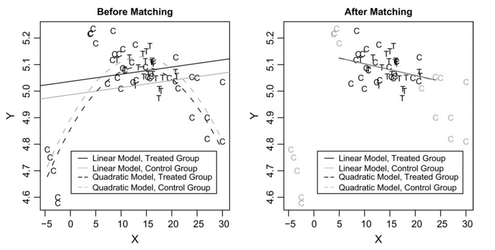

# Motivation

> - We saw weaknesses from multiple regression approaches to estimating causal quantities.
>     - Unmodeled effect heterogeneity 
>     - Specification error
> - Matching is an approach that addresses these weaknesses 
>     - Nonparametric 
>     - Transparent 
>     - **Estimation** technique, not an identification strategy. Alternative to, eg DoubleML
>     - Doesn't solve issues with bad/good controls, selection on unobservables, etc.
 
# Matching overview

> - For each treated unit, pick untreated unit(s) with similar covariate values.
> - Intuitively, comparing these units should estimate Y ~ D | X
> - Formally:
  $$\hat{\tau}_m = \frac{1}{n_1} \sum_{i=1}^{n} D_i \left( Y_i - \frac{1}{M} \sum_{j \in \mathcal{J}_m(i)} Y_j \right)$$
>     - $\mathcal{J}(i)$ are the set of $M$ closest control units to $i$ in terms of $X_i$.

# Example 
## Ho et al 2007

\centering
{width=400}

# Matching Assumptions

> - No unmeasured confounders: \( D_i \perp\!\!\!\perp (Y_i(0), Y_i(1)) | X_i \)
>     - As usual, have to make a non-empirical argument for this (or use experimental data)
> - Overlap/positivity: \( 0 < P(D_i = 1 | X_i = x) < 1 \)
>     - Intuitively, you have to have observations to match on. This is an empirical question

# Matching Approaches

> - For each treated unit, pick untreated unit(s) with similar covariate values.
>     - How many units? 
>     - What counts as similar?
  
> - Exact Matching: choose matches that have exactly the same value of \( X_i \)
>     - Problem: only works with discrete covariates
>     - Problem: what if there is no control unit available?

> - Coarsened Exact Matching (Iacus et al, 2011)
>     - Divide continuous covariates into bins, then exact match
>     - Problem: Sensitive to bin size
>     - Problem: Still might be bins with no control units (more likely with many covariates)

# Exact Matching: Example

```{r echo=F}
pacman::p_load(tidyverse, ggpubr)
set.seed(123)
n <- 50
data <- data.frame(x = sample(c("NY", "PA", "NJ"), n, replace = T), y = sample(c("Male", "Female"), n, replace = T), t = sample(0:1, n, replace = T))
data %>% ggplot(aes(x = as.factor(x), y = as.factor(y), color = as.factor(t))) +
  geom_point(position = position_jitter(width = 0.1, height = 0.1), size=2) +
  labs(
    x = "",
    y = "",
    color = "treat"
  ) +
  theme_minimal()
```

# CEM Example

```{r echo=F, warning=F}
set.seed(123)
n <- 200
data <- data.frame(x = rnorm(n, 30, sd = 5), y = runif(n, 0, 12), t = sample(0:1, n, replace = T))
plt <- data %>% ggplot(aes(x = x, y = y, color = as.factor(t))) +
  geom_point(size=2) +
  labs(
    x = "Age",
    y = "Education",
    color = "treat"
  ) +
  theme_minimal() +
  theme(panel.grid.minor = element_blank(), panel.grid.major = element_blank())
ggarrange(plotlist = list(
  plt,
  plt + theme(panel.grid.major = element_line(
    color = "#8ccde3",
    size = 0.75,
    linetype = 2
  )),
  plt + scale_x_continuous(breaks = seq(20, 45, 8)) + scale_y_continuous(breaks = seq(0, 12, 3)) + theme(panel.grid.major = element_line(
    color = "#8ccde3",
    size = 0.75,
    linetype = 2
  ))
), nrow = 1, common.legend = T, legend = "bottom")
```
  
# Matching in High Dimensions

> - Instead of exact (or CEM), we can define closeness in covariate space using scalar **distance metric**
> - Then, we match using the "nearest neighbors" by this distance metric
>     - Mahalanobis distance metric commonly used to deal with scale problems introduced by Euclidean distances
> - Some questions arise
>     - How many neighbors to choose?
>     - Can a control unit be used for multiple treatment units?
>     - Should we drop matches where the distance is too far (caliper)?

# Matching choices 

> - Matching ratio: how many control units per treated?
>     - Lower reduces bias (only use the closest matches), increases variance

> - With or without replacement: same control matched to multiple treated?
>     - With replacement gives better matches & matching order doesn’t matter.
>     - Without replacement simplifies variance estimation.

> - Caliper: drop poor matches?
>     - Only keep matches below a distance threshold, \( D(X_i, X_j) \leq c \)
>     - Reduces imbalance, but if you drop treated units, estimand changes.

# Bias Correction

> - Suppose a treated unit $i$ and matched control $j$
> - Matching estimate of the treatment effect $\tau$: $\hat{\tau} = Y_{i1} - Y_{j0}$
> - $= Y_{i1} - Y_{i0} + Y_{i0} - Y_{j0}$
> - $= \tau + (Y_{i0} - Y_{j0})$
> - This second term in parens is the bias.
> - Estimate $\hat{Y_{i0}}, \hat{Y_{j0}}$ (eg, with OLS but can also use ML methods)
> - Then bias corrected $\tilde{\tau} = \hat{\tau} + \hat{Y_{j0}} - \hat{Y_i0}$ (Abadie and Imbens, 2011)
>     - Why use $\hat{Y_{j0}}$ instead of observed $Y_{j0}$?
  

# Assessing balance

> - Goal of matching is to maximize balance: \( \hat{F}_1(x) \approx \hat{F}_{0,\delta}(x) \)
>     - Joint distribution of \( X_i \) is similar between treated and matched controls.
>     - How to assess balance across many dimensions?

> - Options for Assessing Balance:
>     - Differences-in-means/medians, standardized.
>     - QQ plots/KS statistics for comparing the entire distribution of \( X_i \).
>     - \( L_1 \): multivariate histogram (for CEM)
>     - Choice of metric can change what matching method works best.

> - Don't use simple hypothesis tests for balance:
>     - Dropping units can lower power (increase p-values) without a change in balance.
  
# Weighting

> - Downsides of Matching
>     - Inefficient: it may throw away data.
>     - Ineffective: crude tool so it may not be able to balance covariates.

> - **Propensity Score**: probability unit is in treatment given covariates
>     - \( \pi(X_i) = Pr(D_i = 1|X_i) \)

> - **Inverse Propensity Weighting**: 
>     - Weight each treated unit with $\frac{1}{\pi(X_i)}$ and control with $\frac{1}{1 - \pi(X_i)}$
>     - Intuition: units **unlikely** to be in treatment/control given covariates are more **important**
>     - Intuition: units **likely** to be in treatment/control given covariates are less **important**

# Stabilized IPW

- The IPW approach works well, but in small samples can be high variance if you get big \( \pi(X) \) values.
- We can slightly improve on it using the stabilized IPW estimator:

  $$ \hat{\tau}_{SIPW} = \frac{\frac{1}{n} \sum_{i} \frac{Y_iD_i}{\hat{\pi}(X_i)}}{\frac{1}{n}\sum_{i} \frac{D_i}{\hat{\pi}(X_i)}} - \frac{\frac{1}{n} \sum_{i} \frac{Y_i(1 - D_i)}{1 - \hat{\pi}(X_i)}}{\frac{1}{n}\sum_{i} \frac{(1-D_i)}{\hat{\pi}(X_i)}}$$

- This estimator benefits by adjusting for unusually high or low values of \( \pi(X) \)

# True vs. Estimated p-scores

> - In most non-experimental settings, the p-score is unknown and must be estimated

> - When estimating, we have two cases:
>     - If \( X \) is discrete, we know that \( \hat{\pi}(X) \) can be an exact approximation
>     - If \( X \) is not discrete (or high-dimensional), how should we approximate it?

> - We need to estimate \( \pi(X) \) in a way that is flexible and will converge to the truth in the limit – e.g., semi-parametric estimation of \( \pi \).
>     - Note a linear model of \( \pi \) will inherently be wrong b/c probabilities are bounded between 0 and 1
>     - Practical implication: logit estimation of \( \pi(X) \) is reasonable, allowing for flexible specification of \( X \)
>     - As dimension of \( X \) grows, ML / lasso style models grow in value
  
  
# True vs. Estimated p-scores

> - Important result: even if you know the true function \( \pi(X) \), better to use the estimated function than the truth (Imbens, Hirano and Ridder (2002))
> - Intuition: the deviations from the "true" propensity score \( \hat{\pi}(X) - \pi(X) \) are informative for the estimation of the treatment effects (a la extra moment restrictions in GMM)
> - Clear tension – as dimension of controls increases, the noisiness in \( \pi \) grows as well

# True vs. Estimated p-scores
\tiny
```{r,warning=FALSE,message=FALSE}
set.seed(123)
ht.est <- function(y, d, w) {
  n <- length(y)
  (1 / n) * sum((y * d * w) - (y * (1 - d) * w))
}
n <- 200
x <- rbinom(n, size = 1, prob = 0.5)
dprobs <- 0.5 * x + 0.4 * (1 - x)
d <- rbinom(n, size = 1, prob = dprobs)
y <- 5 * d - 10 * x + rnorm(n, sd = 5)
true.w <- ifelse(d == 1, 1 / dprobs, 1 / (1 - dprobs))
pprobs <- predict(glm(d ~ x))
est.w <- ifelse(d == 1, 1 / pprobs, 1 / (1 - pprobs))
ht.est(y, d, est.w)
ht.est(y, d, true.w)
```


# True vs. Estimated p-scores
\tiny
```{r,warning=FALSE,message=FALSE}
sims <- 10000
true.holder <- rep(NA, sims)
est.holder <- rep(NA, sims)
for (i in 1:sims) {
  x <- rbinom(n, size = 1, prob = 0.5)
  dprobs <- 0.5 * x + 0.4 * (1 - x)
  d <- rbinom(n, size = 1, prob = dprobs)
  y <- 5 * d - 10 * x + rnorm(n, sd = 5)
  true.w <- ifelse(d == 1, 1 / dprobs, 1 / (1 - dprobs))
  pprobs <- predict(glm(d ~ x))
  est.w <- ifelse(d == 1, 1 / pprobs, 1 / (1 - pprobs))
  est.holder[i] <- ht.est(y, d, est.w)
  true.holder[i] <- ht.est(y, d, true.w)
}
var(est.holder)
var(true.holder)
```

# True vs. Estimated p-scores

```{r,message=FALSE,warning=FALSE,echo=FALSE}
library(ggplot2)
data <- data.frame(
  value = c(est.holder, true.holder),
  type = rep(c("Estimated", "True"), each = length(est.holder))
)
ggplot(data, aes(x = value, fill = type)) +
  geom_density(alpha = 0.5) +
  labs(
    title = "Density of Treatment Effect Estimates",
    x = "Treatment Effect Estimate",
    y = "Density"
  ) +
  scale_fill_manual(values = c("red", "blue")) +
  theme_minimal() +
  theme(legend.title = element_blank())
```

# So??

- Why is the estimated propensity score more efficient than the true PS?
- Removing chance variations using \( \hat{\pi}(X_i) \) adjusts for any small imbalances that arise because of a finite sample.
- True PS only adjusts for the expected differences between samples.
- Only true if propensity score model is correctly specified!!

