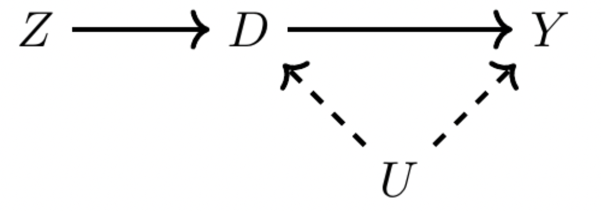
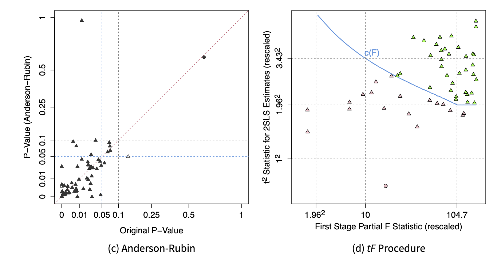
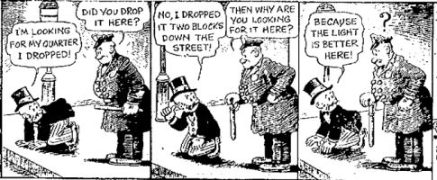
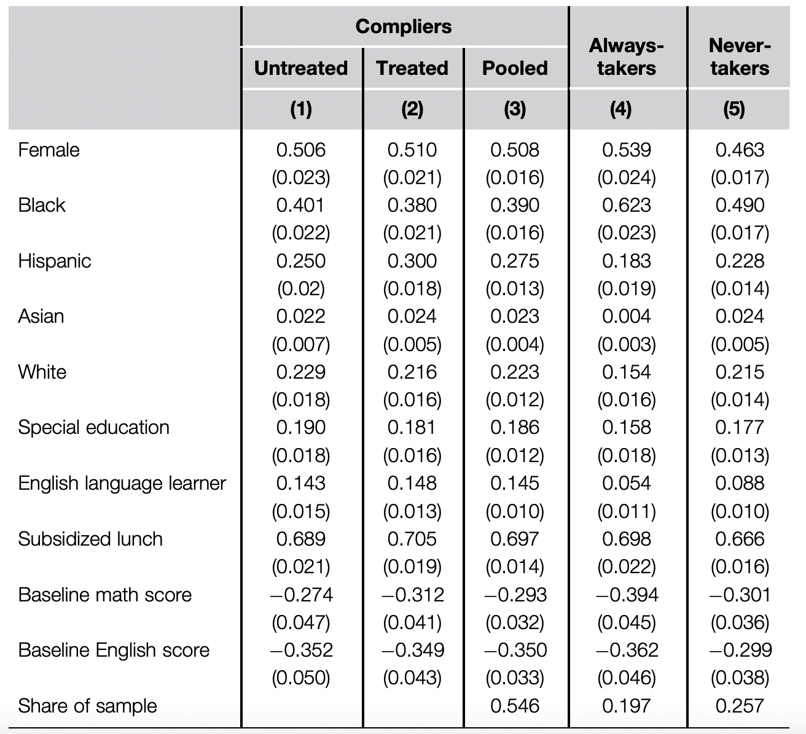

# Plan

- IV Basics
- Weak Instruments and Practical Recommendations
- Nonparametrics and LATE
- Judge IV and Shift Share

# IV Basics

- We worry that treatment (D) and outcome (Y) are confounded by unobservables
> - But suppose we can measure an exogenous **instrument** (Z) that affects the treatment

\pause

{width=300}


# IV Basics

> - Basic estimation (IV as ratio): $\frac{\text{effect of Z on Y}}{\text{effect of Z on D}}$
> - 2SLS estimation: 
>     - Same idea, but residualize w.r.t. controls (FWL)
>     - First, regress the treatment on the instruments + controls to get $\hat{D}$
>     - Second, regress the outcome on the $\hat{D}$
>     - This yields $\frac{Cov(\tilde{Z}, \tilde{Y})}{Cov(\tilde{Z}, \tilde{D})}$

# Manual 2SLS: Card (1995)

\footnotesize
- Effect of schooling on wages uses student home proximity to college as an instrument for education
```{r include=F}
pacman::p_load(estimatr, ivreg, ivDiag, fixest, modelsummary)
pacman::p_load(tidyverse, knitr, stargazer, parallel)
data("SchoolingReturns", package = "ivreg")
# rename for easier manipulation
sr <- SchoolingReturns[, 1:8]
sr$logWage <- log(sr$wage)
sr$nearcollege_num <- as.numeric(sr$nearcollege == "yes")
```

```{r}
s1 <- feols(education ~ nearcollege + ethnicity + smsa + south + age, sr)
sr$educ_inst <- predict(s1)
s2 <- feols(logWage ~ educ_inst + ethnicity + smsa + south + age, sr)
```

\pause

```{r, results='asis', echo=F}
etable(list(s1, s2), fitstat = c("n"), keep = c("nearcollege", "educ_inst"), tex = T)
```

# IV with fixest, estimatr, ivreg

\small

```{r}
# `estimatr` syntax: `y ~ x1 + x2 + ... + d | x1 + x2 + ... + z`
e.m <- estimatr::iv_robust(
  logWage ~ ethnicity + smsa + south + age + education |
    ethnicity + smsa + south + age + nearcollege,
  data = sr,
)

# `fixest` syntax: `y ~ x1 + x2 + ... | d ~ z`
f.m <- fixest::feols(
  logWage ~ ethnicity + smsa + south + age |
    education ~ nearcollege,
  data = sr
)

# `ivreg` syntax: `y ~ x1 + x2 + ... | d | z`
i.m <- ivreg::ivreg(
  logWage ~ ethnicity + smsa + south + age |
    education | nearcollege,
  data = sr
)
```

# IV with fixest, estimatr, ivreg

```{r, results='asis', warning=F}
modelsummary(
  list(s2, e.m, f.m, i.m),
  keep = c("educ"), gof_map = NA, "latex"
)
```

- Why are the SEs different?

# Lal et al (2024)


> - Audit 70 IV designs in JOP, APSR, AJPS 2012-2022
> - (1) Researchers often overestimate the strength of their instruments due to non-i.i.d. error structures
> - (2) Commonly used t-test for two-stage-least-squares (2SLS) estimates underestimate uncertainties.
> - (3) 2SLS estimates are inflated relative to OLS because of weak instruments
> - Develop `ivDiag` package

# IV Diag

```{r message=F, warning=F}
ivd <- ivDiag(
  data = sr,
  Y = "logWage",
  D = "education",
  Z = "nearcollege_num",
  controls = c("ethnicity", "smsa", "south", "age"),
  bootstrap = F
)
ivd$est_2sls %>% kable()
```

# Weak Instruments

> - Suppose the exclusion restriction holds (eg, randomly assigned instrument), but extremely weak association with treatment 
> - Remember 2SLS estimate $\frac{Cov(\tilde{Z}, \tilde{Y})}{Cov(\tilde{Z}, \tilde{D})}$
> - What happens if Z and D have a weak relationship?

# Weak Instrument: Simulation

\small
```{r,warning=TRUE,message=TRUE}
n <- 1000 # Number of observations
beta_true <- 2 # True effect of the treatment on the outcome
simulate_2SLS <- function(strength) {
  # Correlated random data using mvrnorm
  sig <- matrix(c(1, strength, strength, 1), 2, 2)
  dat <- MASS::mvrnorm(n, mu = rep(0, 2), Sigma = sig)
  Z <- dat[, 1]
  D <- dat[, 2]
  Y <- D * beta_true + rnorm(n)
  ivreg(Y ~ D | Z)
}
```

# Weak Instrument: Simulation

```{r}
set.seed(1) # For reproducibility
modelsummary(list(
  simulate_2SLS(0.02),
  simulate_2SLS(0.1),
  simulate_2SLS(0.6)
), gof_map = NA, keep = "D")
```

# Testing for weak instruments

> - Common wisdom: F-statistic of the first-stage regression > 10 
> - Example using the schooling/wages data:

\pause

```{r}
fitstat(f.m, "ivf")
```

> - F > 10 based on assumption of homoskedastic errors, hardly satisfied (Andrews, Stock \& Sun 2019)
> - Solutions: Robust/Effective F statistic (Montiel Olea \& Pflueger 2013)

\pause

```{r}
ivd$F_stat
```

# Lal et al 2024 on Weak Instruments

> - "To our surprise, among the 70 IV designs, 12 (17%) do not report the First-Stage Partial F-Statistic despite its key role in justifying the validity of an IV design. 
> - Among the remaining, 16\% use classic analytic SEs, thus not adjusting for potential heteroskedasticity or clustering structure.


# So you have a weak instrument

\small

> - tF procedure (Lee et al, 2022)
>     - Idea: use a t-test, but adjust the SEs of the second stage using the first stage effective F
>     - If first stage F = 104, tF procedure equivalent to naively reporting SEs of second stage OLS

\pause

```{r}
ivd$tF
```

> - Anderson-Rubin test (Andrews et al, 2019)
>     - Idea: use an F test to compare how much the instruments explain the dependent variable, under the null that the endogenous variables do not matter.
>     - Robust to weak instruments

\pause

```{r}
ivd$AR$ci.print
```

# Simulation: Setup

\small
```{r warning=F, message=F}
set.seed(1)
nums <- 1000
beta_true <- 0.5
simulate_2SLS <- function(strength) {
  # Correlated random data using mvrnorm
  sig <- matrix(c(1, strength, strength, 1), 2, 2)
  dat <- MASS::mvrnorm(nums, mu = rep(0, 2), Sigma = sig)
  Z <- dat[, 1]
  D <- dat[, 2]
  X <- rnorm(nums)
  # A little bit of misspecification / heteroskedasticity
  Y <- D * beta_true + rnorm(nums) + X * X
  ivDiag(
    data = data.frame(Y = Y, D = D, Z = Z, X = X),  
    Y = "Y", D = "D", Z = "Z", controls = "X", 
    bootstrap = F, parallel = F
  )
}
strengths <- c(seq(0.01, 0.1, 0.005), seq(0.1, 0.3, 0.01))
diags <- lapply(strengths, \(s) simulate_2SLS(s))
```

# Simulation: Setup

```{r}
# Extract all coefficients
fs <- lapply(diags, \(d) list(
  "F" = d$F_stat["F.standard"],
  "est" = d$est_2sls[1],
  "2sls.p" = d$est_2sls[6],
  "tFp" = d$tF["p-value"],
  "AR.lo" = d$AR$ci[1],
  "AR.hi" = d$AR$ci[2],
  "2sls.lo" = d$est_2sls[4],
  "2sls.hi" = d$est_2sls[5]
)) %>% bind_rows()
```

# Simulation: AR vs 2SLS CIs by F

```{r echo=F}
# Plot the AR interval and the 2SLS CIs relative to F
pacman::p_load(ggallin)
rbind(
  fs %>% select(F, AR.lo, AR.hi) %>% mutate(type = "AR") %>% rename(lo = AR.lo, hi = AR.hi),
  fs %>% select(F, `2sls.lo`, `2sls.hi`) %>% mutate(type = "2SLS") %>% rename(lo = `2sls.lo`, hi = `2sls.hi`)
) %>%
  mutate(type = factor(type, levels = c("AR", "2SLS"))) %>%
  ggplot(aes(x = F, ymin = lo, ymax = hi, fill = type)) +
  geom_ribbon(alpha = 0.8) +
  scale_x_sqrt(breaks = c(5, 10, 50, 100)) +
  scale_y_continuous(trans=pseudolog10_trans) +
  geom_hline(yintercept = 0, lty = 2) + 
  geom_hline(yintercept = 0.5, lty = 3)
```

# Simulation: tF vs 2SLS p values by F

```{r, echo=F} 
fs %>%
  pivot_longer(cols = c("2sls.p", "tFp")) %>%
  ggplot(aes(x = F, y = value, color = name)) +
  geom_line() +
  scale_x_sqrt() +
  scale_y_sqrt() +
  labs(y = "p value") +
  geom_hline(yintercept = 0.05, lty = 3)
```

# Simulation: coefficient estimate by F

```{r echo=F}
fs %>%
  filter(F > 1)  %>%
  ggplot(aes(x = F, y = est)) +
  geom_line() +
  scale_x_sqrt() +
  scale_y_sqrt() +
  geom_hline(yintercept = 0.5, lty = 3)

```

# Lal et al 2024 on AR/tF



# AR/tF Takeaways

\small

> - Essential when effective F is small and especially when treatment effect is small
> - Use the `ivDiag` package. Also provides bootstrap CIs
> - Plot all coefficients with `plot_coef` 

```{r, fig.height=4}
plot_coef(ivd)
```

# Nonparametric IV

> - Early justification for IV relied on parametric assumptions
>     - eg, **homogenous treatment effect**
> - However, IV can also be used in a nonparametric framework
> - We allow treatment effects to vary at the individual level (potential outcomes model)

# Compliance Framework 

* Let $Z_i$ be "treatment assignment" 
* Let $D_i$ be the "treatment received"
* Four types of units(or principal strata) in this setting:
  * Compliers: $D_i = Z_i$
  * Always-takers: $D_i = 1$. $Z_i$ doesn't matter 
  * Never-takers: $D_i = 0$. $Z_i$ doesn't matter
  * Defiers $D_i = ~Z_i$.
  
# Compliance Framework 

* Even if we observe D and Z, we don't know for sure what strata the unit falls into

|           | $Z_i = 0$                       | $Z_i = 1$                       |
|-----------|---------------------------------|---------------------------------|
| $D_i = 0$ | Never-taker or Complier         | Never-taker or Defier           |
| $D_i = 1$ | Always-taker or Defier          | Always-taker or Complier        |

# LATE Theorem

**Theorem:** Under classic IV assumptions + no defiers:  
\[
\frac{E[Y_i|Z_i = 1] - E[Y_i|Z_i = 0]}{E[D_i|Z_i = 1] - E[D_i|Z_i = 0]} = E[Y_{1i} - Y_{0i}|D_{1i} > D_{0i}]
\]

> - On the right: average causal effect of the treatment among compliers
> - On the left: For binary Z, this is equivalent to IV/2SLS estimator! 
> - LATE theorem: the IV/2SLS estimator targets the average causal effect of the treatment among compliers
> - Proof in lab materials

# Better LATE than never?

> - Angrist, Imbens, and others: We don't get the ATT or ATE but we get something that still makes some sense (particularly for policy).

> - Heckman, Deaton, and others: We don't get the ATT/ATE. How can we interpret LATE? How does the compliers framework transfer to observational settings?

\centering
{width=300}

# Recap

> - Under nonparametric assumptions, IV targets the LATE, a distinct quantity from ATE/ATT. Interpretation of this parameter is substantively important to get right.
> - Under parametric assumptions, IV can target the ATE/ATT. 
>      - If we assume that treatment effects are equal for everyone, then the LATE == ATE == ATT.
>      - If we rule out always-takers, then LATE == ATT


# Characterizing Compliers

> - We can’t tell if any given unit is a complier or an always-taker assigned to treatment (or a never-taker assigned to control)
> - But, we can still learn about compliers *on average*
> - It can often be useful to characterize the compliers of a given IV
> - E.g., to hint at mechanisms, contextualize findings, etc


# Decomposing LATE 


> - Suppose we want to know the average potential outcomes for compliers.
> - Consider IV on the modified outcome \( \tilde{Y_i} = Y_i D_i \)
> - If $D_i = 1$, then $\tilde{Y_i} = Y_i(1)$. If $D_i = 0$, then $\tilde{Y_i} = 0$.
> - So the "treatment effect" is \( \tilde{Y_i}(D_i=1) - \tilde{Y_i}(D_i=0)  = Y_i(1) \)
> - IV with $\tilde{Y_i}$ identifies a "LATE" which is just \( E[{Y_1} | D_i(1) > D_i(0)] \)
> - Similar logic shows that IV of \( \tilde{Y_i} = Y_i(1 - D_i) \) on \( \tilde{D_i} = 1 - D_i \) identifies the $Y_0$s of compliers.
> - Then, compare these to baseline control outcomes $E[Y_i(0) | D_i = 0]$

# Decomposing LATE (Angrist et al 2013)

\small

- Angrist et al 2013 shows how urban charter schools perform better than non urban charter schools

{width=400}

- $\lambda_{0/1}$ is the difference between complier un/treated potential outcomes and baseline
> - Charter school students are better at ELA than average (but no difference for math) *before attending* (high $\lambda_0$) 
> - Nonurban charter school students *become worse than average* at ELA and math
> - Urban charter school students *become better than average* at ELA and math

# Characterizing Compliers

> - Many ways to characterize other properties of complier group using similar tricks
> - Subjects assigned to the control group who take the treatment are “observable” always-takers, and subjects assigned to the treatment group who do not take the treatment are “observable” never-takers
> - Observable and nonobservable always/nevertakers should have the same covariate distribution if the instrument is independently assigned
> - So we can directly estimate the covariate means for these two subpopulations
> - By subtracting the weighted covariate mean of observable always-takers and never-takers from the covariate mean of the entire sample, we can back out the covariate mean for compliers.
> - Abadie weights (Abadie 2003) and Marbach and Hainmueller (2020) for more on this


# Illustration: Angrist, Hull, and Walters (2023)

\centering
{width=350}

# Illustration: Gerber, Karlan, and Bergan (2009)

\centering
{width=400}


# Illustration: Gerber, Karlan, and Bergan (2009)

\centering
{width=320}

# Constructed IVs (Judge, Shift Share)

- IV doesn't have to be a directly observed variable
- Some creative designs **construct** the IV

# Judge IV

> - Original setting: criminal justice, effect of sentence length on future earnings 
> - Assignment of cases to judges quasirandom.
> - Judges vary in harshness
> - With this, have enough for IV. Need to use leave-one-out jacknife estimation in the first stage.
> - Other settings: startup accelerators, admissions committees, police/emergency service dispatch ...


# Shift-Share IV aka Bartik Instrument

> - Autor, Dorn, Hanson (2013) aka ADH
> - Unit of analysis: geographic localities $\ell$
> - Treatment: Rising Chinese imports
> - Outcome: (un)employment
> - Instrument: $z_{\ell t} = \sum_n s_{\ell n t} g_{n_t}$
>     - $g_{n t}$: industry ($n$) level exposure to China import growth in **non-US** countries
>     - $s_{\ell n t}$ share of industry $n$ in locality $\ell$
>     - $t$ lagged
>     - Intuitively, "previous expected exposure to China imports"

# Shift-Share IV

> - Argument: shift-share is a valid instrument
>     - Industries have different exposure to "China shock"
>     - If shares of industries in locality are exogenous, then valid instrument for exposure to China shock

> - Argument: shift-share in ADH setting **not** valid instrument (Boryusak, 2022)
>     - Are shares of industries in a locality really exogenous?
>     - Intuitively, anything correlated with China shock exposure and employment not controlled for by "previous expected exposure" violates this assn.
>     - Eg, increase in automation

# Math appendix

# Weak Instruments

The probability limit of the IV estimator is given by:

\[
\text{plim} \ \hat{\alpha}_{IV} = \frac{\text{Cov}[Y, Z]}{\text{Cov}[Z, D]} + \frac{\text{Cov}[Z, u_2]}{\text{Cov}[Z, D]} = \alpha_D + \frac{\text{Cov}[Z, u_2]}{\text{Cov}[Z, D]}
\]

The second term is non-zero if the instrument is not exogenous. Let \(\sigma^2_{u_1}\) be the variance of the first stage error and \(F\) be the F statistic of the first-stage. Then, the bias in IV is

\[
\text{E}[\hat{\alpha}_{IV} - \alpha] = \frac{\sigma_{u_1 u_2}}{\sigma^2_{u_2}} \left( \frac{1}{F + 1} \right)
\]

If the first stage is weak, the bias approaches \(\frac{\sigma_{u_1 u_2}}{\sigma^2_{u_2}}\). As \(F\) approaches infinity, \(B_{IV}\) approaches zero.

# Abadie's Kappa (2003)

Suppose assumptions of LATE theorem hold conditional on covariates \( X \). Let \( g(\cdot) \) be any measurable real function of \( Y, D, X \) with finite expectation. We can show that the expectation of \( g \) is a weighted sum of the expectation in the three groups


\[
E[g|X] = \underbrace{E[g|X, D_1 > D_0] Pr(D_1 > D_0|X)}_\text{Compliers} + 
\]
\[
+\underbrace{E[g|X, D_1 = D_0 = 1] Pr(D_1 = D_0 = 1|X)}_\text{Always Takers}
\]
\[
+ \underbrace{E[g|X, D_1 = D_0 = 0] Pr(D_1 = D_0 = 0|X)}_\text{Never Takers}
\]

# Abadie's Kappa (2003)

Rearranging terms gives us then,
\[
E[g(Y, D, X)|D_1 > D_0] = \frac{E[k \cdot g(Y, D, X)]}{Pr(D_1 > D_0)} = \frac{E[k \cdot g(Y, D, X)]}{E[k]}
\]
where
\[
k_i = \frac{D(1 - Z)}{1 - Pr(Z = 1|X)} - \frac{(1 - D)Z}{Pr(Z = 1|X)}
\]

* This result can be applied to \textit{any characteristic or outcome and get its mean for compliers
by removing the means for never and always takers}.
* Standard example: average covariate value among compliers: $E[X|D_1 > D_0] = \frac{E[kX]}{E[k]}$


# LATE proof

* Canonical IV assumptions for $Z_i$ to be a valid instrument:
  1. Randomization of $Z_i$
  2. Presence of some compliers $\pi_{co} \neq 0$ (first-stage)
  3. Exclusion restriction $Y_i(z, d) = Y_i(z', d)$
  4. Monotonicity: $D_i(1) \geq D_i(0)$ for all $i$ (no defiers)

* Let $\pi_{co}$, $\pi_{at}$, $\pi_{nt}$, and $\pi_{de}$ be the proportions of each type.
* Implies ITT effect on treatment equals proportion compliers: $ITT_{D} = \pi_{co}$

* Implies ITT for the outcome has the same interpretation:

$$
ITT_{Y} = ITT_{Y,co} \pi_{co} + \underbrace{ITT_{Y,at}}_\text{=0 (ER)} \pi_{at} + \underbrace{ITT_{Y,nt}}_\text{=0 (ER)} \pi_{nt} + ITT_{Y,de} \underbrace{\pi_{de}}_\text{=0 (mono)}
$$
$$ = ITT_{Y,co} \pi_{co} $$

* $\approx$ same identification result: $\tau_{LATE} = \frac{ITT_Y}{ITT_D}$

# LATE Theorem

**Theorem:** Under assumptions 1 - 4:  
\[
\frac{E[Y_i|Z_i = 1] - E[Y_i|Z_i = 0]}{E[D_i|Z_i = 1] - E[D_i|Z_i = 0]} = E[Y_{1i} - Y_{0i}|D_{1i} > D_{0i}]
\]

**Proof.**  

Start with the first bit of the Wald estimator:

\[
E[Y_i|Z_i = 1] 
= E[Y_{0i} + (Y_{1i} - Y_{0i})D_i|Z_i = 1]
\]
\[
= E[Y_{0i} + (Y_{1i} - Y_{0i})D_{1i}]
\]

# LATE Theorem
**Proof.**  

Similarly
\[
E[Y_i|Z_i = 0] = E[Y_{0i} + (Y_{1i} - Y_{0i})D_{0i}]
\]

So the numerator of the Wald estimator is
\[
E[Y_i|Z_i = 1] - E[Y_i|Z_i = 0] = E[(Y_{1i} - Y_{0i})(D_{1i} - D_{0i})]
\]

Monotonicity means \(D_{1i} - D_{0i}\) equals one or zero, so
\[
E[(Y_{1i} - Y_{0i})(D_{1i} - D_{0i})] = E[Y_{1i} - Y_{0i}|D_{1i} > D_{0i}]P[D_{1i} > D_{0i}].
\]

A similar argument shows
\[
E[D_i|Z_i = 1] - E[D_i|Z_i = 0] = P[D_{1i} > D_{0i}].
\]

