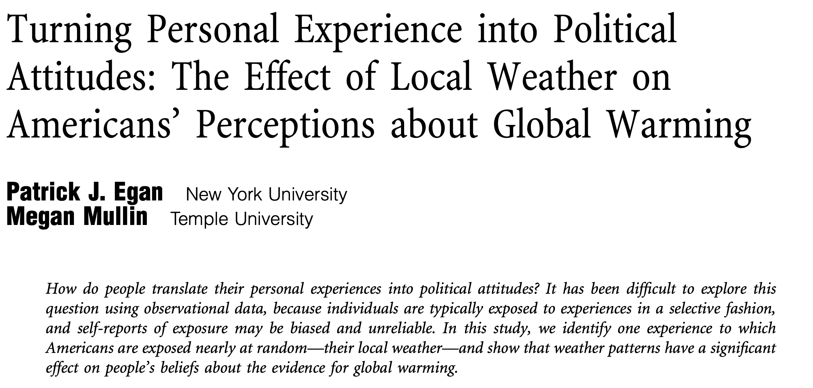
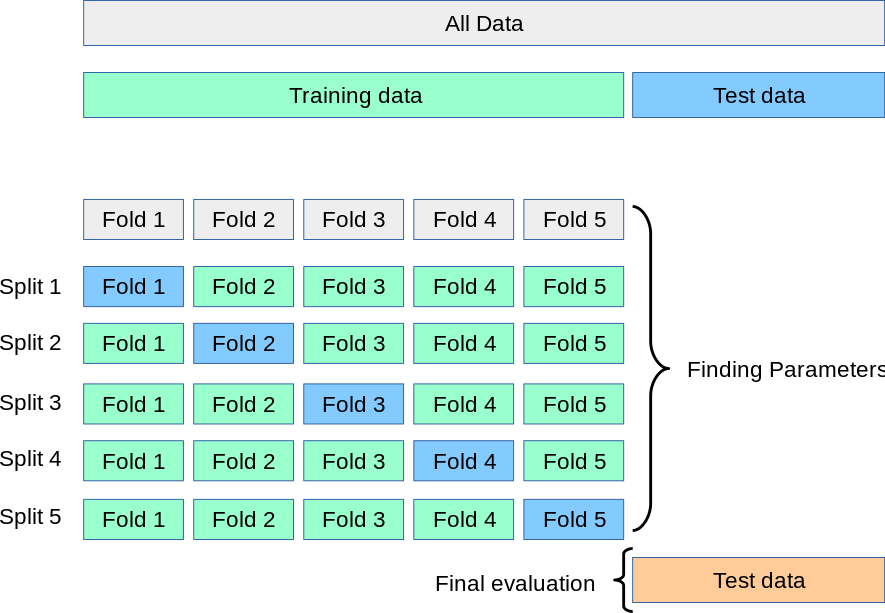
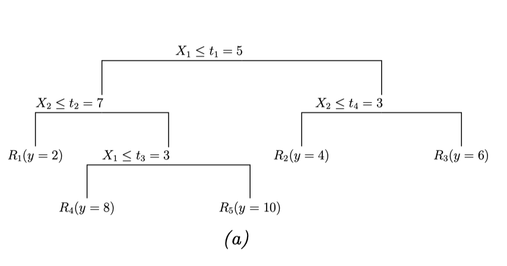

# Today's Agenda

- Effective Sample Size
- Weighting
- Specification Error
- Double Machine Learning Partially Linear Regression


```{r}
#| include: false
library(tidyverse)
library(knitr)
library(broom)
library(fixest)
library(ggpubr)
library(here)
pacman::p_load(haven, maps, tidyverse, gridExtr)
here::i_am("lab04/lab04_slides.qmd")
```

# Effective Samples Intuition

- Consider a unit whose D is perfectly explained by X
- Then, does this unit help identify the effect of D|X on Y?

# Effective Samples Intuition

- Simulation
- True treatment effect is 1
- How is X related to D here?

```{r}
set.seed(12)
N <- 1000
X <- rnorm(N)
D <- X + rbinom(N, size = 1, prob = 0.10) * rnorm(N)
Y <- D + X + rnorm(N)
df <- data.frame(X = X, D = D, Y = Y)
```

\pause

```{r}
table(df$X == df$D)
```

# Effective Samples: Intuition

\small
```{r}
models <- list(
    feols(Y ~ D + X, data = df),
    feols(Y ~ D + X, data = df %>% filter(df$X != df$D))
)
```

```{r}
#| echo: false
etable(models, fitstat = c("n"))
```

# Effective Sample Weights
:::{.incremental}
- Observations where D is already "explained" by X are almost useless
- Effective Sample Weights formalize this intuition
- The effective sample weight for unit $i$ is $\hat{w}_i = (D_i - \hat{E}[D_i|X_i])^2$
     - If we assume linearity of the treatment assignment in $X_i$, then
     - Run the regression $D_i = X_i\gamma + e_i$
     - Take residual $\hat{e}_i = D_i - X_i \hat{\gamma}$ and square it
:::

# What can you do with the sample weights?
:::{.incremental}
- Use them to characterize your "effective" sample
- Maybe some substantive interpretation
- Eg, original sample is "representative," but is the effective sample "representative?"
- Interpretation depends on the research setting. Controlling for confounders likely makes the effective sample non representative, if you started with a representative sample.
:::

# Example: Egan/Mullin 2012



# Example: Egan/Mullin 2012

```{r}
#| include: false
# Import state IDs
statenums <- read_dta(here("lab04/data/zipcodetostate.dta")) %>%
    distinct(statenum, statefromzipfile) %>%
    rename(abb = statefromzipfile) %>%
    filter(!(statenum == 8 & abb == "NY")) # duplicate entry

# Import population data
pops <- read.csv(here("lab04/data/population_ests_2013.csv")) %>% mutate(
    state = tolower(NAME)
)

# Import state fips data
data(state.fips)

state.data <- statenums %>%
    left_join(state.fips, by = "abb") %>%
    left_join(pops, by = c("fips" = "STATE")) %>%
    distinct(abb, .keep_all = T)

d <- read_dta(here("lab04/data/gwdataset.dta")) %>% left_join(state.data)

# Format
d$getwarmord <- as.double(d$getwarmord)
```

- Outcome variable `getwarmord` (attitudes about climate change)
    -   "From what you've read and heard, is there solid evidence that the average temperature on earth has been getting warmer over the past few decades, or not?" \pause

- Treatment variable `ddtweek` (departure from normal daily average local temperature) \pause


\footnotesize
```{r}
out.d <- feols(ddt_week ~ educ_hsless + educ_coll + educ_postgrad +
    educ_dk + party_rep + party_leanrep + party_leandem +
    party_dem + male + raceeth_black + raceeth_hisp +
    raceeth_notwbh + raceeth_dkref + age_1824 + age_2534 +
    age_3544 + age_5564 + age_65plus + age_dk + ideo_vcons +
    ideo_conservative + ideo_liberal + ideo_vlib + ideo_dk +
    attend_1 + attend_2 + attend_3 + attend_5 + attend_6 +
    attend_9 | doi + state + wbnid_num, d)
```

\pause

```{r}
# Extract the residuals and take their square
d$wts <- residuals(out.d)^2
```

# Example: Egan/Mullin 2012

- Suppose we want to characterize the sample contribution by state
- "Nominal" weight: just the (normalized) number of observations per state

```{r}
#| echo: false
#| fig-width: 8
#| fig-height: 4

state_map <- map_data("state")
theme_state_map <- function(map) {
    map +
        expand_limits(x = state_map$long, y = state_map$lat) +
        scale_fill_continuous("% Weight", limits = c(0, 17), low = "white", high = "black") +
        theme(
            legend.position = c(.2, .1), legend.direction = "horizontal",
            axis.line = element_blank(), axis.text = element_blank(),
            axis.ticks = element_blank(), axis.title = element_blank(),
            panel.background = element_blank(),
            plot.background = element_blank(),
            panel.border = element_blank(),
            panel.grid = element_blank()
        )
}
```

```{r}
#| fig-width: 8
#| fig-height: 4
nom_map <- theme_state_map(d %>%
    group_by(state) %>%
    summarize(nom = n() * 100 / nrow(d)) %>%
    ggplot(aes(map_id = state)) +
    geom_map(aes(fill = nom), map = state_map) +
    labs(title = "Nominal Sample"))
```

# Example: Egan/Mullin 2012

```{r}
#| echo: false
#| fig-width: 8
#| fig-height: 4
nom_map
```

# Example: Egan/Mullin 2012

- To characterize the "effective" contribution of each state, use the effective sample weight instead

```{r}
eff_map <- theme_state_map(d %>%
    group_by(state) %>%
    summarize(eff = sum(wts) * 100 / sum(d$wts)) %>%
    ggplot(aes(map_id = state)) +
    geom_map(aes(fill = eff), map = state_map) +
    labs(title = "Effective Sample"))
```

# Example: Egan/Mullin 2012

```{r}
#| echo: false
#| fig-width: 8
#| fig-height: 4
eff_map
```

# Example: Egan/Mullin 2012

```{r}
#| echo: false
#| fig-width: 8
#| fig-height: 4
d %>%
    group_by(state) %>%
    summarize(
        nom = n() * 100 / nrow(d),
        eff = sum(wts) * 100 / sum(d$wts),
        diff = eff - nom
    ) %>%
    ggplot(aes(map_id = state)) +
    geom_map(aes(fill = diff), map = state_map) +
    expand_limits(x = state_map$long, y = state_map$lat) +
    scale_fill_gradient2("Difference", limits = c(-2, 8), low = "#D55E00", mid = "grey95", high = "#0072B2") +
    labs(title = "Difference Effective and Nominal Weight") +
    theme(
        legend.position = c(.2, .1), legend.direction = "horizontal",
        axis.line = element_blank(), axis.text = element_blank(),
        axis.ticks = element_blank(), axis.title = element_blank(),
        panel.background = element_blank(),
        plot.background = element_blank(),
        panel.border = element_blank(), panel.grid = element_blank()
    )
```

# Example: Egan/Mullin 2012

- One possible critique here: 
     - Coastal cities in WA, CA have extremely variable weather
     - Rural areas of WA, CA have extremely stable weather
     - We control for liberal/conservative, but maybe there's urban/rural confounding slightly separate driving results?
     
     
# Propensity score
- The propensity score is defined as 
$$ e(X_i) = P(D_i = 1|X_i) = E(D_i|X_i) $$
- Under strong ignorability, we have

(Rosenbaum and Rubin)
$$D_{i} \perp (Y_{0i},Y_{1i}) \mid e(X_i)$$
$$D_i \perp X_{i} \mid e(X_i)$$

# Weighting 

-   Inverse probability weighting (IPW) is appealing
-   With correct $e(X)$ and overlap, it identifies the PATE under CIA by creating a pseudo-population where $D$ is independent of $X$

\pause
\scriptsize
$$
\begin{aligned}
E \left[\frac{D_iY_i}{e(X_i)} - \frac{(1-D_i)Y_i}{1-e(X_i)}\right] 
  & = E \left[\frac{D_iY_{1i}}{e(X_i)} - \frac{(1-D_i)Y_{0i}}{1-e(X_i)}\right] \\
  & = E\left[ E\left[\frac{D_iY_{1i}}{e(X_i)} - \frac{(1-D_i)Y_{0i}}{1-e(X_i)} \mid X_i \right]\right] \\
  & = E\left[ \frac{E[D_i|X_i] E[Y_{1i}|X_i]}{e(X_i)} - \frac{E[1-D_i|X_i]E[Y_{0i}|X_i]}{1-e(X_i)} \right] \\
  & = E\left[\frac{e(X_i)E[Y_{1i}|X_i]}{e(X_i)} - \frac{(1-e(X_i)) E[Y_{0i}|X_i]}{1-e(X_i)}\right] = \\
  & = E[E[Y_{1i} - Y_{0i}|X_i]] = E[Y_{1i} - Y_{0i}] \\
  & = \tau_{PATE}
\end{aligned}
$$
\pause
\normalsize
Unstable with extreme weights when $e(X_i)$ is near 0 or 1

# Weighting
A natural weighting estimator is the IPW estimator. 
$$
\hat{\tau} = \frac{1}{N} \sum_{i=1}^N\frac{D_iY_i}{\hat{e}(X_i)} - \frac{1}{N}\sum_{i=1}^N\frac{(1-D_i)Y_i}{1 - \hat{e}(X_i)}
$$

We usually use a "normalized" version of it.
$$
\hat{\tau}_{ipw} = \frac{\sum_{i=1}^N\frac{D_iY_i}{\hat{e}(X_i)}}{\sum_{i=1}^N\frac{D_i}{\hat{e}(X_i)}} - \frac{\sum_{i=1}^N\frac{(1-D_i)Y_i}{(1-\hat{e}(X_i))}}{\sum_{i=1}^N\frac{(1-D_i)}{(1-\hat{e}(X_i))}}
$$

Shifts modeling burdens from estimating $E[Y_i|X_i]$ to estimating $e(X_i)$. 


# Weighting
> - Other weighting estimators do not model the probability of treatment but target covariate balance directly

> - E.g. Covariate Balancing Propensity Score, Entropy Balancing

> - In R: all available in the package `WeightIt`
>   - Other packages: `CBPS`, `PSweight`, `Causalweight`

> - Methods allowed for IPW: glm (default), non-parametric methods, SuperLearner

# Weighting
Application to climate change opinions example
\tiny
```{r}
# Use WeightIt package
pacman::p_load(WeightIt)

# Binary indicator for treatment 
d$treat <- ifelse(d$ddt_week>quantile(d$ddt_week, 0.75),1,0)
  
# Propensity score weighting
wd <- weightit(treat ~ educ_hsless + educ_coll + educ_postgrad +
    educ_dk + party_rep + party_leanrep + party_leandem +
    party_dem + male + raceeth_black + raceeth_hisp +
    raceeth_notwbh + raceeth_dkref + age_1824 + age_2534 +
    age_3544 + age_5564 + age_65plus + age_dk + ideo_vcons +
    ideo_conservative + ideo_liberal + ideo_vlib + ideo_dk +
    attend_1 + attend_2 + attend_3 + attend_5 + attend_6 +
    attend_9 + as.factor(statenum), 
    data=d, estimand="ATT", method = "ps")

# Description
wd
```


# Weighting

\tiny
```{r}
# Describe the weights
summary(wd)
```

# Weighting
```{r}
# Weighted difference in means
etable(feols(getwarmord ~ treat, data = d, weights = wd$weights, cluster = ~wbnid_num), fitstat = c("n"))
```

     
# Specification Error

- Linear specification for controls is a substantive assumption
- Introduce bias when confounding is nonlinear and controls are misspecified 
- Simulation:
    - True effect is 0.5
    - Nonlinearity in both y ~ x and d ~ x

\pause

```{r}
set.seed(123)
N <- 5000
effect <- 0.5
age <- rnorm(N, 0, 1)
age2 <- -(age)^2 + age
d <- rbinom(N, size = 1, prob = plogis(age2))
income <- -(age)^2 + age + rnorm(N) + d * effect
```

# Specification Error

```{r}
#| echo: false
#| fig-width: 6
#| fig-height: 3
dat <- data.frame(
    age = age,
    income = income,
    d = d
)
ggplot(dat, aes(x = age, y = income, color = as.factor(d))) +
    geom_point(alpha = 0.5) +
    theme_bw()
```

# Specification Error

- Using a linear specification for control leads to bias in estimate

\small
```{r}
etable(feols(income ~ age + d, data = dat), fitstat = c("n"))
```

# Specification Error

> - But, a problem quickly arises.
> - How do we know what specification to use?
> - "Classical" Machine Learning: flexible algorithms to estimate nonlinear relationships


# Machine Learning Packages in R
- `mlr3`: unified interface for training, predicting, cross-validation, tuning hyperparameters; pipelines and benchmarking

- `mlr3learners`: companion package providing a catalog of model implementations ("learners") you can plug into `mlr3`

- `xgboost`: Gradient-boosted decision trees

- `ranger`: Random Forests

\pause

If you're interested in ML

-  Quant 3 - Machine Learning
- A Machine Learning Textbook:
    -   \href{https://probml.github.io/pml-book/book1.html}{Probabilistic Machine Learning: An Introduction} by Kevin Patrick Murphy. MIT Press, March 2022.

# Regularized Linear Regression: Ridge, Lasso, Elastic Net
\small
Goal: Predict Y from many covariates X without overfitting by shrinking coefficients.
$$\hat\beta=\arg\min_\beta \frac{1}{N}\sum_{i=1}^N (y_i-x_i^\top\beta)^2 \;+\; \lambda\,\text{Penalty}(\beta)$$

-   Lasso (L1): Penalty = $\sum_j |\beta_j|$
    -   Shrinks and can set some coefficients exactly to $0$. \pause

-   Ridge (L2): Penalty = $\sum_j \beta_j^2$
    -   Shrinks coefficients toward 0; usually keeps all variables. \pause

-	Elastic Net (L1 + L2): Penalty = $\alpha\sum_j|\beta_j| + (1-\alpha)\sum_j\beta_j^2$

- Choose $\lambda$ (and $\alpha$ for Elastic Net) by cross-validation.


# Cross Validation

{fig-align="center" width=70%}

Image from \href{https://scikit-learn.org/stable/modules/cross_validation.html}{sk-learn}

# Trees

**Tree**: a set of nested decision rules

-   Recursively partitioning the input space
-   Assign a local prediction to each region (a constant mean / class probability)

{fig-align="center" width=70%}

\scriptsize (Murphy 2022)

# Trees

**Training**

-   Minimize total prediction error on the training data. \pause
-   Greedy procedure (CART)
    -   iteratively grow the tree one node at a time
    -   at each node, choose the split that gives the biggest immediate loss reduction
-   Common hyperparameters: max depth, min leaf size, min split size, pruning/complexity, features tried per split.
-   Tune by CV \pause
-   Prevent overfitting is critical - set maximum depth or *prune* \pause

**Problem**

-   Easy to interpret but sensitive to small changes in the data
-   High-variance problem \pause

$\rightarrow$ Ensemble methods combining many trees 

# Bagging, Random Forest
**Bagging** (Bootstrap Aggregating)

-   Problem: single trees have high variance (unstable predictions)
-   Idea: fit many trees on bootstrap resamples, then aggregate predictions
    -   averaging many noisy models reduces variance

**Random Forests**

-   Bagging + extra randomness
-   At each split, consider only a random subset of features (mtry)
    -   Reduces correlation between trees, soaveraging becomes more effective

# Boosting

-   Build trees sequentially, each new tree improves on the current model
-   Result is an additive model 
-   Intuition: each tree learns to predict the remaining errors
    -   Each tree is scaled, usually by performance or a learning rate
-   Easy to overfit
    -   Regularization is crucial: shallow trees, early stopping, small learning rates
-   Adaboost, gradient boosting, XGBoost (extreme gradient boosting)


# Classical Machine Learning

```{r}
pacman::p_load(mlr3, xgboost, mlr3learners, ranger)

# Use XGBoost algorithm
learner <- lrn("regr.xgboost", eta = 0.1, nrounds = 35)
# Set up a task to predict 'income'
task <- as_task_regr(
    select(dat, income, age),
    target = "income"
)
# Fit to the data
learner$train(task)
```

# Classical Machine Learning

```{r}
dat$preds <- learner$predict_newdata(dat)$response
```
```{r}
#| echo: false
#| fig-width: 6
#| fig-height: 3
ggplot(dat, aes(x = age, y = preds, color = as.factor(d))) +
    geom_point(alpha = 0.5) +
    theme_bw()
```

# Double Machine Learning - partially linear regression

- Now, we can predict Y given X in a nonlinear way. \pause
- How do we use this to retrieve a good estimate of `Y ~ D | X`? \pause
- Basic idea is to use ML to model both `y ~ x` and `d ~ x` and use the residuals to retrieve a consistent estimate for $\theta$

# PLR By Hand

\small

```{r}
# Model y as a function of age
y.x <- lrn("regr.xgboost", eta = 0.1, nrounds = 35)
y.x.task <- as_task_regr(
    select(dat, income, age),
    target = "income"
)
y.x$train(y.x.task)
```

\pause

```{r}
# Model D as a function of age
d.x <- lrn("regr.xgboost", eta = 0.1, nrounds = 35)
d.x.task <- as_task_regr(
    select(dat, d, age),
    target = "d"
)
d.x$train(d.x.task)
```

\pause

```{r}
# Calculate residuals
d.x.resid <- dat$d - d.x$predict_newdata(dat)$response
y.x.resid <- dat$income - y.x$predict_newdata(dat)$response
```

# PLR By Hand
\scriptsize
```{r}
# effect <- 0.5
# income <- -(age)^2 + age + rnorm(N) + d * effect
summary(lm(y.x.resid ~ d.x.resid))
```

# DML PLR By Hand
```{r}
set.seed(123)

# dat must have columns: income (Y), d (D), age (X)
K <- 5
fold_id <- sample(rep(1:K, length.out = nrow(dat)))

# Learners for nuisance functions
y_learner <- lrn("regr.xgboost", eta = 0.1, nrounds = 35)
d_learner <- lrn("regr.xgboost", eta = 0.1, nrounds = 35)

# Storage for out-of-fold predictions
y_hat <- rep(NA_real_, nrow(dat))
d_hat <- rep(NA_real_, nrow(dat))
```

# DML PLR By Hand
\scriptsize
```{r}
for (k in 1:K) {
  idx_test  <- which(fold_id == k)
  idx_train <- which(fold_id != k)

  # Train m(x): y ~ age on training folds
  y_task <- as_task_regr(dat[idx_train, c("income", "age")], target = "income")
  y_fit <- y_learner$clone(deep = TRUE)
  y_fit$train(y_task)

  # Train g(x): d ~ age on training folds
  d_task <- as_task_regr(dat[idx_train, c("d", "age")], target = "d")
  d_fit <- d_learner$clone(deep = TRUE)
  d_fit$train(d_task)

  # Predict on held-out fold
  y_hat[idx_test] <- 
    y_fit$predict_newdata(dat[idx_test, "age", drop = FALSE])$response
  d_hat[idx_test] <- 
    d_fit$predict_newdata(dat[idx_test, "age", drop = FALSE])$response
}
```

# DML PLR by Hand
\scriptsize
```{r}
# Cross-fitted residuals
y_resid <- dat$income - y_hat
d_resid <- dat$d - d_hat

# Second stage (PLR)
summary(lm(y_resid ~ d_resid))
```


# A More Complex Example

A more complex dataset...

```{r}
#| echo: false
set.seed(123)
n_obs <- 5000
n_vars <- 50
theta <- 2
X <- matrix(rnorm(n_obs * n_vars), nrow = n_obs, ncol = n_vars)

# 50 normally distributed variables
# Let's make some nonlinearities
for(i in 20:50) {
    # Make a random polynomial combination of several other variables
    n_poly <- sample(1:5, 1)
    vars <- sample(1:50, n_poly)
    powers <- sample(1:3, n_poly, replace=T)
    col <- X[,i]
    for (j in 1:n_poly) {
      z <- scale(X[, vars[j]])[, 1]           # standardize to avoid huge values
      col <- col + z ^ powers[j]
    }
    X[, i] <- scale(col)[, 1]                 # re-scale after construction
}

d_effects <- rbinom(n_vars, size=1, prob=0.6)
d <- X %*% d_effects + rnorm(n_obs)

x_effects <- rbinom(n_vars, size=1, prob=0.6)
y <- (X %*% x_effects) + (theta * d) + rnorm(n_obs)

df <- data.frame(
    y=y,
    d=d
) %>% cbind(X) 
colnames(df) <- c('y', 'd', sapply(1:50, \(x) paste0('X', x)))
```

\small

```{r}
glimpse(df)
```


# Single ML - not causal
\small
```{r}
set.seed(123)

# Use the mlr3 library to set up a machine learning workflow
# The glmnet.cv regression model uses Elastic Net regularization
# Here, we use lambda with lowest cross-validated error. 
# Use lambda.1se for a more parsimonious model
lrner <- lrn("regr.cv_glmnet", s="lambda.min") 

# Make a "training task" to target Y (outcome)
task <- as_task_regr(df, target='y')

# Train the model
lrner$train(task)

# Extract the coefficient for d directly
coef(lrner$model, s="lambda.min")['d',]
```


# `DoubleML` Package
\small
```{r}
pacman::p_load(DoubleML)
dmd <- double_ml_data_from_data_frame(df, y_col='y', d_cols='d')
dmd
```

# `DoubleML` Package

\scriptsize
```{r}
# Make a fresh instance of the learner object
ml_l_sim <- lrn("regr.cv_glmnet", s = "lambda.1se") # y learner
ml_m_sim <- lrn("regr.cv_glmnet", s = "lambda.min") # d learner
set.seed(1)
obj_dml_plr_sim <- DoubleMLPLR$new(dmd, ml_l = ml_l_sim, ml_m = ml_m_sim, n_folds = 5)
obj_dml_plr_sim$fit()
obj_dml_plr_sim$summary()
```

# `DoubleML` Package

\scriptsize
```{r}
# mtry = Number of variables randomly sampled as candidates at each split.
ml_l_rf = lrn("regr.ranger", max.depth = 5, mtry = 7, min.node.size = 5)
ml_m_rf = lrn("regr.ranger", max.depth = 5, mtry = 7, min.node.size = 5)
set.seed(1)
obj_dml_plr_rf <- DoubleMLPLR$new(dmd, ml_l = ml_l_rf, ml_m = ml_m_rf, n_folds = 5)
obj_dml_plr_rf$fit()
obj_dml_plr_rf$summary()
```


