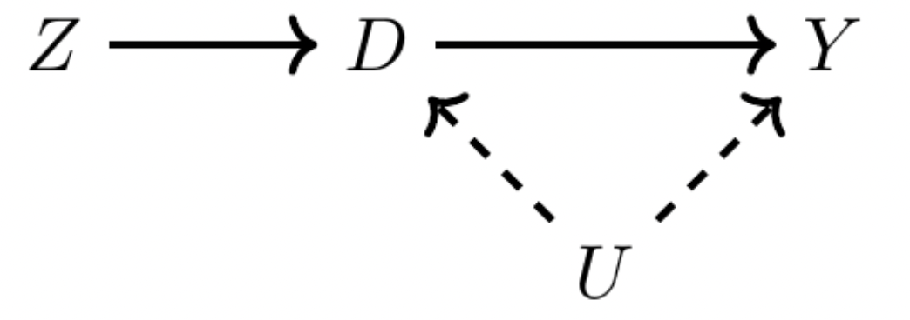
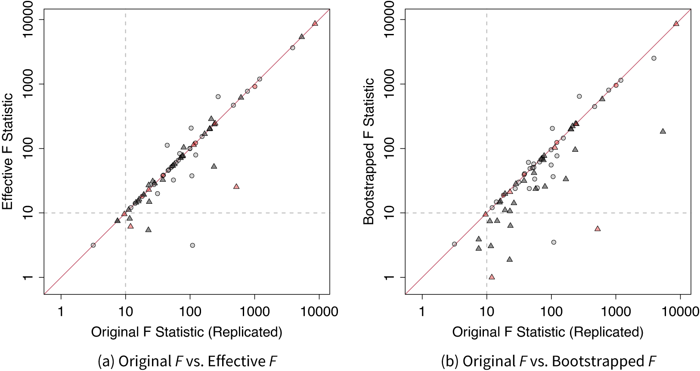
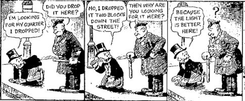
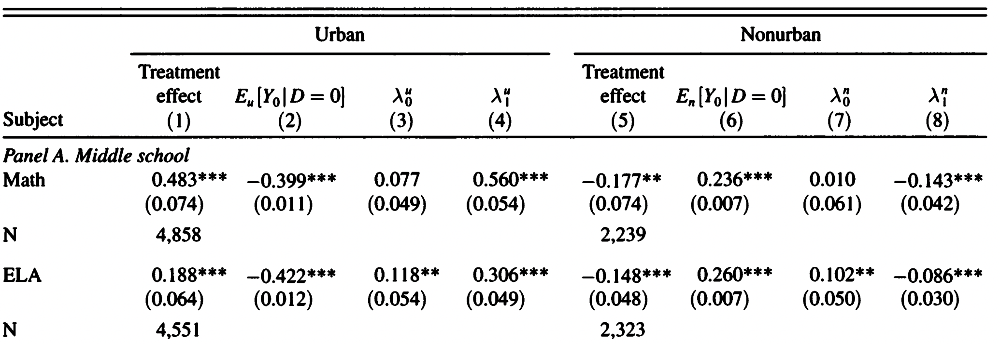
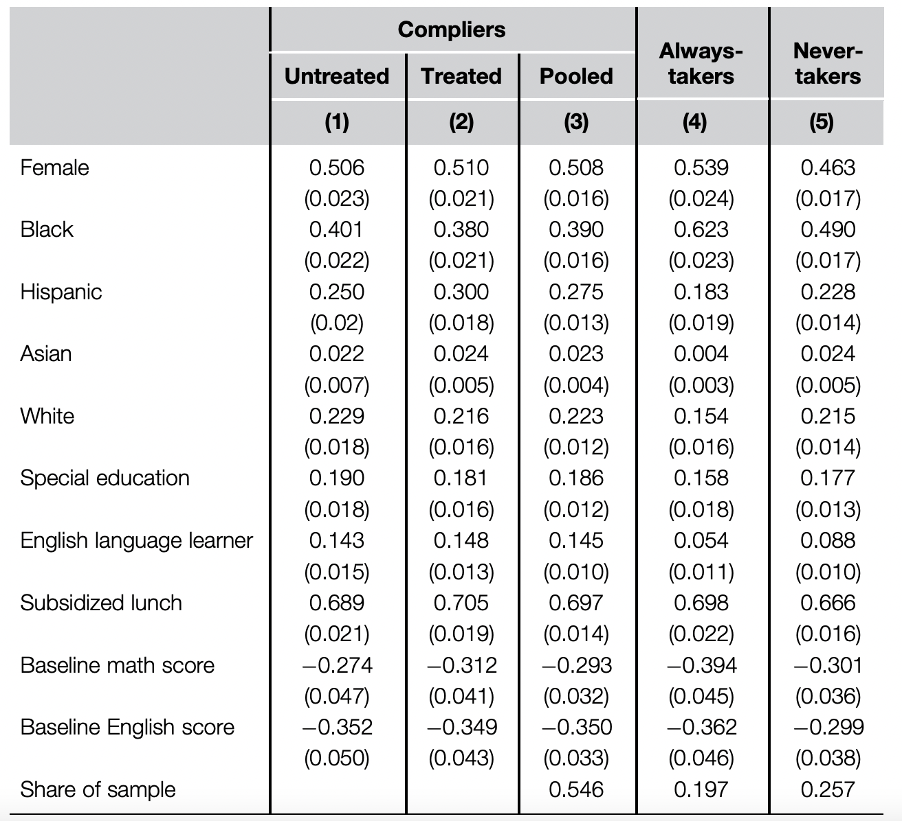

# Today's Agenda

- IV in practice
- Weak Instruments 
- Characterizing compilers
- Constructed IV - Shift-share


```{r}
#| include: false
pacman::p_load(modelsummary)
pacman::p_load(tidyverse, knitr, stargazer)
here::i_am("lab05/lab05_slides.qmd")
```

# IV Basics

- We worry that treatment (D) and outcome (Y) are confounded by unobservables
- But suppose we can measure an exogenous **instrument** (Z) that affects Y only via the treatment \pause

{fig-align="center" width=70%}


# IV Basics

- Basic estimation (IV as ratio): $\frac{\text{effect of Z on Y}}{\text{effect of Z on D}}$
- 2SLS estimation: 
    - Same idea, but residualize w.r.t. controls (FWL)
    - First, regress the treatment on the instruments + controls to get $\hat{D}$
    - Second, regress the outcome on the $\hat{D}$
    - This yields $\frac{Cov(\tilde{Z}, \tilde{Y})}{Cov(\tilde{Z}, \tilde{D})}$

# 2SLS

- Effect of schooling on wages uses student home proximity to college as an instrument for education \pause

\scriptsize
```{r}
pacman::p_load(ivreg, fixest)
data("SchoolingReturns", package = "ivreg")
```

```{r}
#| include: false
# rename for easier manipulation
sr <- SchoolingReturns[, 1:8]
sr$logWage <- log(sr$wage)
sr$nearcollege_num <- as.numeric(sr$nearcollege == "yes")
```

\pause

```{r}
s1 <- feols(education ~ nearcollege + ethnicity + smsa + south + age, sr)
sr$educ_inst <- predict(s1)
s2 <- feols(logWage ~ educ_inst + ethnicity + smsa + south + age, sr)
```

\pause

```{r}
#| echo: false
etable(list(s1, s2), 
       fitstat = c("n"), 
       keep = c("nearcollege", "educ_inst"),
       signif.code = c("***"=0.01, "**"=0.05, "*"=0.1))
```


# `ivreg` `fixest` `estimatr`

```{r}
# ivreg
# `y ~ x1 + x2 + ... | d | z`
pacman::p_load(ivreg, sandwich, lmtest)
m.ivreg <- ivreg(
  logWage ~ ethnicity + smsa + south + age |
    education | nearcollege,
  data = sr
)
```

# `ivreg` `fixest` `estimatr`

```{r}
# fixest
# `fixest` syntax: `y ~ x1 + x2 + ... | d ~ z`
m.fixest <- feols(
  logWage ~ ethnicity + smsa + south + age |
    education ~ nearcollege,
  vcov = "hc1",
  data = sr
)
```


# `ivreg` `fixest` `estimatr`

```{r}
# estimatr
# `estimatr` syntax: `y ~ x1 + x2 + ... + d | x1 + x2 + ... + z`
pacman::p_load(estimatr)
m.estimatr <- iv_robust(
  logWage ~ ethnicity + smsa + south + age + education |
    ethnicity + smsa + south + age + nearcollege,
  se_type = "HC1",
  data = sr,
)
```

# `ivreg` `fixest` `estimatr`

\scriptsize
```{r}
models <- list(m.ivreg, m.fixest, m.estimatr)
names(models) <- c("m.ivreg", "m.fixest", "m.estimatr")
vcovs <- list(
  vcovHC(m.ivreg, type = "HC1"),
  vcov(m.fixest), vcov(m.estimatr)
)
modelsummary(models, vcov = vcovs, 
             keep = c("educ"), 
             statistic = "std.error", 
             stars = c("***"=0.01, "**"=0.05, "*"=0.1), 
             gof_map = "nobs", output = "kableExtra")
```

# Weak instruments

- Weak instruments: small correlation of the instrument with the endogenous treatment 
- Exacerbate bias and make inference unreliable \pause
- Old advice: F-statistic of the first-stage regression > 10
- New advice: > 104.7

# Weak instruments
- Example using the schooling/wages data:

```{r}
fitstat(m.fixest, "ivf")
```

\pause

- F 10 based on assumption of homoskedastic errors, hardly satisfied (Andrews, Stock \& Sun 2019) \pause
- Solutions: 
    - Robust F statistic. (Andrews, Stock \& Sun 2019)\
    - Effective first-stage F-statistic (Montiel Olea \& Pflueger 2013)

# Lal et al (2024) `ivDiag`

{fig-align="center" width=70%}

- Audit 70 IV designs in JOP, APSR, AJPS 2012-2022 \pause
    - 1. Researchers often overestimate the strength of their instruments due to non-i.i.d. error structures \pause
    - 2. Commonly used t-test for two-stage-least-squares (2SLS) estimates underestimate uncertainties. \pause
    - 3. 2SLS estimates are inflated relative to OLS because of weak instruments \pause
- Develop `ivDiag` package (\href{https://yiqingxu.org/packages/ivDiag/articles/iv_tutorial.html
}{Tutorials})

# `ivDiag` and Robust/Effective F-stat

\scriptsize
```{r message=F, warning=F}
pacman::p_load(ivDiag)
ivd <- ivDiag(
  data = sr,
  Y = "logWage",
  D = "education",
  Z = "nearcollege_num",
  controls = c("ethnicity", "smsa", "south", "age"),
  bootstrap = F
)
# Can do bootstrap CIs with `bootstrap = T`
ivd$est_2sls %>% kable()
```

\pause

```{r}
ivd$F_stat
```

# Lal et al 2024 on Weak Instruments

- "To our surprise, among the 70 IV designs, 12 (17\%) do not report the First-Stage Partial F-Statistic despite its key role in justifying the validity of an IV design. \pause
- Among the remaining, 16\% use classic analytic SEs, thus not adjusting for potential heteroskedasticity or clustering structure. \pause

{fig-align="center" width=70%}


# Weak Instruments - tF procedure

Lee et al, 2022

- Want valid t-ratio inference for just-identified IV 
- Replace the fixed cutoff (e.g., 1.96) with a critical value that depends on the first-stage effective F \pause
- Or equivalently, rescales the 2SLS SE by an F-dependent factor and use the standard critical value \pause

\scriptsize
```{r}
ivd$tF
```

# Weak Instruments - Anderson-Rubin test

Andrews et al, 2019

- Under a null $\rho=\rho_0$ is true, then after subtracting out $\rho_0D$ from $Y$, the instrument $Z$ should have no remaining predictive power for the adjusted outcome $Y-\beta_0D$
- So we test whether $Z$ still explains $Y-\beta_0D$ \pause
- Robust to weak instruments \pause

\scriptsize
```{r}
ivd$AR
```

# Weak Instruments

- When you have small effective F-statistic 
- Use weak-instrument-robust methods (e.g., tF, Anderson–Rubin)

\footnotesize
```{r}
#| fig-width: 6
#| fig-height: 3.3

plot_coef(ivd)
```


# Weak Instruments - Simulation

```{r}
#| echo: False
#| message: false
#| label: simulation
set.seed(1)
nums <- 1000
beta_true <- 0.5
simulate_2SLS <- function(strength) {
  # Correlated random data using mvrnorm
  sig <- matrix(c(1, strength, strength, 1), 2, 2)
  dat <- MASS::mvrnorm(nums, mu = rep(0, 2), Sigma = sig)
  Z <- dat[, 1]
  D <- dat[, 2]
  X <- rnorm(nums)
  # A little bit of misspecification / heteroskedasticity
  Y <- D * beta_true + rnorm(nums) + X * X
  ivDiag(
    data = data.frame(Y = Y, D = D, Z = Z, X = X),  
    Y = "Y", D = "D", Z = "Z", controls = "X", 
    bootstrap = F, parallel = F
  )
}
strengths <- c(seq(0.01, 0.1, 0.005), seq(0.1, 0.3, 0.01))
diags <- lapply(strengths, \(s) simulate_2SLS(s))
# Extract all coefficients
fs <- lapply(diags, \(d) list(
  "F" = d$F_stat["F.standard"],
  "est" = d$est_2sls[1],
  "2sls.p" = d$est_2sls[6],
  "tFp" = d$tF["p-value"],
  "AR.lo" = d$AR$ci[1],
  "AR.hi" = d$AR$ci[2],
  "2sls.lo" = d$est_2sls[4],
  "2sls.hi" = d$est_2sls[5]
)) %>% bind_rows()
```

```{r}
#| echo: False
#| fig-width: 6
#| fig-height: 4

cb_cols <- c("AR" = "#0072B2", "2SLS" = "#D55E00")
cb_cols_lines <- c("2sls.p" = "#D55E00", "tFp" = "#0072B2")

base_theme <- theme_bw() +
  theme(
    plot.title = element_text(face = "bold"),
    legend.position = "bottom"
  )

# Plot the AR interval and the 2SLS CIs relative to F
pacman::p_load(ggallin)

plot_df <- rbind(
  fs %>%
    select(F, AR.lo, AR.hi) %>%
    mutate(type = "AR") %>%
    rename(lo = AR.lo, hi = AR.hi),
  fs %>%
    select(F, `2sls.lo`, `2sls.hi`) %>%
    mutate(type = "2SLS") %>%
    rename(lo = `2sls.lo`, hi = `2sls.hi`)
) %>%
  mutate(type = factor(type, levels = c("AR", "2SLS")))

ggplot(plot_df, aes(x = F, ymin = lo, ymax = hi, fill = type)) +
  geom_ribbon(alpha = 1) +
  scale_fill_manual(values = cb_cols, name = "Method") +
  scale_x_sqrt(breaks = c(5, 10, 50, 100)) +
  scale_y_continuous(trans = pseudolog10_trans) +
  geom_hline(yintercept = 0, lty = 2) +
  geom_hline(yintercept = beta_true, lty = 3) +
  labs(
    title = "Confidence Intervals vs First-Stage Strength",
    subtitle = paste0("True effect = ", beta_true),
    x = "First-stage F.standard"
  ) +
  base_theme
```

# Weak Instruments - Simulation
```{r}
#| echo: False
#| fig-width: 6
#| fig-height: 4

fs %>%
  pivot_longer(cols = c("2sls.p", "tFp"), names_to = "test", values_to = "p_value") %>%
  mutate(
    test = recode(test,
      "2sls.p" = "2SLS",
      "tFp" = "tF"
    )
  ) %>%
  ggplot(aes(x = F, y = p_value, color = test)) +
  geom_line(linewidth = 1) +
  scale_color_manual(
    values = c("2SLS" = "#D55E00",
               "tF" = "#0072B2")
  ) +
  scale_x_sqrt() +
  geom_hline(yintercept = 0.05, lty = 3) +
  labs(
    title = "P-values vs First-Stage Strength",
    x = "First-stage F.standard",
    y = "p-value"
  ) +
  base_theme
```

# Weak Instruments - Simulation
```{r}
#| echo: False
#| fig-width: 6
#| fig-height: 3.6


fs %>%
  filter(F > 1) %>%
  ggplot(aes(x = F, y = est)) +
  geom_line(linewidth = 1, color = "#0072B2") +
  scale_x_sqrt() +
  scale_y_continuous() +
  geom_hline(yintercept = beta_true, lty = 3) +
  labs(
    title = "2SLS Point Estimates vs First-Stage Strength",
    subtitle = paste0("True effect =", beta_true),
    x = "First-stage F.standard",
    y = "2SLS estimate"
  ) +
  base_theme
```

# Compliance Framework - Principal Strata

4 principal strata based on treatment take-up

- Compliers: $D_i(1) = 1$, $D_i(0) = 0$ \pause
- Always-takers: $D_i(1) = 1$, $D_i(0) = 1$ \pause
- Never-takers: $D_i(1) = 0$, $D_i(0) = 0$ \pause 
- Defiers $D_i(1) = 0$, $D_i(0) = 1$

\pause 
Assume the effect of assignment on take-up is monotonic $\Rightarrow$ no defiers


# LATE Theorem

**Theorem:** Under classic IV assumptions + no defiers:  

$$\frac{E[Y_i|Z_i = 1] - E[Y_i|Z_i = 0]}{E[D_i|Z_i = 1] - E[D_i|Z_i = 0]} = E[Y_{1i} - Y_{0i}|D_{1i} > D_{0i}]$$

\pause
> - On the right: average causal effect of the treatment among compliers
> - On the left: For binary Z, this is equivalent to IV/2SLS estimator 
> - LATE theorem: the IV/2SLS estimator targets the average causal effect of the treatment among compliers


# Better LATE than never?

- Angrist, Imbens, and others: We don't get the ATT or ATE but we get something that still makes some sense (particularly for policy). \pause

- Heckman, Deaton, and others: We don't get the ATT/ATE. How does the compliers framework transfer to observational settings?

{fig-align="center" width=70%}

# Decomposing LATE

Suppose we want to know the average potential outcomes for compliers. \pause

Consider IV on the modified outcome $\tilde{Y_i} = Y_i D_i$ \pause

- If $D_i = 1$, then $\tilde{Y_i} = Y_i(1)$. 
- If $D_i = 0$, then $\tilde{Y_i} = 0$.

\pause

So the "treatment effect" is $\tilde{Y_i}(D_i=1) - \tilde{Y_i}(D_i=0) = Y_i(1)$

- IV with $\tilde{Y_i}$ identifies a "LATE" $E[{Y_1} | D_i(1) > D_i(0)]$ \pause


Similar logic: 

- IV of $\tilde{Y_i} = Y_i(1 - D_i)$ on $\tilde{D_i} = 1 - D_i$ identifies $E[{Y_0} | D_i(1) > D_i(0)]$. \pause

Then, compare these to baseline control outcomes $E[Y_i(0) | D_i = 0]$

# Decomposing LATE

\small

- Angrist et al 2013 shows how urban charter schools perform better than non urban charter schools

{fig-align="center" width=70%}

::: {.incremental}
- $\lambda_{0/1}$ is the difference between complier un/treated potential outcomes and baseline
- Charter school students are better at ELA than average (but no difference for math) *before attending* (high $\lambda_0$) 
- Nonurban charter school students *become worse than average* at ELA and math
- Urban charter school students *become better than average* at ELA and math
:::

# Characterizing Compliers
::: {.incremental}
Under monotonicity

- Subjects assigned to the control group who take the treatment are "observable" always-takers
- Subjects assigned to the treatment group who do not take the treatment are "observable" never-takers
- Observable and nonobservable always/never-takers should have the same covariate distribution if the instrument is independently assigned
- Estimate the covariate means for these two subpopulations
:::

\pause
The observed sample is a mixture of always-takers, never-takers, and compliers

::: {.incremental}
- Backout covariate mean for compliers with weighted covariate means of ovserved always-takers, never-takers, and whole sample
- Implement with Abadie weights or 2SLS with constructed-outcome
:::

# Characterizing Compliers

[Angrista et al 2023, Section 3.2](https://economics.mit.edu/sites/default/files/2023-08/Methods%20for%20Measuring%20School%20Effectiveness_0.pdf)

{fig-align="center" width=60%}

# Constructed IVs (Judge, Shift Share)

- IV doesn't have to be a directly observed variable
- Some creative designs **construct** the IV

# Judge IV

- Original setting: criminal justice, effect of sentence length on future earnings 
- Assignment of cases to judges quasirandom.
- Judges vary in harshness
- With this, have enough for IV. Need to use leave-one-out jacknife estimation in the first stage.
- Other settings: admissions committees, police/emergency service dispatch ...


# Shift-Share IV aka Bartik Instrument

::: {.incremental}
- Autor, Dorn, Hanson (2013) aka ADH
- Unit of analysis: geographic localities $\ell$
- Treatment: Rising Chinese imports
- Outcome: (un)employment
- Instrument: $z_{\ell t} = \sum_n s_{\ell n t-1} g_{n_t}$
    - $g_{n t}$: industry ($n$) level exposure to China import growth in **non-US** countries
    - $s_{\ell n t-1}$ lagged share of industry $n$ in locality $\ell$
    - Intuitively, "previous expected exposure to China imports"
:::

# Shift-Share IV Exercise
`shift-share-exercise.R`

# AIPW implementation in R

[Apoorva Lal 2022 Slides](https://apoorvalal.github.io/files/teaching/450c_Lal_W9.html#1)


