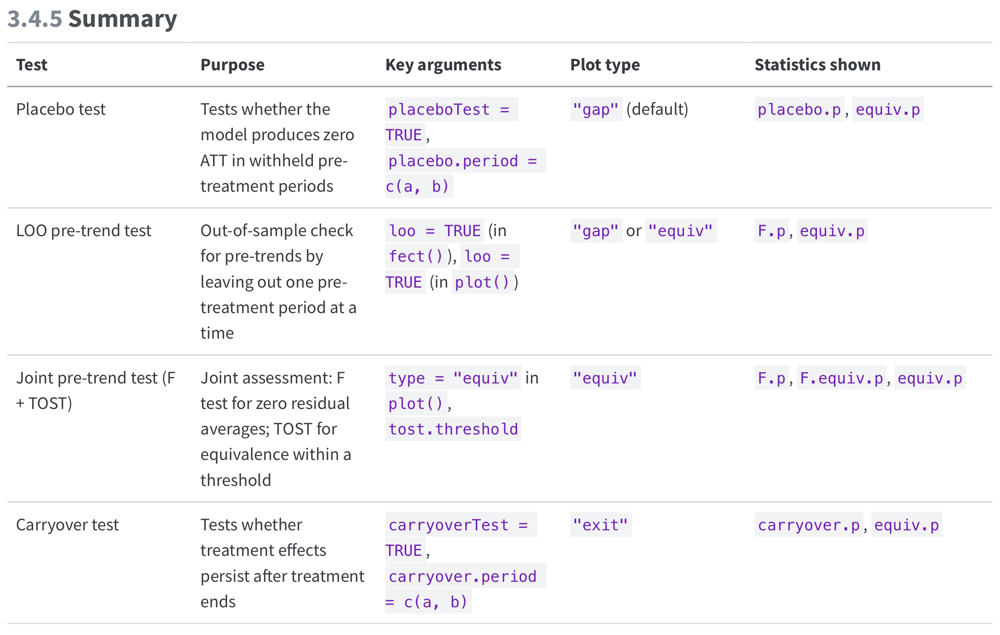

# Today's Agenda
- Panel Imputation Methods
- `fect` demo code adapted from the `fect` package manual (<https://yiqingxu.org/packages/fect/>)
    - TWFE, Interactive Fixed Effect, Matrix Completion
    - `fect` Diagnostics
- Augmented Synthetic Control `augsynth`
- An exercise


```{r}
#| echo: false
# devtools::install_github("ebenmichael/augsynth")
# devtools::install_github("chadhazlett/kbal")
# devtools::install_github("xuyiqing/tjbal")
# devtools::install_github("synth-inference/synthdid")
pacman::p_load(fect, panelView, tidyverse, ggplot2, here)
library(augsynth)
library(tjbal)
library(kbal)
library(synthdid)
```


## `fect`'s simulated dataset

```{r}
#| echo: false
data("turnout", package = "fect")
data("simdata", package = "fect")
# head(turnout)
# head(simdata)
panelview(simdata, index = c("id", "time"), Y = "Y", D = "D")
```


## TWFE Imputation (fe)

- Borusyak, Jaravel & Spiess (2024)
- Model is fit only to pre-treatment and control data and then used to impute Y0s.


## Implementation by hand with fixest

```{r}
library(fixest)
modl <- feols(Y ~ X1 + X2 | id + time, data = simdata %>% filter(D == 0))
simdata$y0.impute <- predict(modl, newdata = simdata)
treated <- simdata %>% filter(D == 1)
att <- mean(treated$Y) - mean(treated$y0.impute)
att
```

## Implementation using `fect` package

```{r}
library(fect)
fe <- fect(
    Y ~ D,
    index = c("id", "time"),
    data = simdata,
    method = "fe",
    se = T)
plot(fe)
print(fe)
```


```{r}
# With covariates
fe.cov <- fect(
    Y ~ D + X1 + X2,
    index = c("id", "time"),
    data = simdata,
    method = "fe",
    se = T)
plot(fe.cov)
print(fe.cov)
```


## Interactive FE

- Basic idea: instead of assuming untreated outcomes are explained only by additive unit and time effects, allow for a small number of latent time-varying factors that affect units differently.
- Model r latent factors. Choose some low value r (usually r < 5)
- $Y_it(0) = X'_{it}\beta + \alpha_i + \xi_t + \lambda_i'f_t + \epsilon_{it}$

```{r}
ife <- fect(
    Y ~ D + X1 + X2,
    index = c("id", "time"),
    data = simdata,
    method = "ife",
    CV = TRUE,
    r = c(0, 5),
    se = T)
plot(ife)
print(ife)
```


## Matrix Completion

```{r}
mc <- fect(
    Y ~ D + X1 + X2,
    index = c("id", "time"),
    data = simdata,
    method = "mc",
    CV = TRUE,
    se = T)
plot(mc)
print(mc)
```


## Exit plot

```{r}
plot(ife, type = "exit", main = "Exit Plot (FEct)")
```


## Diagnostics
<https://yiqingxu.org/packages/fect/03-ife-mc.html#summary>


### Placebo Tests

```{r}
out.ife.p <- fect(Y ~ D + X1 + X2, data = simdata, index = c("id", "time"),
  method = "ife",  r = 2, CV = 0, se = TRUE, 
  placeboTest = TRUE, placebo.period = c(-2, 0))

plot(out.ife.p)
print(out.ife.p)

out.mc.p <- fect(Y ~ D + X1 + X2, data = simdata, index = c("id", "time"),
                 method = "mc",  lambda = mc$lambda.cv, CV = 0, se = TRUE,
                 placeboTest = TRUE, placebo.period = c(-2, 0))
plot(out.mc.p)
print(out.mc.p)
```


### Carryover Tests

```{r}
out.ife.c <- fect(Y ~ D + X1 + X2, data = simdata, index = c("id", "time"),
  method = "ife", r = 2, CV = 0, parallel = TRUE, se = TRUE,
  carryoverTest = TRUE, carryover.period = c(1, 3))

plot(out.ife.c, type = "exit", main = "Carryover Effects (IFE)")
```


## Remove Carryover Periods 
```{r}
out.ife.rm <- fect(Y ~ D + X1 + X2, data = simdata, index = c("id", "time"),
                   method = "ife", r = 2, CV = 0, parallel = TRUE, se = TRUE,
                   carryover.rm = 3, carryover.period = c(1, 3))
plot(out.ife.rm)
```

## Generalized Synthetic Control
From the `fect` package manual:

- Gsynth: designed to handle block and staggered DID settings **without treatment reversal**, whereas other methods allow for treatment reversal under the assumption of limited carryover effects.
- Gsynth: particularly suited for cases where the **number of treated units is small**, including scenarios with only one treated unit. In contrast, other methods rely on large samples, particularly a large number of treated units, to obtain reliable standard errors and confidence intervals 
- Compared with IFEct (method = "ife"), Gsynth does not rely on pre-treatment data from the treated units to estimate time components (e.g., factors). Hence, `time.component.from = "nevertreated"`. This approach speeds up computation, improves stability, and is more suitable for predictive inference based on row exchangeability.


```{r}
#| echo: false
set.seed(123)

n_per_cohort <- 100
periods <- 1:10
cohorts <- c(4, 6, 8, Inf)

sim_staggered <- tibble(
  id = 1:(n_per_cohort * length(cohorts)),
  g = rep(cohorts, each = n_per_cohort)
) |>
  expand_grid(period = periods) |>
  mutate(
    treated = if_else(!is.infinite(g) & period >= g, 1, 0),
    time_to_treat = if_else(is.infinite(g), NA_real_, period - g),
    g_cs = if_else(is.infinite(g), 0, g),       # for Callaway-Sant'Anna
    g_sa = if_else(is.infinite(g), 1000, g)     # for Sun-Abraham/fixest
  )

unit_fe <- tibble(
  id = unique(sim_staggered$id),
  alpha_i = rnorm(n_distinct(sim_staggered$id), 0, 1)
)

time_fe <- tibble(
  period = periods,
  lambda_t = c(-0.5, -0.2, 0, 0.2, 0.4, 0.5, 0.7, 0.8, 1.0, 1.1)
)

sim_staggered <- sim_staggered |>
  left_join(unit_fe, by = "id") |>
  left_join(time_fe, by = "period") |>
  mutate(
    y0 = alpha_i + lambda_t + rnorm(n(), 0, 0.8),
    tau = case_when(
      treated == 0 ~ 0,
      g == 4 & time_to_treat == 0 ~ 0.5,
      g == 4 & time_to_treat == 1 ~ 1.0,
      g == 4 & time_to_treat >= 2 ~ 1.5,
      g == 6 & time_to_treat == 0 ~ 1.0,
      g == 6 & time_to_treat == 1 ~ 1.8,
      g == 6 & time_to_treat >= 2 ~ 2.5,
      g == 8 & time_to_treat == 0 ~ 1.8,
      g == 8 & time_to_treat == 1 ~ 2.8,
      g == 8 & time_to_treat >= 2 ~ 3.5,
      TRUE ~ 0
    ),
    y = y0 + tau
  )
```

```{r}
panelview(
  Y = "y", D = "treated", data = sim_staggered,
  index = c("id", "period"),  by.timing = TRUE, display.all = TRUE)
```

```{r}
gsynth <- fect(
    y ~ treated,
    index = c("id", "period"),
    data = sim_staggered,
    method = "gsynth",
    CV = TRUE,
    r = c(1, 5),
    se = T,
    vartype = "jackknife")
plot(gsynth)
print(gsynth)
```

## `fect` Manual
<https://yiqingxu.org/packages/fect/>


## Augmented Synthetic Control `augsynth`

```{r}
asyn <- multisynth(y ~ treated, id, period, sim_staggered)
asyn.summ <- summary(asyn)
asyn.summ
plot(asyn.summ, levels = "Average")
```

Collapsing treated units with the same treatment time into time cohorts, and find one synthetic control per time cohort
```{r}
asyn_time <- multisynth(y ~ treated, id, period, sim_staggered, 
                        time_cohort = TRUE)
asyn_time.summ <- summary(asyn_time)
asyn_time.summ
plot(asyn_time.summ, levels = "Average")
```


# Chiu et al 2026 APSR


# Class exercise
In groups, choose the most appropriate strategy for analyzing the given dataset and research question. Prepare a short presentation (no slides, you can just talk through code and figures) discussing why you chose the given strategy. Compare your results to another strategy that is less appropriate. Discuss the differences in the analysis

## `germany.rds`
- Country-year panel of gdp
- Treatment variable is reunification of Germany post 1990s

- Outcome: gdp 
- Treatment: treat
- Interesting covariates: "trade","infrate","industry", "schooling", "invest80"

## `collective`
- Effects of states implementing mandatory collective bargaining agreements for public sector unions

- Year, State: The state and year of the measurement
- YearCBrequired: The year that the state adopted mandatory collective bargaining
- lnppexpend: Log per pupil expenditures in 2010 dollars 

## `Turnout`
- Effect of Election Day Registration laws on voter turnout in the United States

- State-level voter turnout data
- policy_edr = election-day registration policy

## `Kansas`
- Economic indicators for US states from 1990-2016
- treated: Whether the state passed tax cuts before the given year and quareter
- Format: A dataframe with 5250 rows and 32 variables:
- Codebook:

fips
FIPS code for each state

year
Year of measurement

qtr
Quarter (1-4) of measurement

state
Name of State

gdp
Gross State Product (millions of $) Values before 2005 are linearly interpolated between years

revenuepop
State and local revenue per capita

rev_state_total
State total general revenue (millions of $)

rev_local_total
Local total general revenue (millions of $)

popestimate
Population estimate

qtrly_estabs_count
Count of establishments for a given quarter

month1_emplvl, month2_emplvl, month3_emplvl
Employment level for first, second, and third months of a given quarter

total_qtrly_wages
Total wages for a givne quarter

taxable_qtrly_wage
Taxable wages for a given quarter

avg_wkly_wage
Average weekly wage for a given quarter

year_qtr
Year and quarter combined into one continuous variable

lngdpcapita
Natural log of GDP per capita

emplvlcapita
Average employment level per capita

Xcapita
Per capita value of X

abb
State abbreviation


<!-- ## Trajectory Balancing -->

<!-- ```{r} -->
<!-- out.tjbal <- tjbal(Y ~ D, -->
<!--     data = simdata, -->
<!--     index = c("id", "time"), Y.match.npre = 0, -->
<!--     demean = TRUE, vce = "boot", nsims = 200, -->
<!-- ) -->
<!-- print(out.tjbal) -->
<!-- plot(out.tjbal) -->
<!-- ``` -->