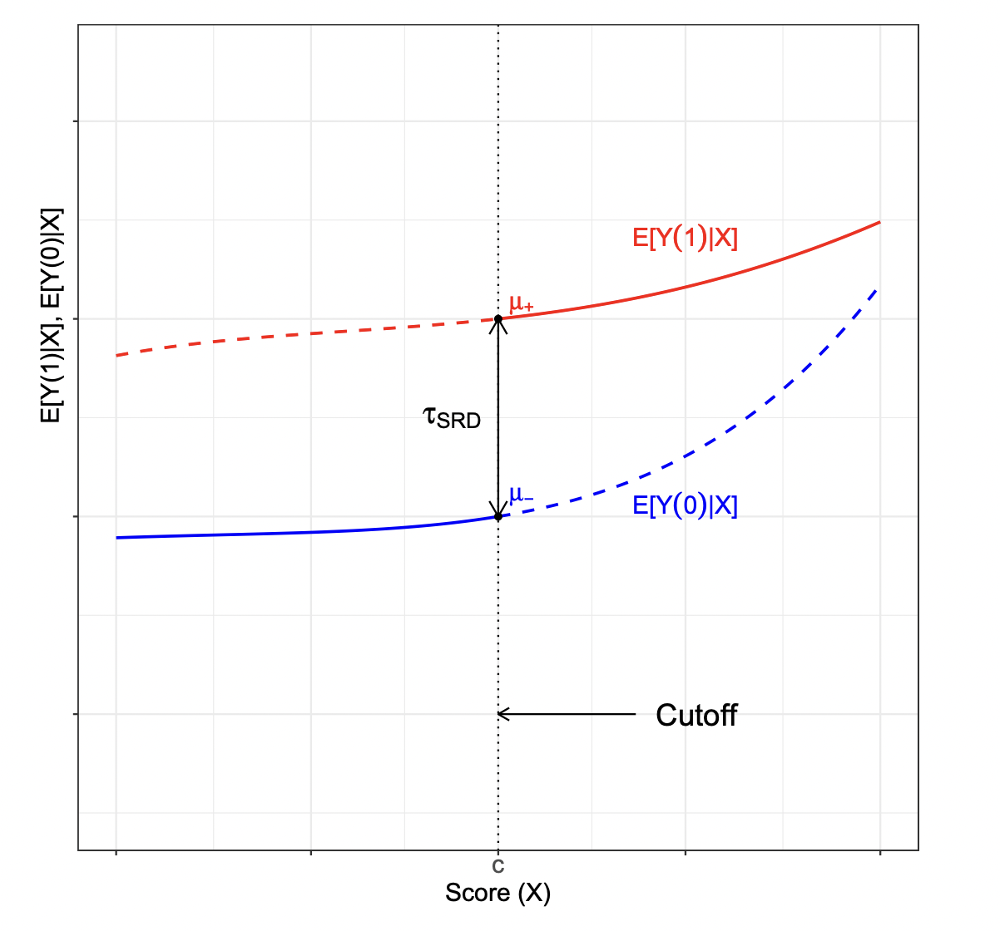
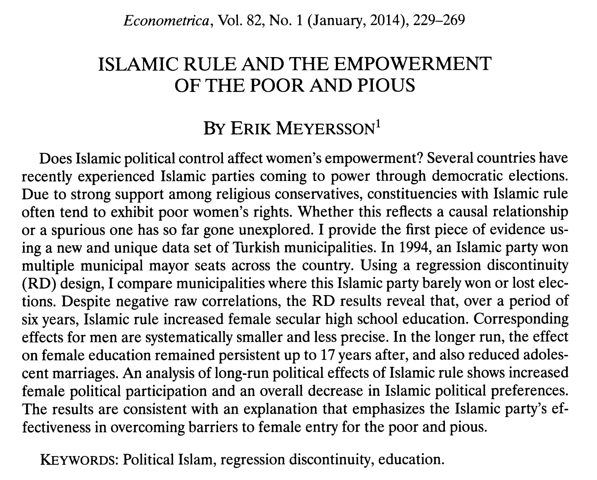
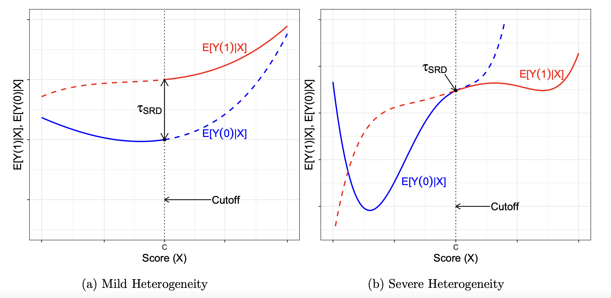
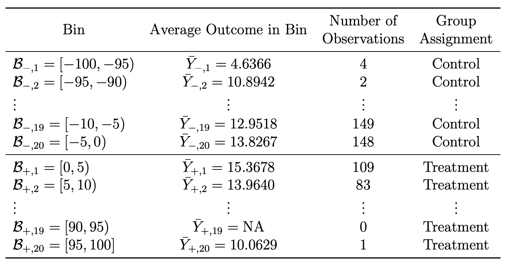
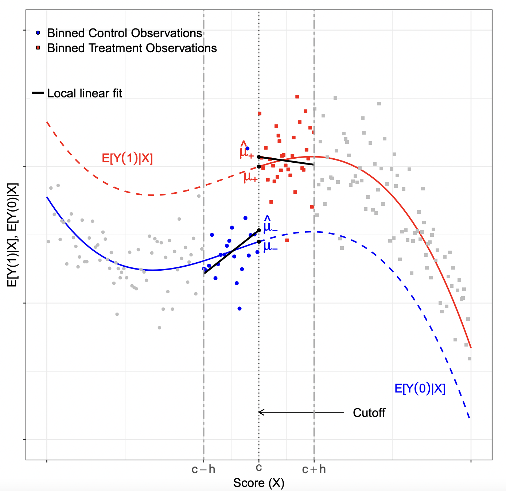
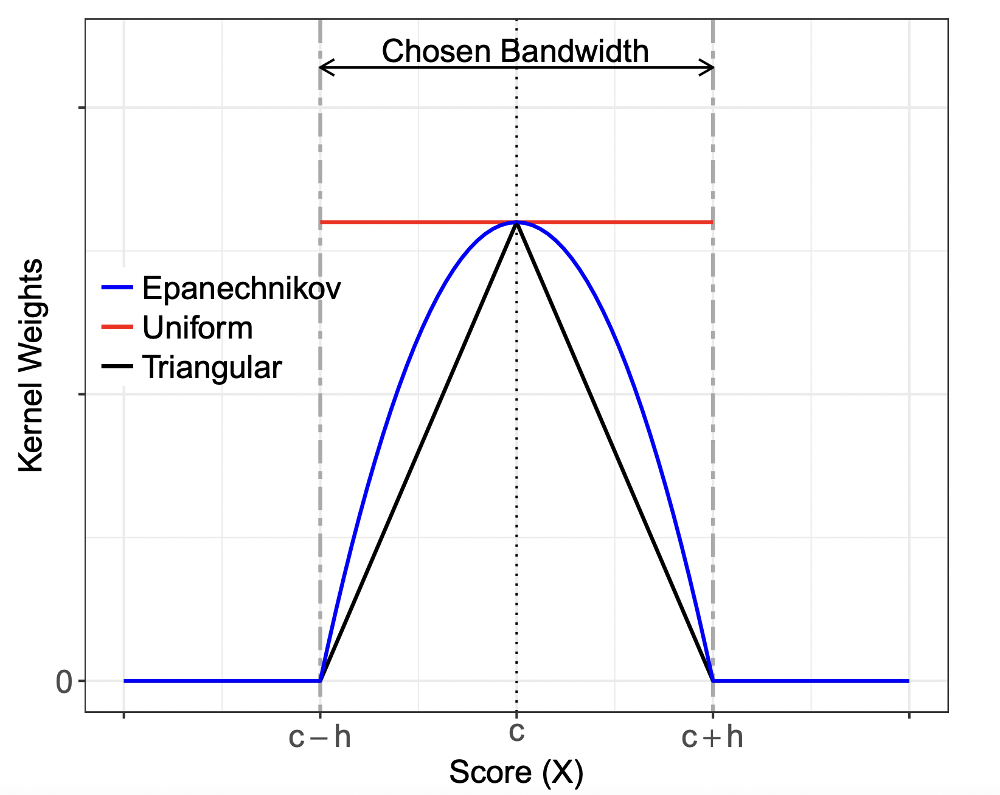
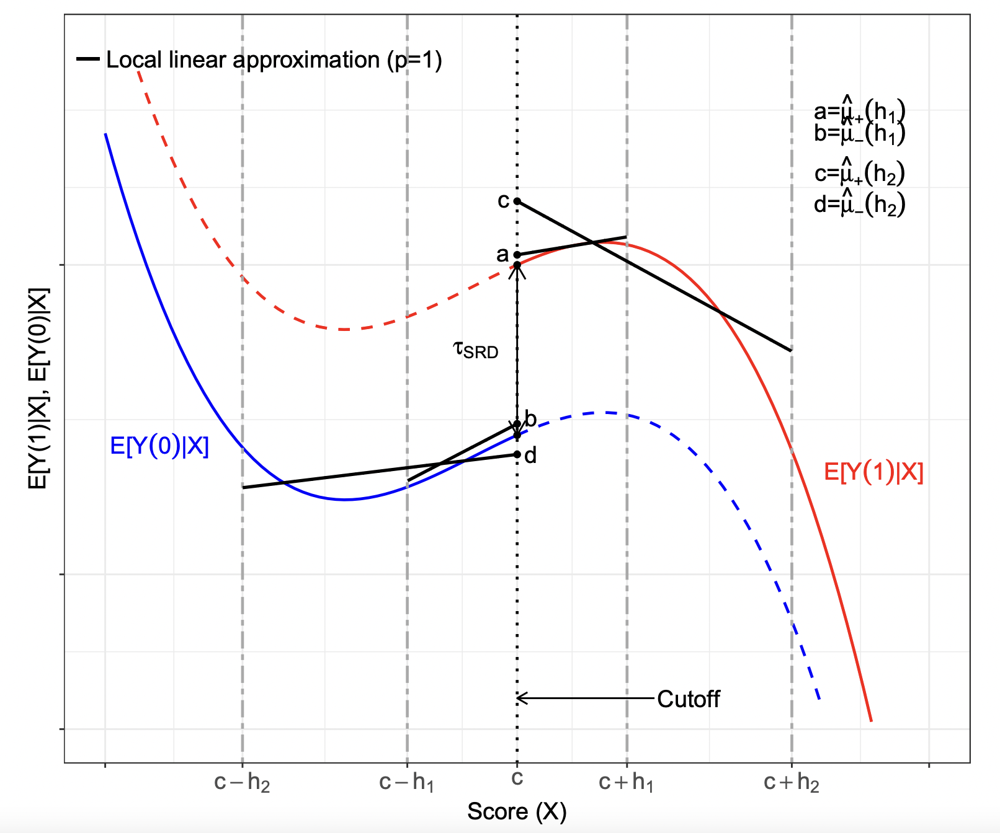
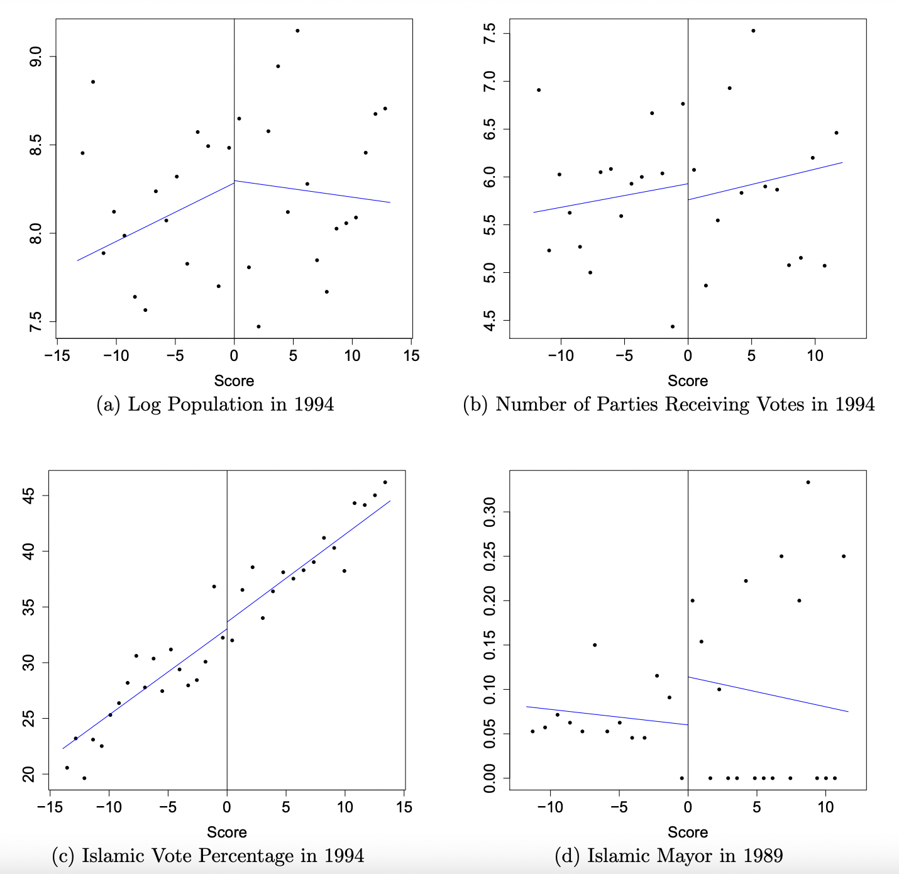
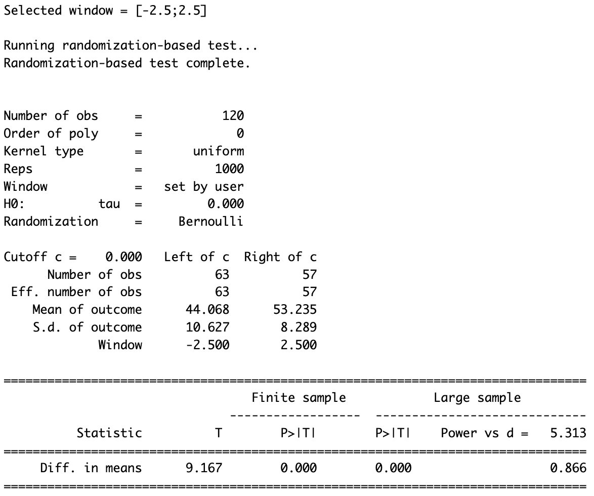
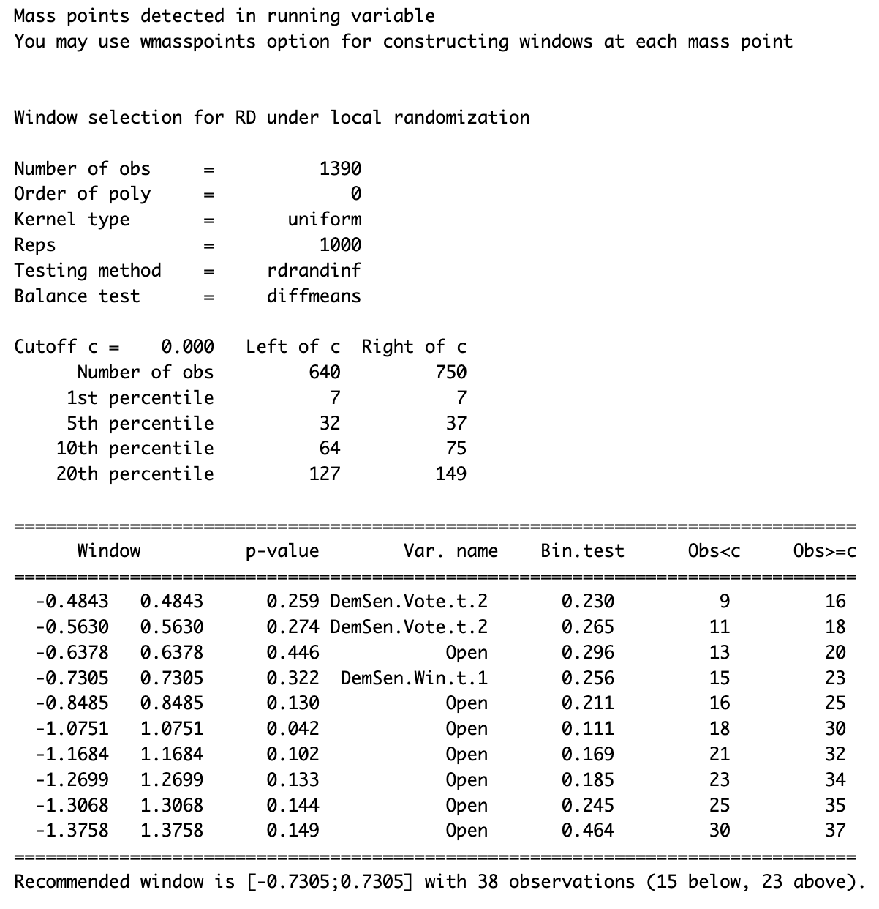

# Today's Agenda

- RDD
- Estimation and Inference
- Falsification Tests 
- Local Randomization Approach
- Fuzzy RD
- Geographical RD

# Setting

Sharp regression discontinuity design involves:

- Scalar continuous score (a.k.a. running variable, forcing variable) $X_i$
- Scalar cutoff $c$ (with non-zero density of $X_i$ on both sides)
- Binary treatment $D_i = 1[X_i \geq c]$
    - Fully determined by the score, no discretion
    - Rule is discontinuous in $X_i$ at $c$
- Continuity of (expected) potential outcomes $\mathbb{E}[Y(0) | X_i], \mathbb{E}[Y(1) | X_i]$ at $X_i = c$
    - No other determinant of $Y_i$ jumps at $X_i = c$
    - Score cannot be precisely (and endogenously) manipulated
    
# Identification

Then 
$$
\lim_{X_i \downarrow c} \mathbb{E}[Y_i | X_i = x] - \lim_{X_i \uparrow c} \mathbb{E}[Y_i | X_i = x] = \mathbb{E}[Y_i(1) - Y_i(0) | X_i = c]
$$
- Discontinuity of regression $\mathbb{E}[Y_i | X_i]$ at $c$ identifies a local causal parameter

\centering
{width=230}

# Is RDD a special case of something?

- Is RDD like selection on observables, with $X_i$ as a control? 
- Is RDD like IV, with $X_i$ as instrument?
- Is RDD like a RCT in the neighborhood of $X_i = c$?

# Is RDD a special case of something?

- Is RDD like selection on observables, with $X_i$ as a control?
  - No. By construction, there is no overlap: no value of $X_i$ where both $D_i = 0$ and $D_i = 1$ are observed \pause
- Is RDD like IV, with $X_i$ as instrument?
  - No. Exogeneity of $X_i$ is not assumed, e.g. higher vote share in election $t - 1$ correlates with higher vote share in $t$ \pause
- Is RDD like a RCT in the neighborhood of $X_i = c$?
  - Yes. Continuity of potential outcomes implies their balance around $X_i = c$
  - No. This only holds in an infinitesimal neighborhood. So we need to be careful with estimation

# Example 

\centering


# Meyersson (2014)

Causal effects of interest: 

- Victory of Islamic candidate on educational attainment of women

Elements:

 - **Outcome (Y)**: percentage of women aged 15-20 in 2000 who had completed high school by 2000

 - **Running variable (X)**: vote percentage of the Islamic party minus vote percentage of the strongest secular opponent

 - **Treatment (T)**: 1 if Islamic party won in 1994, 0 otherwise


# A checklist for how to support the RDD analysis

- A graphical representation and test of "balance" and first stage (if fuzzy)
- Permutation test of characteristic at cutoff
- The density of the forcing variable
- Placebo checks
- A graphical representation of the outcomes (what we’ve already seen)
- Estimates based on optimal bandwidth choice and robust inference, using local linear analysis
  - These decisions vary depending on running variable. If discrete running variable, need to account for discreteness (Kolesar and Rothe (2018))
  - Should use local linear regression, and not global polynomials (Gelman and Imbens)
- Robustness analysis along bandwidth choice (and other tuning parameters)
  - Present this graphically

# Set-up

```{r}
library(rdrobust) 
library(rddensity)
library(haven)
library(ggplot2)
# Import data and define variables
data <- read_dta("CIT_2019_Cambridge_polecon.dta")

Y <- data$Y
X <- data$X
t <- data$T
T_X <- t*X
```


# Visualization
\tiny
```{r, fig.align='center', out.width = "75%"}
# Raw means comparison
rdplot(Y, X, nbins = c(2500, 500), p = 0, col.lines = "red", col.dots = "black", title = "", 
       x.label = "Islamic Margin of Victory", y.label = "Female High School Percentage", y.lim = c(0,70))
```


# Visualization
\tiny
```{r, fig.align='center', out.width = "75%"}
# Local means comparison
rdplot(Y[abs(X) <= 50], X[abs(X) <= 50], nbins = c(2500, 500), p = 0, col.lines = "red", col.dots = "black", 
       title = "", x.label = "Islamic Margin of Victory", y.label = "Female High School Percentage", 
       y.lim = c(0,70))
```

# Visualization
\tiny
```{r, fig.align='center', out.width = "75%"}
# Local means comparison
rdplot(Y[abs(X) <= 50], X[abs(X) <= 50], nbins = c(2500, 500), p = 4, col.lines = "red", col.dots = "black", 
       title = "", x.label = "Islamic Margin of Victory", y.label = "Female High School Percentage", 
       y.lim = c(0,70))
```

# The Local Nature of RD Effects

\centering


# the Raw Data is Rarely Informative
```{r, fig.align='center', out.width = "75%", warning=FALSE,message=FALSE,echo=FALSE}
ggplot(data, aes(x = X, y = Y)) +
  geom_point(colour = 'black', size = 0.5) + 
  labs(x = "Score", y = "Outcome") +
  theme(axis.text = element_text(size = 15), 
        axis.title = element_text(size = 15)) + 
  geom_vline(xintercept = 0, linetype = "solid") + theme_bw()
```

# RD plot: Details

Shows discontinuity in regression $\mathbb{E}[Y_i | X_i]$ in two ways:

- Smooth fit on each side: shape and nonlinearity of the regression
  - Separately on the left and right of $c$, fitted values from
  $$
  Y_i = \alpha_0 + \alpha_1(X_i - c) + \ldots + \alpha_p(X_i - c)^p + \text{error}
  $$
  e.g. with quartic polynomial ($p = 4$) \pause

- Binscatter: a local/nonparametric estimator of the regression
  - Separately on each side, for some bins of $X_i$: average $Y_i$ against bin's midpoint
  - Bins with similar numbers of observations (splitting by quantile) are more informative. But equal width is also common
  - Calonico, Cattaneo, Titiunik (2015) propose data-driven optimal number of bins

# Partition of Islamic Margin of Victory into 40 Bins of Equal Length 

\centering


# Evenly-Spaced Binning
\tiny
```{r, fig.align='center', out.width = "75%"}
# Default is 4th polynomial degree on each side
rdplot(Y, X, nbins = c(20,20), binselect = "es", y.lim = c(0,25))
```

# Quantile-Spaced Binning
\tiny
```{r, fig.align='center', out.width = "75%"}
rdplot(Y, X, nbins = c(20,20), binselect = 'qs', x.label = 'Score', 
       y.label = 'Outcome', title = '', x.lim = c(-100,100), y.lim = c(0,25))
```

# Choosing the Number of Bins

- Once we choose how to do bins, how should we choose the number?
  - Can we choose "optimally"?

- Cattaneo et al. (2020) argue for two approaches (available in `rdrobust`'s `rdplot`):
- IMSE-minimizing, and mimicking variance.
  - IMSE-minimizing trades off between bias and variance in choice of bins, but does it over the whole range – proportional to $n^{1/3}$
  - Mimicking-variance tries to match the underlying variance of the raw data in the binned plots – proportional to $\frac{n}{\log(n)^2}$

# Integrated Mean Squared Error (IMSE) Method
\tiny
```{r, fig.align='center', out.width = "75%"}
rdplot(Y, X, binselect = 'qs', x.label = 'Score', 
       y.label = 'Outcome', title = '', x.lim = c(-100,100), y.lim = c(0,25))
```

# Mimicking Variance Method
\tiny
```{r, fig.align='center', out.width = "75%"}
rdplot(Y, X, binselect = 'qsmv', x.label = 'Score', 
       y.label = 'Outcome', title = '', x.lim = c(-100,100), y.lim = c(0,25))
```


# The Continuity-Based Approach to RD Analysis

\textbf{Local Polynomial Approach:}

- Choose a polynomial order $p$ and a kernel function $K(\cdot)$
- Choose a bandwidth $h$ around the cutoff $c$
- On each side of the cutoff, fit a local polynomial by weighted least squares using observations within the bandwidth, with weights $K\!\left(\frac{X_i-c}{h}\right)$
- Compute the sharp RD estimate as the difference between the two fitted functions evaluated at the cutoff


# RD Estimation with Local Polynomial

\centering
{width=300}

# Kernel

Triangular one is recommended (weight = 0 outside $h$ and $\uparrow$ as we get closer to $c$) and default in `rdrobust`. Alternatives: Uniform and Epanechnikov 

\centering
{width=300}

# Kernel

\tiny
```{r}
# By default c = 0
out <- rdrobust(Y, X, kernel = "uniform", p = 1)
summary(out)
```

# Kernel

\tiny
```{r}
# By default c = 0
out <- rdrobust(Y, X, kernel = "triangular", p = 1)
summary(out)
```

# The choice of local polynomial order

1. A polynomial of order zero has undesirable theoretical properties at boundary points, which is precisely where RD estimation must occur. 

2. For a given bandwidth, increasing the order of the polynomial generally improves the accuracy of the approximation but also increases the variability of the treatment effect estimator. 

3. Higher-order polynomials tend to produce overfitting of the data and lead to unreliable results near boundary points.


# The choice of local polynomial order

\tiny
```{r}
out <- rdrobust(Y, X, p = 1)
summary(out)
```

# The choice of local polynomial order

\tiny
```{r}
out <- rdrobust(Y, X, p = 2)
summary(out)
```

# Bandwidth Selection 

\centering
{width=300}

# Optimal bandwidth choice
\tiny
```{r, fig.align='center', out.width = "75%"}
# mserd: MSE-optimal bandwidth selector for the RD treatment effect estimator.
out <- rdrobust(Y, X, kernel = "triangular", p = 1, bwselect = "mserd")
bw <- out$bws[1,1]
rdplot(Y[abs(X)<=bw], X[abs(X)<=bw], p = 1, kernel = 'triangular', 
       x.label = 'Score', y.label = 'Outcome', title = '', y.lim = c(10,22))
```


# Inference and bias correction

- Problem: $h^*$ minimizes MSE by trading off $\text{bias}^2$ and variance
  - at the MSE-optimal $h^*$, smoothing bias remains large enough to matter for inference
  - conventional confidence intervals typically have incorrect coverage. \pause

- One solution: "undersmoothing"
  - Use bandwidth $h$ much smaller than $h^*$. 
  - Then inference is fine (bias $\ll$ SE)
  - But unclear how to choose $h$, and would be a higher-MSE estimator \pause

- Better solution: \textbf{robust bias correction} \\ (Calonico et al. 2014; \texttt{rdrobust})
  - Fit the RD estimator using a low-order local polynomial
  - Estimate its leading bias using a higher-order local polynomial
  - Construct a confidence interval that accounts for both sampling variation and the noise in the bias estimate
  - "Robust bias-corrected conf. interval"


# Inference
\tiny
```{r}
out <- rdrobust(Y, X, kernel = 'triangular',  p = 1, bwselect = 'mserd', all = TRUE)
summary(out)
```

# RDD assumption violations

**Sorting / manipulation of the running variable**: units or relevant actors can precisely influence treatment assignment by manipulating the running variable around the cutoff.


- In our example: Islamic parties may invest more in winning election in some important municipalities, If they are successful, just-won towns would be different from just-lost ones, i.e. a discontinuity at the cutoff \pause

**We can check for:**

  1. the null treatment effect on predetermined covariates or placebo outcomes;
  2. the continuity of the score density around the cutoff;
  3. the treatment effect at artificial cutoff values; 
  4. the exclusion of observations near the cutoff;
  5. the sensitivity to bandwidth choices.
  
# Checking for balance

\tiny
```{r,warning=FALSE,message=FALSE}
out = rdrobust(data$lpop1994, X)
summary(out)
```

#  Graphical Illustration of Local Linear RD Effects for Predetermined Covariates

\centering
{width=270}

# Checking for balance

- As we discussed above, key test is to compare the averages of other variables at $Z = 0$, the cutoff. \pause

- However
  - Testing just mean differences doesn’t look at other parts of the distribution (which may more obviously violate this) and so may have low power
  - Because the local sample size is effectively small, this can create problematic inference issues if the function is not particularly smooth \pause

- Canay and Kamat (2017) propose a permutation test \pause
  - Key intuition – covariates should be *approximately* identically distributed on each side of the cutoff
  - This is an *asymptotic* argument, since it’s not actually a random experiment

# Checking for Balance - Canay and Kamat

\tiny
```{r,warning=FALSE,message=FALSE, out.width = "80%"}
library(RATest)
lee2008<-lee2008
set.seed(101)
permtest<-RDperm(W="demshareprev", z="difdemshare",data=lee2008,q_type=51)
plot(permtest,w="demshareprev")
```

# Testing for sorting in running variable
\tiny
```{r,warning=FALSE,message=FALSE, out.width = "80%"}
library(rddensity)
denstest <- rddensity(data$X, c = 0)
rdplotdensity(denstest, data$X)
```

# RDD with placebo cutoffs
\tiny
```{r}
placebo <- function(Y, X, new_cutoff){
  if (new_cutoff > 0){
    Y <- Y[X>=0]; X <- X[X>=0]
  }
  if (new_cutoff < 0){
    Y <- Y[X<0]; X <- X[X<0]
  }
  else{
    Y <- Y; X <- X
  }
  out <- rdrobust(Y, X, c = new_cutoff)
  coef <- out$coef["Conventional",]
  ll <- out$ci["Robust",1]
  ul <- out$ci["Robust",2]
  
  cbind(coef, ll, ul)
}

cutoffs <- as.list(c(-3:3))
(placebos <- do.call("rbind", lapply(cutoffs, function(i) placebo(Y, X, i))))
```

# RDD with placebo cutoffs
\tiny
```{r, fig.align="center", out.width="75%",warning=FALSE,message=FALSE}
library(dplyr)
placebos %>% as.data.frame() %>% mutate(cutoff = -3:3) %>% 
  ggplot(aes(x=cutoff, y=coef)) + geom_point(col="red") +
  geom_errorbar(aes(ymin=ll, ymax=ul), col="blue",width=0.1) + 
  labs(y = "RD Treatment Effect", x = "Cutoff (x=0 true cutoff)") +
  geom_hline(yintercept=0, col="black", linetype = "dashed") + theme_bw()
```

# Analogies with experiment

- Lee (2008): RD design can be as credible as a randomized experiment for units very near cutoff

- Imagine that score depends on each unit's unobservables characteristics and choices

- If the two following conditions hold:
  - some random variation in the score near the cutoff
  - probability of this random "error" doesn't change abruptly at cutoff

- Then the RD design can be seen as an experiment:
  - units barely above the cutoff as-if randomly assigned to treatment
  - units barely above the cutoff as-if randomly assigned to control

- \textcolor{red}{This fails if individuals have ability to exactly control their score}

# Analogies with experiment

- Consider an RD Design where:
  - treatment is assigned based on score exceeding cutoff
  - units lack ability to manipulate score (continuity holds)

- **Crucial distinction**:
  - Experiment → no need to make assumptions about shape of the average potential outcomes
  - RD design → inferences depend crucially on assumptions regarding functional form of the conditional mean functions

- Any experiment can be recast as an RD design where
  - score is a uniform random variable
  - cutoff chosen to ensure a given probability of treatment
  - \textcolor{red}{Ex: each student assigned uniform random number between 0 and 100, scholarship given to students whose score is above 50}


# Local Randomization Approach to RD Design

- Choose a narrow window around the cutoff and assume that, within this window, treatment assignment is **as-if random**

- Then units just above and just below the threshold can be compared like treated and control units in an experiment

- This is stronger than the continuity-based approach
  - it requires the running variable to matter little within the window apart from determining treatment status.
  
# How to Implement It

**Step 1: Select the window**

- Start near the cutoff and choose the largest window that still passes balance checks on predetermined covariates. \pause

**Step 2: Analyze as an experiment**

- Within that window, compare treated and control units using randomization-based inference.
- Inference depends on the assumed assignment mechanism and is most credible when the window is small and balance is good.


# Empirical Illustration: Incumbency Advantage (CFT, 2015, JCI)

- Problem: incumbency advantage (U.S. senate).

- Data:
  - $Y_i$ = election outcome at $t + 1$.
  - $T_i$ = whether party wins election at $t$.
  - $X_i$ = margin of victory at $t$  ($c = 0$).
  - $Z_i$ = covariates (_demvoteshlag1, demvoteshlag2, dopen_, etc.).

- Potential outcomes:
  - $Y_i(0)$ = election outcome at $t + 1$ if had not been incumbent.
  - $Y_i(1)$ = election outcome at $t + 1$ if had been incumbent.

# Empirical Illustration: Incumbency Advantage (CFT, 2015, JCI)
\tiny
```{r,warning=FALSE,message=FALSE, fig.align="center", out.width="75%"}
library(rdlocrand)
library(rdrobust)
data <- read.csv("rdlocrand_senate.csv")
X  <-  cbind(data$presdemvoteshlag1,
            data$population/1000000, data$demvoteshlag1,
            data$demvoteshlag2, data$demwinprv1,
            data$demwinprv2, data$dopen,
            data$dmidterm, data$dpresdem)
colnames(X) <-  c("DemPres Vote", "Population",
                 "DemSen Vote t-1","DemSen Vote t-2",
                 "DemSen Win t-1", "DemSen Win t-2",
                 "Open", "Midterm", "DemPres")
R <- data$demmv
Y <- data$demvoteshfor2
D <- as.numeric(R>=0)
```

# Simple RD plot
\tiny
```{r,warning=FALSE,message=FALSE, fig.align="center", out.width="75%"}
rdplot(Y,R,p=3) 
```

# Randomization inference using selected window
\tiny
```{r,warning=FALSE,message=FALSE, fig.align="center", out.width="75%"}
out <- rdrandinf(Y, R, wl = -2.5, wr = 2.5, seed = 50)
```

# Binomial randomization mechanism
```{r,warning=FALSE,message=FALSE, fig.align="center", out.width="75%"}
bern_prob <- numeric(length(R))
bern_prob[abs(R) > 2.5] <- NA
bern_prob[abs(R) <= 2.5] <- 1/2
out <- rdrandinf(Y, R, wl = -2.5, wr = 2.5, seed = 50, bernoulli = bern_prob)
```

# Binomial randomization mechanism
{width=300}


# Selecting the Window
- \texttt{rdwinselect()} searches over candidate windows around the cutoff and tests whether observations just below and above the threshold look balanced.

```{r,warning=FALSE,message=FALSE}
out <- rdwinselect(R, X, seed = 50, reps = 1000, wobs = 2)
```
# Selecting the Window
{width=250}

# P-value for Different Windows
\tiny
```{r,warning=FALSE,message=FALSE, out.width="75%"}
tmp <- rdwinselect(R,X,wmin=.5,wstep=.125,approx=TRUE,nwin=80,quietly=TRUE,plot=TRUE)
```


# Fuzzy RD

- In a sharp RD, crossing the cutoff changes treatment status from 0 to 1 exactly.

- In a fuzzy RD, crossing the cutoff only changes the **probability** of treatment:
  - some units above the cutoff do not take treatment
  - some units below the cutoff still receive treatment
  - **no defiers**

- This makes fuzzy RD a local IV
  - the cutoff affects treatment take-up
  - treatment take-up affects the outcome
  - so the cutoff can be used as an instrument for actual treatment near the threshold

# Fuzzy RD

- Interpretation:
  - first estimate the jump in the outcome at the cutoff
  - then scale it by the jump in treatment take-up
  - this gives the treatment effect for **compliers at the cutoff**

- `rdrobust(..., fuzzy = , ...)`

# Geographic Regression Discontinuity 

 **GRD** geographic or administrative boundary splits units into treated and control areas and analysts make the case that the division into treated and control areas occurs in an as-if random fashion. 

# Peculiarities of GRD (Keele and Titiunik, 2015)

1. *Compound* treatments
  - multiple treatments that affect the outcome of interest simultaneously
2. Different measures of distance from the cutoffs may require different identification assumptions and affect fundamentally the interpretation of the results
3. Spatial variation in treatment effects can be mapped to specific locations, which can be used to detect geographic areas where the identification assumptions are more (or less) likely to hold

# Recommendations for practice 

- **Data:**
  - researchers need to collect geographic data
(addresses, latitude and longitude, or other geographic information that can be used for geocoding) along with more traditional covariates;
  - qualitative research on the history of the border and conditions around it will often prove useful to justify various assumptions. \pause
- **Falsification tests:**
  - researchers should at least rule out nonzero treatment effects
on predetermined covariates, which can be easily implemented using covariates as outcomes in the estimation for each boundary point. \pause
- **Isolating the treatment**:
  - restrict the analysis to areas around the border where other important geographically defined institutional units are kept constant on either side of border.

# `rd2d` Package Demo
[`rd2d-demo`]

