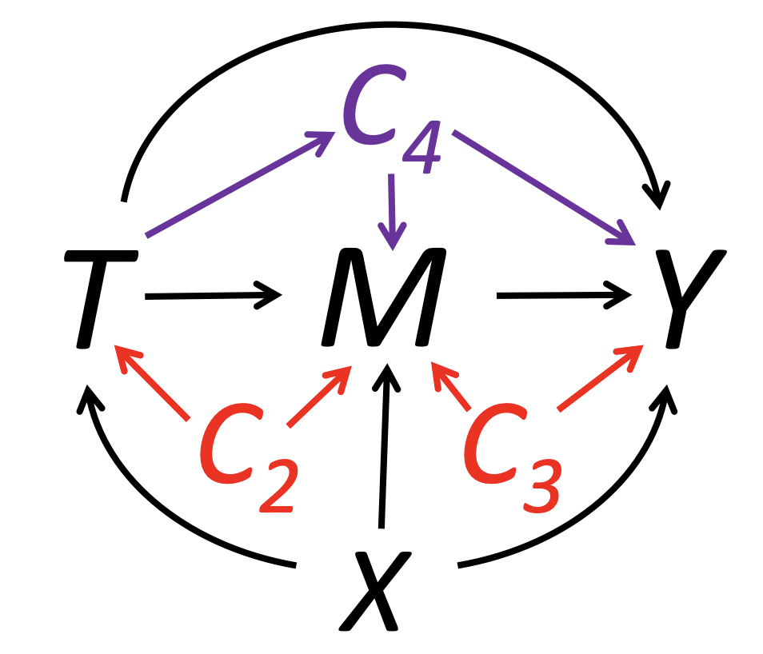
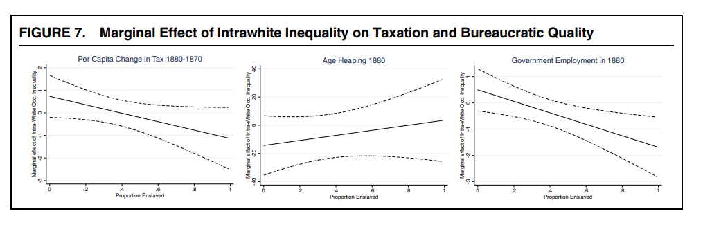

# Today's Agenda

- Mediation
- Moderation
- Interference

# Mediation: concepts review

- Total Effect: $\tau_i = Y_i(1,M_i(1)) - Y_i(0,M_i(0))$
  - Overall effect of treatment on outcome \pause
- Natural Direct Effect: $\zeta_i(t) = Y_i(1, M_i(t)) - Y_i(0, M_i(t))$
  - Share of total effect that doesn't go through M. \pause
- Natural Mediation Effect: $\delta_i(t) = Y_i(t, M_i(1)) - Y_i(t, M_i(0))$
  - Share of total effect that goes through M.
- $\tau_i = \delta_i(t) + \zeta_i(1-t)$

- ID assumption for $\delta$ and $\zeta$: sequential ignorability


# Sequential ignorability

$$
\begin{aligned}
T_i \perp (Yi(t',m), M_i(t))|X_i=x \\
M_i(t) \perp Y_i(t', m)|T_i, X_i=x
\end{aligned}
$$

- First part: CIA, satisfied in a randomized experiment

- Second part: no omitted post-treatment confounder or other mediator causally connected to $M$


# Sequential ignorability
\centering
{width=250}


# Causal mediation analysis

- R package `mediation`: causal mediation analysis under sequential ignorability

- Identify effect of $T$ on $M$ given $X$ and the effect of $M$ on $Y$ given $T$ and $X$

- With them compute the direct/mediation effects

- In the special case of linear models one can multiply the coefficients

# Causal mediation analysis

- Working example from the `mediation` package: Brader et al (2008)

- $T$: Media stories about immigration
- $Y$: Letter about immigration policy to representative in Congress
- $M$: Anxiety
- $X$: Age, education, gender, income


# Causal mediation analysis
\scriptsize
```{r}
library(mediation)

data(framing)

set.seed(2014)

# Model for the mediator (T + X)
med.fit <- lm(emo ~ treat + age + educ + gender + income, data = framing)

# Model for the outcome (M + T + X)
out.fit <- glm(cong_mesg ~ emo + treat + age + educ + gender + income, data = framing, 
               family = binomial("probit"))

# Compute the mediation effects
med.out <- mediate(med.fit, out.fit, treat = "treat", mediator = "emo", 
                   robustSE = TRUE, sims = 1000)
```


# Causal mediation analysis
\scriptsize
```{r}
summary(med.out)
```

# Treatment Mediator Interaction
\tiny
```{r}
med.interact.fit <- lm(emo ~ treat + age + educ + gender + income, data=framing)
out.interact.fit <- glm(cong_mesg ~ emo * treat + age + educ + gender + income,
               data = framing, family = binomial("probit"))
med.interact.out <- mediate(med.interact.fit, out.interact.fit, 
                            treat = "treat", mediator = "emo",
                            robustSE = TRUE, sims = 1000)
summary(med.interact.out)
```

# Treatment Mediator Interaction
\scriptsize
```{r}
test.TMint(med.interact.out, conf.level = .95)
```

# Sensitivity Analysis for SI
\tiny
```{r}
sens.out <- medsens(med.out, rho.by = 0.1, effect.type = "indirect", sims = 1000)
summary(sens.out)
```

# Sensitivity Analysis for SI
\tiny
```{r}
#| echo: true
#| fig.width: 9
#| fig.height: 5
#| out.width: "100%"
par(mfrow = c(1, 2))
plot(sens.out, sens.par = "rho", main = "Anxiety", ylim = c(-0.2, 0.2))
```

# Sensitivity Analysis for SI
\tiny
```{r}
#| echo: true
#| fig.width: 9
#| fig.height: 5
#| out.width: "100%"
par(mfrow = c(1, 2))
plot(sens.out, sens.par = "R2", r.type = "total", sign.prod = "positive")
```

# Controlled Direct Effect

- Controlled Direct Effect: $\kappa_i(m) = Y_i(1,m) - Y_i(0,m)$

- Effect of $T$ on $Y$ when $M$ has the same value for all units.

- Relative to NDE and NME, can be identified under assumptions that allow observed intermediate confounders.  \pause

- A natural approach to close $M$ channel: 
  - Include $M$ as control in the regression
  - In presence of intermediate confounders, this introduces post-treatment bias

- CDE is an estimand that allows to overcome this issue


# Sequential g-estimation

- Popularized in political science by [Acharya, Blackwell, and Sen (2016)](https://www.mattblackwell.org/files/papers/direct-effects.pdf)

- Procedure in two stages:
  - Regress $Y$ on $M$, $T$, pre-treatment and intermediate variables
  - Subtract from $Y$ the effect of $M$: get the "demediated" $Y$, $\tilde{Y} = Y - \hat{\beta_M}M$
  - Regress $\tilde{Y}$ on $T$ and pre-treatment variables

- Doing it by hand would ignore variability in $\tilde{Y}$, which is an estimated quantity, resulting in wrong SEs

- Use the package `DirectEffects` or bootstrap

- Center the mediator at the value you want to "fix" it at


# Sequential g-estimation

- Why is it important?

- Research questions may involve comparisons that "hold fixed" things realized after the treatment \pause

- Do natural shocks impact political development even in absence of physical destruction?

- Does ethnic diversity lead to conflict even in absence of government instability?  \pause

- We may also want to rule causal mechanisms alternative to our theory
   - Are the effects of slavery/famine just due to subsequent changes in racial/ethnic composition? (Acharya, Blackwell, and Sen (2016); Rozenas and Zhukov (2019) resp.)


# ACDE Example

- [Alesina, Giuliano, and Nunn (2013)](https://scholar.harvard.edu/files/nunn/files/alesina_giuliano_nunn_qje_2013.pdf): data provided with the `DirectEffects` package

- $Y$: share of political positions held by women in 2000
- $T_i$: relative proportion of ethnic groups that traditionally used the plow within a country
- $M_i$: log GDP per capita in 2000, mean-centered
- $Z_i$: post-treatment, pre-mediator intermediate confounders
  - civil conflict, interstate conflict, oil, European descent, communist, polity2..)
- $X_i$: pre-treatment characteristics of the country
  - tropical climate, agricultural suitability, large animals, political hierarchies, economic complexity, rugged


# ACDE Example
\scriptsize
```{r}
library(DirectEffects)

data("ploughs")

# adjusted OLS benchmark
mod <- lm(women_politics ~ plow + agricultural_suitability + 
                tropical_climate + large_animals + 
                political_hierarchies + economic_complexity + rugged, 
              data = ploughs)
```

# ACDE Example
\scriptsize
```{r}
summary(mod)
```

# ACDE Example
\scriptsize
```{r}
## Formula for sequential_g
form_main <- women_politics ~ plow + agricultural_suitability +
  tropical_climate + large_animals + political_hierarchies + 
  economic_complexity + rugged | # pre-treatment vars
  years_civil_conflict + years_interstate_conflict  + 
  oil_pc + european_descent + communist_dummy + 
  polity2_2000 + serv_va_gdp2000 | # intermediate vars
  centered_ln_inc + centered_ln_incsq # mediating vars

## Sequential g-estimation
direct <- sequential_g(formula = form_main, data = ploughs)

```

# ACDE Example
\scriptsize
```{r}
summary(direct)
```


# ACDE Example
\scriptsize
```{r}
# bootstrap standard errors
out.boots <- boots_g(direct, boots = 1000)
summary(out.boots)
```


# ACDE Sensitivity Analysis
Only supports one mediator
\scriptsize
```{r}
direct1 <- sequential_g(women_politics ~ plow + 
                          agricultural_suitability + tropical_climate +
                          large_animals + political_hierarchies + 
                          economic_complexity + rugged | # pre-treatment vars
                          years_civil_conflict + years_interstate_conflict  + 
                          oil_pc + european_descent + communist_dummy + 
                          polity2_2000 + serv_va_gdp2000 | # intermediate vars
                          centered_ln_inc, # one mediator
                        ploughs)
out_sens <- cdesens(direct1, var = "plow")
```


# ACDE Sensitivity Analysis
\scriptsize
```{r}
#| fig.width: 9
#| fig.height: 5
#| out.width: "100%"
plot(out_sens)
```


# Moderation

- Characterize treatment effect heterogeneity

  - Going beyond the aggregation

  - e.g., for a policy intervention, on what sub-populations the intervention is more effective


# Issues with linear interaction terms

  - Linear interaction terms used to study how the treatment effect evolves over the distribution of the moderator  \pause

  - [Hainmueller, Mummolo, and Xu (2019)](https://scholar.princeton.edu/sites/default/files/jmummolo/files/how_much_should_we_trust_estimates_from_multiplicative_interaction_models_simple_tools_to_improve_empirical_practice.pdf) point out that this practice relies on requirements which might be violated

  - TE changes linearly in the moderator at any point of its distribution
    - May be non-linear or non-monotonic

  - Common support between treatment and moderator
    - If not, the model relies on linear extrapolation


# Working example

Slaveholding and state-building in the US South


# Moderation with linear estimator



# interflex

- `interflex` package (in both R and Stata) proposes a more flexible procedure to moderation, proposed by Hainmueller, Mummolo, and Xu (2019)  \pause


**Binning estimator**

- Divide the support of $Z$ into $j$ bins (e.g. terciles), indicated by $G_j$, and estimate

$$
y_{ij} = \sum_{j=1}^J\{\alpha_j + \beta_jD_{ij} + \gamma_j (Z_{ij} - Z^M_j) + \delta_j(Z_{ij} - Z^M_j)D_{ij}\}G_j + \psi X_{ij} + \epsilon_{ij}
$$

- $Z^M_j$ is the median value of $Z$ inside bin $j$. Given the specification, $\beta_j$s are the conditional ATEs at the center of each bin.

# Moderation using binning estimator
\tiny
```{r, out.height="50%", fig.align="center"}
library(interflex); library(haven); library(tidyverse)

# Import the data
d <- read_dta("suri_white_preprocessed.dta") %>% as.data.frame()

# Raw data plot
# Note we are not including controls used in the paper
interflex(estimator = "raw", data = d, Y = "tax_diff", D = "county_sei_gini_whitemale_1850", 
                 X = "pslave1860", ylab = "Marginal effect of GINI",
                 xlab = "Z: Proportion slaves in 1860", theme.bw = T, ncols=3,
          Dlabel = "White GINI 1850", Ylabel = "Per capita tax change 1880-1870",
          Xlabel = "Prop. slaves 1860")


```


# Moderation using the binning estimator
\tiny
```{r, out.height="60%", fig.align="center"}
# Heterogeneous TE with interflex (note in this notation Z and X are inverted)
out <- interflex(estimator = "binning", data = d, 
                 Y = "tax_diff", D = "county_sei_gini_whitemale_1850", 
                 X = "pslave1860", ylab = "Marginal effect of GINI",
                 xlab = "Z: Proportion slaves in 1860", theme.bw = T)

out$figure
```


# interflex
**Kernel estimator**

 - Allow TE to vary over the whole distribution of the moderator, estimating the following semiparametric model 

$$
y_{i} = f(Z_i) + g(Z_i)D_i + h(Z_i)X_i + \epsilon_i
$$


# Moderation with the kernel estimator
\tiny
```{r, out.height="50%", fig.align="center"}
set.seed(123)
outk <- interflex(estimator = "kernel", data = d, 
                 Y = "tax_diff", D = "county_sei_gini_whitemale_1850", 
                 X = "pslave1860", ylab = "Marginal effect of GINI",
                 xlab = "Z: Proportion slaves in 1860", theme.bw = T)

outk$figure
```


# Diagnostic tools

- `interflex` also gives diagnostic tools for model specification

- E.g. Wald tests for the hypothesis that the simple linear interaction is correct

- With a slight reparametrization, the null hypothesis is
  - bin-specific deviations from the reference bin are jointly zero
  - i.e. constant coefficients \pause
  
- If we fail to reject, the data do not provide strong evidence that coefficients differ across bins. \pause

\scriptsize
```{r}
out$tests$p.wald
```

# Effect Modification and Causal Moderation

Factorial Difference-in-Differences

- Yiqing Xu, Anqi Zhao, and Peng Ding (2026)
- FDID distinguishes effect modification from causal moderation \pause
- Standard DID assumptions identify effect modification, not causal moderation
- In the FDID setting, interpreting effect modification as causal moderation requires an additional factorial parallel-trends assumption (could be conditional on observed covariates)
- Slides <https://yiqingxu.org/papers/2025_fdid/fdid_slides.pdf>
- Paper <https://doi.org/10.1080/01621459.2026.2628343>


# Interference

SUTVA violations

- Potential outcomes might depend on others' treatment assignment.
- Example: a voter mobilization message may affect not only the contacted voter, but also the voter’s household member or network peers.
- In network experiments, we summarize others’ treatment assignments through an **exposure mapping**.


# Design-Based Inference with Interference

Zonszein, Samii, and Aronow `interference` package

- Treatment is randomly assigned.
- Units are connected through a known network.
- Define exposure conditions, such as:
  - directly treated;
  - indirectly exposed through treated neighbors;
  - neither directly nor indirectly exposed.
- Estimation uses known randomization probabilities for each exposure condition. \pause

\scriptsize
```{r}
# devtools::install_github('szonszein/interference')
library(interference)
```


# Simulation

```{r}
#| echo: true
#| message: false
#| warning: false

N <- 50
p <- 0.2

# Randomly assign 20% of units to treatment
Z <- make_tr_vec_permutation(N, p, R = 1, seed = 42)

# Generate a small-world network
adj_matrix <- make_adj_matrix(
  N, model = "small_world", seed = 42)
```


# Exposure Mapping
Define exposure by own treatment and neighbors’ treatment.

- `isol_dir`: directly treated, no treated neighbor.
- `dir_ind1`: directly treated and indirectly exposed through a treated neighbor.
- `ind1`: untreated but has a treated neighbor.
- `no`: untreated and has no treated neighbor.

\scriptsize
```{r}
#| echo: true
D <- make_exposure_map_AS(
  adj_matrix, Z, hop = 1)
D
```

# Treatment Assignment Probabilities

To estimate causal effects, we need the probability that each unit falls into each exposure condition.

\scriptsize
```{r}
#| echo: true

omega <- make_tr_vec_permutation(
  N, p, R = 50, seed = 42,
  allow_repetitions = FALSE)

prob_exposure <- make_exposure_prob(
  omega, adj_matrix, make_exposure_map_AS, list(hop = 1))

make_prob_exposure_cond(prob_exposure)
```

# Observed Outcomes under Interference
\scriptsize
```{r}
#| echo: true

potential_outcomes <- make_dilated_out(
  adj_matrix, make_corr_out, seed = 1101,
  multipliers = NULL, hop = 1)

observed_outcomes <- rowSums(D * t(potential_outcomes))

observed_outcomes
```

# Estimate Spillover Effects

```{r}
#| echo: true

estimates <- estimates(
  D, observed_outcomes, prob_exposure,
  control_condition = "no")
estimates$tau_ht
estimates$var_tau_h
```


